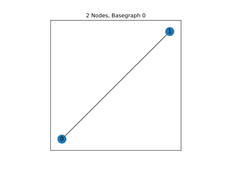

2 Nodes, Basegraph 0
====================

|image1| All unique qubits derived from the above base graph are shown
below. Circuits with series linear elements or no no Josephson Junctions
are excluded.

n2_g0_c1
--------

.. list-table::
   :header-rows: 1

   - 

      - unique_key
      - n_nodes
      - graph_index
      - circuit
      - edges
   - 

      - n2_g0_c1
      - 2
      - 0
      - [(‘J’,)]
      - [(0, 1)]

Notes:

|image2| ### Circuit Hamiltonian For scQubits and SQcircuit, default
numerical values are given as :math:`E_C = 0.2` GHz, :math:`E_L = 1`
GHz, :math:`E_J = 5` GHz, and :math:`E_{CJ} = 20` GHz. ### scQubits:
Nodes index from 1, and are assumed to be connected to a voltage source
via a coupling capacitor.

.. math:: \left(80.0 n_{1}^{2} + 80.0 n_{g1}^{2} + 160.0 n_{1} n_{g1}\right) - J_{1 2} \cos{\left(θ_{1} \right)}

### SQcircuit:
$$:raw-latex:`\begin{align*} &\hat{H} =~E_{C_{11}}(\hat{n}_1-n_{g_{1}})^2~~-~E_{J_{1}}\cos(\hat{\varphi}_1)

\\ &\text{mode}~1:~~~~~~~~~~~\text{charge}~~~~~~~~~~~~~~~~n_{g_{1}}~=~0

\\ &\text{parameters}:~~~~~~~~~~~E_{C_{11}}~=~80.0~~~~~~~~~~~E_{J_{1}}~=~5.0~~~~~~~~~~~
\\ &\text{loops}:~~~~~~~~~~~~~~~~~~~~\end{align*}`\ 

.. math::

   ### CircuitQ:
   Nodes index from 0, with node 0 assigned to be ground. Flux biases are included, but offset charges are ignored.

- E\_{J010} :raw-latex:`\cos{\left(\frac{\Phi_{1}}{\Phi_{o}} \right)}` +
:raw-latex:`\frac{0.5 q_{1}^{2}}{C_{01}}`$$

n2_g0_c3
--------

.. list-table::
   :header-rows: 1

   - 

      - unique_key
      - n_nodes
      - graph_index
      - circuit
      - edges
   - 

      - n2_g0_c3
      - 2
      - 0
      - [(‘C’, ‘J’)]
      - [(0, 1)]

Notes: Transmon

|image3| ### Circuit Hamiltonian For scQubits and SQcircuit, default
numerical values are given as :math:`E_C = 0.2` GHz, :math:`E_L = 1`
GHz, :math:`E_J = 5` GHz, and :math:`E_{CJ} = 20` GHz. ### scQubits:
Nodes index from 1, and are assumed to be connected to a voltage source
via a coupling capacitor.

.. math:: \left(\frac{0.5 n_{1}^{2}}{0.01 + \frac{1}{8 C_{1 2}}} + \frac{0.5 n_{g1}^{2}}{0.01 + \frac{1}{8 C_{1 2}}} + \frac{1.0 n_{1} n_{g1}}{0.01 + \frac{1}{8 C_{1 2}}}\right) - J_{1 2} \cos{\left(θ_{1} \right)}

### SQcircuit:
$$:raw-latex:`\begin{align*} &\hat{H} =~E_{C_{11}}(\hat{n}_1-n_{g_{1}})^2~~-~E_{J_{1}}\cos(\hat{\varphi}_1)

\\ &\text{mode}~1:~~~~~~~~~~~\text{charge}~~~~~~~~~~~~~~~~n_{g_{1}}~=~0

\\ &\text{parameters}:~~~~~~~~~~~E_{C_{11}}~=~0.792~~~~~~~~~~~E_{J_{1}}~=~5.0~~~~~~~~~~~
\\ &\text{loops}:~~~~~~~~~~~~~~~~~~~~\end{align*}`\ 

.. math::

   ### CircuitQ:
   Nodes index from 0, with node 0 assigned to be ground. Flux biases are included, but offset charges are ignored.

- E\_{J010} :raw-latex:`\cos{\left(\frac{\Phi_{1}}{\Phi_{o}} \right)}` +
:raw-latex:`\frac{0.5 q_{1}^{2}}{C_{01}}`$$

n2_g0_c5
--------

.. list-table::
   :header-rows: 1

   - 

      - unique_key
      - n_nodes
      - graph_index
      - circuit
      - edges
   - 

      - n2_g0_c5
      - 2
      - 0
      - [(‘J’, ‘L’)]
      - [(0, 1)]

Notes:

|image4| ### Circuit Hamiltonian For scQubits and SQcircuit, default
numerical values are given as :math:`E_C = 0.2` GHz, :math:`E_L = 1`
GHz, :math:`E_J = 5` GHz, and :math:`E_{CJ} = 20` GHz. ### scQubits:
Nodes index from 1, and are assumed to be connected to a voltage source
via a coupling capacitor.

.. math:: 80.0 Q_{1}^{2} + \left(- J_{1 2} \cos{\left(θ_{1} \right)} + 0.5 L_{1 2} (2πΦ_{1})^{2} + 0.5 L_{1 2} θ_{1}^{2} - 1.0 (2πΦ_{1}) L_{1 2} θ_{1}\right)

### SQcircuit:
$$:raw-latex:`\begin{align*} &\hat{H} =~\omega_1\hat a^\dagger_1\hat a_1~~-~E_{J_{1}}\cos(\hat{\varphi}_1+\varphi_{\text{ext}_{1}})

\\ &\text{mode}~1:~~~~~~~~~~~\text{harmonic}~~~~~~~~~~~\hat{\varphi}_1~=~\varphi_{zp_{1}}(\hat a_1+\hat a^\dagger_1)~~~~~~~~~~~\omega_1/2\pi~=~12.64905~~~~~~~~~~~\varphi_{zp_{1}}~=~2.51e+00

\\ &\text{parameters}:~~~~~~~~~~~E_{J_{1}}~=~5.0~~~~~~~~~~~
\\ &\text{loops}:~~~~~~~~~~~~~~~~~~~~\varphi_{\text{ext}_{1}}/2\pi~=~0.0~~~~~~~~~~~\end{align*}`\ 

.. math::

   ### CircuitQ:
   Nodes index from 0, with node 0 assigned to be ground. Flux biases are included, but offset charges are ignored.

\ :raw-latex:`\frac{\left(\Phi_{1} + \tilde{\Phi}_{010}\right)^{2}}{2 L_{010}}`
- E\_{J010} :raw-latex:`\cos{\left(\frac{\Phi_{1}}{\Phi_{o}} \right)}` +
:raw-latex:`\frac{0.5 q_{1}^{2}}{C_{01}}`$$

n2_g0_c6
--------

.. list-table::
   :header-rows: 1

   - 

      - unique_key
      - n_nodes
      - graph_index
      - circuit
      - edges
   - 

      - n2_g0_c6
      - 2
      - 0
      - [(‘C’, ‘J’, ‘L’)]
      - [(0, 1)]

Notes: Fluxonium

|image5| ### Circuit Hamiltonian For scQubits and SQcircuit, default
numerical values are given as :math:`E_C = 0.2` GHz, :math:`E_L = 1`
GHz, :math:`E_J = 5` GHz, and :math:`E_{CJ} = 20` GHz. ### scQubits:
Nodes index from 1, and are assumed to be connected to a voltage source
via a coupling capacitor.

.. math:: \frac{0.5 Q_{1}^{2}}{0.01 + \frac{0.12}{C_{1 2}}} + \left(- J_{1 2} \cos{\left(θ_{1} \right)} + 0.5 L_{1 2} (2πΦ_{1})^{2} + 0.5 L_{1 2} θ_{1}^{2} - 1.0 (2πΦ_{1}) L_{1 2} θ_{1}\right)

### SQcircuit:
$$:raw-latex:`\begin{align*} &\hat{H} =~\omega_1\hat a^\dagger_1\hat a_1~~-~E_{J_{1}}\cos(\hat{\varphi}_1+\varphi_{\text{ext}_{1}})

\\ &\text{mode}~1:~~~~~~~~~~~\text{harmonic}~~~~~~~~~~~\hat{\varphi}_1~=~\varphi_{zp_{1}}(\hat a_1+\hat a^\dagger_1)~~~~~~~~~~~\omega_1/2\pi~=~1.25863~~~~~~~~~~~\varphi_{zp_{1}}~=~7.93e-01

\\ &\text{parameters}:~~~~~~~~~~~E_{J_{1}}~=~5.0~~~~~~~~~~~
\\ &\text{loops}:~~~~~~~~~~~~~~~~~~~~\varphi_{\text{ext}_{1}}/2\pi~=~0.0~~~~~~~~~~~\end{align*}`\ 

.. math::

   ### CircuitQ:
   Nodes index from 0, with node 0 assigned to be ground. Flux biases are included, but offset charges are ignored.

\ :raw-latex:`\frac{\left(\Phi_{1} + \tilde{\Phi}_{010}\right)^{2}}{2 L_{010}}`
- E\_{J010} :raw-latex:`\cos{\left(\frac{\Phi_{1}}{\Phi_{o}} \right)}` +
:raw-latex:`\frac{0.5 q_{1}^{2}}{C_{01}}`$$

.. |image3| image:: img/n2_g0_c3.svg

