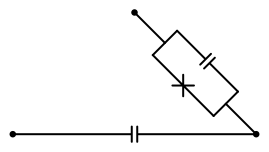
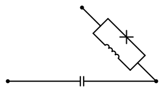
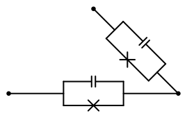
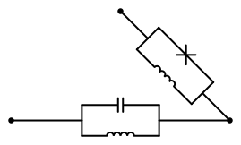
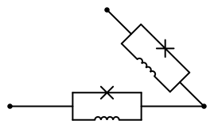
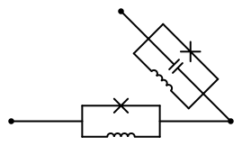
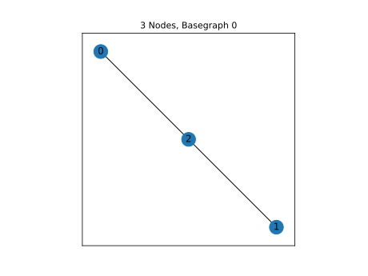

3 Nodes, Basegraph 0
====================

|image1| All unique qubits derived from the above base graph are shown
below. Circuits with series linear elements or no no Josephson Junctions
are excluded.

n3_g0_c1
--------

.. list-table::
   :header-rows: 1

   - 

      - unique_key
      - n_nodes
      - graph_index
      - circuit
      - edges
   - 

      - n3_g0_c1
      - 3
      - 0
      - [(‘C’,), (‘J’,)]
      - [(0, 2), (1, 2)]

Notes:

Circuit Hamiltonian
~~~~~~~~~~~~~~~~~~~

For scQubits and SQcircuit, default numerical values are given as
:math:`E_C = 0.2` GHz, :math:`E_L = 1` GHz, :math:`E_J = 5` GHz, and
:math:`E_{CJ} = 20` GHz.

scQubits:
^^^^^^^^^

Nodes index from 1, and are assumed to be connected to a voltage source
via a coupling capacitor.

.. math:: N/A

SQcircuit:
^^^^^^^^^^

.. math:: \begin{align*} &\hat{H} =~E_{C_{11}}(\hat{n}_1-n_{g_{1}})^2~~-~E_{J_{1}}\cos(\hat{\varphi}_1)  \\ &\text{mode}~1:~~~~~~~~~~~\text{charge}~~~~~~~~~~~~~~~~n_{g_{1}}~=~0  \\ &\text{parameters}:~~~~~~~~~~~E_{C_{11}}~=~80.0~~~~~~~~~~~E_{J_{1}}~=~5.0~~~~~~~~~~~ \\ &\text{loops}:~~~~~~~~~~~~~~~~~~~~\end{align*}

CircuitQ:
^^^^^^^^^

Nodes index from 0, with node 0 assigned to be ground. Flux biases are
included, but offset charges are ignored.

.. math:: N/A

n3_g0_c3
--------

.. list-table::
   :header-rows: 1

   - 

      - unique_key
      - n_nodes
      - graph_index
      - circuit
      - edges
   - 

      - n3_g0_c3
      - 3
      - 0
      - [(‘C’,), (‘C’, ‘J’)]
      - [(0, 2), (1, 2)]

Notes:

.. _circuit-hamiltonian-1:

Circuit Hamiltonian
~~~~~~~~~~~~~~~~~~~

For scQubits and SQcircuit, default numerical values are given as
:math:`E_C = 0.2` GHz, :math:`E_L = 1` GHz, :math:`E_J = 5` GHz, and
:math:`E_{CJ} = 20` GHz.

.. _scqubits-1:

scQubits:
^^^^^^^^^

Nodes index from 1, and are assumed to be connected to a voltage source
via a coupling capacitor.

.. math:: N/A

.. _sqcircuit-1:

SQcircuit:
^^^^^^^^^^

.. math:: \begin{align*} &\hat{H} =~E_{C_{11}}(\hat{n}_1-n_{g_{1}})^2~~-~E_{J_{1}}\cos(\hat{\varphi}_1)  \\ &\text{mode}~1:~~~~~~~~~~~\text{charge}~~~~~~~~~~~~~~~~n_{g_{1}}~=~0  \\ &\text{parameters}:~~~~~~~~~~~E_{C_{11}}~=~0.792~~~~~~~~~~~E_{J_{1}}~=~5.0~~~~~~~~~~~ \\ &\text{loops}:~~~~~~~~~~~~~~~~~~~~\end{align*}

.. _circuitq-1:

CircuitQ:
^^^^^^^^^

Nodes index from 0, with node 0 assigned to be ground. Flux biases are
included, but offset charges are ignored.

.. math:: N/A

n3_g0_c5
--------

.. list-table::
   :header-rows: 1

   - 

      - unique_key
      - n_nodes
      - graph_index
      - circuit
      - edges
   - 

      - n3_g0_c5
      - 3
      - 0
      - [(‘C’,), (‘J’, ‘L’)]
      - [(0, 2), (1, 2)]

Notes:

.. _circuit-hamiltonian-2:

Circuit Hamiltonian
~~~~~~~~~~~~~~~~~~~

For scQubits and SQcircuit, default numerical values are given as
:math:`E_C = 0.2` GHz, :math:`E_L = 1` GHz, :math:`E_J = 5` GHz, and
:math:`E_{CJ} = 20` GHz.

.. _scqubits-2:

scQubits:
^^^^^^^^^

Nodes index from 1, and are assumed to be connected to a voltage source
via a coupling capacitor.

.. math:: N/A

.. _sqcircuit-2:

SQcircuit:
^^^^^^^^^^

.. math:: \begin{align*} &\hat{H} =~\omega_1\hat a^\dagger_1\hat a_1~~-~E_{J_{1}}\cos(-\hat{\varphi}_1+\varphi_{\text{ext}_{1}})  \\ &\text{mode}~1:~~~~~~~~~~~\text{harmonic}~~~~~~~~~~~\hat{\varphi}_1~=~\varphi_{zp_{1}}(\hat a_1+\hat a^\dagger_1)~~~~~~~~~~~\omega_1/2\pi~=~12.64905~~~~~~~~~~~\varphi_{zp_{1}}~=~2.51e+00  \\ &\text{parameters}:~~~~~~~~~~~E_{J_{1}}~=~5.0~~~~~~~~~~~ \\ &\text{loops}:~~~~~~~~~~~~~~~~~~~~\varphi_{\text{ext}_{1}}/2\pi~=~0.0~~~~~~~~~~~\end{align*}

.. _circuitq-2:

CircuitQ:
^^^^^^^^^

Nodes index from 0, with node 0 assigned to be ground. Flux biases are
included, but offset charges are ignored.

.. math:: N/A

n3_g0_c6
--------

.. list-table::
   :header-rows: 1

   - 

      - unique_key
      - n_nodes
      - graph_index
      - circuit
      - edges
   - 

      - n3_g0_c6
      - 3
      - 0
      - [(‘C’,), (‘C’, ‘J’, ‘L’)]
      - [(0, 2), (1, 2)]

Notes:

.. _circuit-hamiltonian-3:

Circuit Hamiltonian
~~~~~~~~~~~~~~~~~~~

For scQubits and SQcircuit, default numerical values are given as
:math:`E_C = 0.2` GHz, :math:`E_L = 1` GHz, :math:`E_J = 5` GHz, and
:math:`E_{CJ} = 20` GHz.

.. _scqubits-3:

scQubits:
^^^^^^^^^

Nodes index from 1, and are assumed to be connected to a voltage source
via a coupling capacitor.

.. math:: N/A

.. _sqcircuit-3:

SQcircuit:
^^^^^^^^^^

.. math:: \begin{align*} &\hat{H} =~\omega_1\hat a^\dagger_1\hat a_1~~-~E_{J_{1}}\cos(-\hat{\varphi}_1+\varphi_{\text{ext}_{1}})  \\ &\text{mode}~1:~~~~~~~~~~~\text{harmonic}~~~~~~~~~~~\hat{\varphi}_1~=~\varphi_{zp_{1}}(\hat a_1+\hat a^\dagger_1)~~~~~~~~~~~\omega_1/2\pi~=~1.25863~~~~~~~~~~~\varphi_{zp_{1}}~=~7.93e-01  \\ &\text{parameters}:~~~~~~~~~~~E_{J_{1}}~=~5.0~~~~~~~~~~~ \\ &\text{loops}:~~~~~~~~~~~~~~~~~~~~\varphi_{\text{ext}_{1}}/2\pi~=~0.0~~~~~~~~~~~\end{align*}

.. _circuitq-3:

CircuitQ:
^^^^^^^^^

Nodes index from 0, with node 0 assigned to be ground. Flux biases are
included, but offset charges are ignored.

.. math:: N/A

n3_g0_c8
--------

.. list-table::
   :header-rows: 1

   - 

      - unique_key
      - n_nodes
      - graph_index
      - circuit
      - edges
   - 

      - n3_g0_c8
      - 3
      - 0
      - [(‘J’,), (‘J’,)]
      - [(0, 2), (1, 2)]

Notes:

.. _circuit-hamiltonian-4:

Circuit Hamiltonian
~~~~~~~~~~~~~~~~~~~

For scQubits and SQcircuit, default numerical values are given as
:math:`E_C = 0.2` GHz, :math:`E_L = 1` GHz, :math:`E_J = 5` GHz, and
:math:`E_{CJ} = 20` GHz.

.. _scqubits-4:

scQubits:
^^^^^^^^^

Nodes index from 1, and are assumed to be connected to a voltage source
via a coupling capacitor.

.. math:: \left(80.0 n_{1}^{2} + 80.0 n_{2}^{2} + 80.0 n_{g1}^{2} + 80.0 n_{g2}^{2} + 160.0 n_{1} n_{g1} + 160.0 n_{2} n_{g2}\right) - \left(J_{1 3} \cos{\left(θ_{1} \right)} + J_{2 3} \cos{\left(θ_{2} \right)}\right)

.. _sqcircuit-4:

SQcircuit:
^^^^^^^^^^

.. math:: \begin{align*} &\hat{H} =~E_{C_{11}}(\hat{n}_1-n_{g_{1}})^2~+~E_{C_{12}}(\hat{n}_1-n_{g_{1}})(\hat{n}_2-n_{g_{2}})~+~E_{C_{22}}(\hat{n}_2-n_{g_{2}})^2~~-~E_{J_{1}}\cos(\hat{\varphi}_1)~-~E_{J_{2}}\cos(\hat{\varphi}_2)  \\ &\text{mode}~1:~~~~~~~~~~~\text{charge}~~~~~~~~~~~~~~~~n_{g_{1}}~=~0 \\ &\text{mode}~2:~~~~~~~~~~~\text{charge}~~~~~~~~~~~~~~~~n_{g_{2}}~=~0  \\ &\text{parameters}:~~~~~~~~~~~E_{C_{11}}~=~80.0~~~~~~~~~~~E_{C_{12}}~=~-0.0~~~~~~~~~~~E_{C_{22}}~=~80.0~~~~~~~~~~~E_{J_{1}}~=~5.0~~~~~~~~~~~E_{J_{2}}~=~5.0~~~~~~~~~~~ \\ &\text{loops}:~~~~~~~~~~~~~~~~~~~~\end{align*}

.. _circuitq-4:

CircuitQ:
^^^^^^^^^

Nodes index from 0, with node 0 assigned to be ground. Flux biases are
included, but offset charges are ignored.

.. math:: - E_{J020} \cos{\left(\frac{\Phi_{2}}{\Phi_{o}} \right)} - E_{J210} \cos{\left(\frac{\Phi_{2}}{\Phi_{o}} \right)} + \frac{0.5 q_{2}^{2}}{C_{02} + C_{21}}

n3_g0_c9
--------

.. list-table::
   :header-rows: 1

   - 

      - unique_key
      - n_nodes
      - graph_index
      - circuit
      - edges
   - 

      - n3_g0_c9
      - 3
      - 0
      - [(‘J’,), (‘L’,)]
      - [(0, 2), (1, 2)]

Notes:

.. _circuit-hamiltonian-5:

Circuit Hamiltonian
~~~~~~~~~~~~~~~~~~~

For scQubits and SQcircuit, default numerical values are given as
:math:`E_C = 0.2` GHz, :math:`E_L = 1` GHz, :math:`E_J = 5` GHz, and
:math:`E_{CJ} = 20` GHz.

.. _scqubits-5:

scQubits:
^^^^^^^^^

Nodes index from 1, and are assumed to be connected to a voltage source
via a coupling capacitor.

.. math:: N/A

.. _sqcircuit-5:

SQcircuit:
^^^^^^^^^^

.. math:: \begin{align*} &\hat{H} =~E_{C_{11}}(\hat{n}_1-n_{g_{1}})^2~~-~E_{J_{1}}\cos(\hat{\varphi}_1)  \\ &\text{mode}~1:~~~~~~~~~~~\text{charge}~~~~~~~~~~~~~~~~n_{g_{1}}~=~0  \\ &\text{parameters}:~~~~~~~~~~~E_{C_{11}}~=~80.0~~~~~~~~~~~E_{J_{1}}~=~5.0~~~~~~~~~~~ \\ &\text{loops}:~~~~~~~~~~~~~~~~~~~~\end{align*}

.. _circuitq-5:

CircuitQ:
^^^^^^^^^

Nodes index from 0, with node 0 assigned to be ground. Flux biases are
included, but offset charges are ignored.

.. math:: \frac{\Phi_{2}^{2}}{2 L_{210}} - E_{J020} \cos{\left(\frac{\Phi_{2}}{\Phi_{o}} \right)} + \frac{0.5 q_{2}^{2}}{C_{02} + Cp_{21}}

n3_g0_c10
---------

.. list-table::
   :header-rows: 1

   - 

      - unique_key
      - n_nodes
      - graph_index
      - circuit
      - edges
   - 

      - n3_g0_c10
      - 3
      - 0
      - [(‘J’,), (‘C’, ‘J’)]
      - [(0, 2), (1, 2)]

Notes:

.. _circuit-hamiltonian-6:

Circuit Hamiltonian
~~~~~~~~~~~~~~~~~~~

For scQubits and SQcircuit, default numerical values are given as
:math:`E_C = 0.2` GHz, :math:`E_L = 1` GHz, :math:`E_J = 5` GHz, and
:math:`E_{CJ} = 20` GHz.

.. _scqubits-6:

scQubits:
^^^^^^^^^

Nodes index from 1, and are assumed to be connected to a voltage source
via a coupling capacitor.

.. math:: \left(80.0 n_{1}^{2} + 80.0 n_{g1}^{2} + \frac{0.5 n_{2}^{2}}{0.01 + \frac{1}{8 C_{2 3}}} + \frac{0.5 n_{g2}^{2}}{0.01 + \frac{1}{8 C_{2 3}}} + 160.0 n_{1} n_{g1} + \frac{1.0 n_{2} n_{g2}}{0.01 + \frac{1}{8 C_{2 3}}}\right) - \left(J_{1 3} \cos{\left(θ_{1} \right)} + J_{2 3} \cos{\left(θ_{2} \right)}\right)

.. _sqcircuit-6:

SQcircuit:
^^^^^^^^^^

.. math:: \begin{align*} &\hat{H} =~E_{C_{11}}(\hat{n}_1-n_{g_{1}})^2~+~E_{C_{12}}(\hat{n}_1-n_{g_{1}})(\hat{n}_2-n_{g_{2}})~+~E_{C_{22}}(\hat{n}_2-n_{g_{2}})^2~~-~E_{J_{1}}\cos(\hat{\varphi}_1)~-~E_{J_{2}}\cos(\hat{\varphi}_2)  \\ &\text{mode}~1:~~~~~~~~~~~\text{charge}~~~~~~~~~~~~~~~~n_{g_{1}}~=~0 \\ &\text{mode}~2:~~~~~~~~~~~\text{charge}~~~~~~~~~~~~~~~~n_{g_{2}}~=~0  \\ &\text{parameters}:~~~~~~~~~~~E_{C_{11}}~=~80.0~~~~~~~~~~~E_{C_{12}}~=~0.0~~~~~~~~~~~E_{C_{22}}~=~0.792~~~~~~~~~~~E_{J_{1}}~=~5.0~~~~~~~~~~~E_{J_{2}}~=~5.0~~~~~~~~~~~ \\ &\text{loops}:~~~~~~~~~~~~~~~~~~~~\end{align*}

.. _circuitq-6:

CircuitQ:
^^^^^^^^^

Nodes index from 0, with node 0 assigned to be ground. Flux biases are
included, but offset charges are ignored.

.. math:: - E_{J020} \cos{\left(\frac{\Phi_{2}}{\Phi_{o}} \right)} - E_{J210} \cos{\left(\frac{\Phi_{2}}{\Phi_{o}} \right)} + \frac{0.5 q_{2}^{2}}{C_{02} + C_{21}}

n3_g0_c11
---------

.. list-table::
   :header-rows: 1

   - 

      - unique_key
      - n_nodes
      - graph_index
      - circuit
      - edges
   - 

      - n3_g0_c11
      - 3
      - 0
      - [(‘J’,), (‘C’, ‘L’)]
      - [(0, 2), (1, 2)]

Notes:

.. _circuit-hamiltonian-7:

Circuit Hamiltonian
~~~~~~~~~~~~~~~~~~~

For scQubits and SQcircuit, default numerical values are given as
:math:`E_C = 0.2` GHz, :math:`E_L = 1` GHz, :math:`E_J = 5` GHz, and
:math:`E_{CJ} = 20` GHz.

.. _scqubits-7:

scQubits:
^^^^^^^^^

Nodes index from 1, and are assumed to be connected to a voltage source
via a coupling capacitor.

.. math:: \left(80.0 n_{1}^{2} + 80.0 n_{g1}^{2} + 1.0 C_{2 3} Q_{2}^{2} + 160.0 n_{1} n_{g1}\right) - \left(J_{1 3} \cos{\left(θ_{1} \right)} - 2.0 L_{2 3} θ_{2}^{2}\right)

.. _sqcircuit-7:

SQcircuit:
^^^^^^^^^^

.. math:: \begin{align*} &\hat{H} =~E_{C_{11}}(\hat{n}_1-n_{g_{1}})^2~~-~E_{J_{1}}\cos(\hat{\varphi}_1)  \\ &\text{mode}~1:~~~~~~~~~~~\text{charge}~~~~~~~~~~~~~~~~n_{g_{1}}~=~0  \\ &\text{parameters}:~~~~~~~~~~~E_{C_{11}}~=~80.0~~~~~~~~~~~E_{J_{1}}~=~5.0~~~~~~~~~~~ \\ &\text{loops}:~~~~~~~~~~~~~~~~~~~~\end{align*}

.. _circuitq-7:

CircuitQ:
^^^^^^^^^

Nodes index from 0, with node 0 assigned to be ground. Flux biases are
included, but offset charges are ignored.

.. math:: \frac{\Phi_{2}^{2}}{2 L_{210}} - E_{J020} \cos{\left(\frac{\Phi_{2}}{\Phi_{o}} \right)} + \frac{0.5 q_{2}^{2}}{C_{02} + C_{21}}

n3_g0_c12
---------

.. list-table::
   :header-rows: 1

   - 

      - unique_key
      - n_nodes
      - graph_index
      - circuit
      - edges
   - 

      - n3_g0_c12
      - 3
      - 0
      - [(‘J’,), (‘J’, ‘L’)]
      - [(0, 2), (1, 2)]

Notes:

.. _circuit-hamiltonian-8:

Circuit Hamiltonian
~~~~~~~~~~~~~~~~~~~

For scQubits and SQcircuit, default numerical values are given as
:math:`E_C = 0.2` GHz, :math:`E_L = 1` GHz, :math:`E_J = 5` GHz, and
:math:`E_{CJ} = 20` GHz.

.. _scqubits-8:

scQubits:
^^^^^^^^^

Nodes index from 1, and are assumed to be connected to a voltage source
via a coupling capacitor.

.. math:: \left(80.0 Q_{2}^{2} + 80.0 n_{1}^{2} + 80.0 n_{g1}^{2} + 160.0 n_{1} n_{g1}\right) - \left(J_{1 3} \cos{\left(θ_{1} \right)} + J_{2 3} \cos{\left(θ_{2} \right)} - 0.5 L_{2 3} (2πΦ_{1})^{2} - 0.5 L_{2 3} θ_{2}^{2} + 1.0 (2πΦ_{1}) L_{2 3} θ_{2}\right)

.. _sqcircuit-8:

SQcircuit:
^^^^^^^^^^

.. math:: \begin{align*} &\hat{H} =~\omega_1\hat a^\dagger_1\hat a_1~+~E_{C_{22}}(\hat{n}_2-n_{g_{2}})^2~~-~E_{J_{1}}\cos(\hat{\varphi}_2)~-~E_{J_{2}}\cos(-\hat{\varphi}_1+\varphi_{\text{ext}_{1}})  \\ &\text{mode}~1:~~~~~~~~~~~\text{harmonic}~~~~~~~~~~~\hat{\varphi}_1~=~\varphi_{zp_{1}}(\hat a_1+\hat a^\dagger_1)~~~~~~~~~~~\omega_1/2\pi~=~12.64905~~~~~~~~~~~\varphi_{zp_{1}}~=~2.51e+00 \\ &\text{mode}~2:~~~~~~~~~~~\text{charge}~~~~~~~~~~~~~~~~n_{g_{2}}~=~0  \\ &\text{parameters}:~~~~~~~~~~~E_{C_{22}}~=~80.0~~~~~~~~~~~E_{J_{1}}~=~5.0~~~~~~~~~~~E_{J_{2}}~=~5.0~~~~~~~~~~~ \\ &\text{loops}:~~~~~~~~~~~~~~~~~~~~\varphi_{\text{ext}_{1}}/2\pi~=~0.0~~~~~~~~~~~\end{align*}

.. _circuitq-8:

CircuitQ:
^^^^^^^^^

Nodes index from 0, with node 0 assigned to be ground. Flux biases are
included, but offset charges are ignored.

.. math:: \frac{\Phi_{2}^{2}}{2 L_{210}} - E_{J020} \cos{\left(\frac{\Phi_{2}}{\Phi_{o}} \right)} - E_{J210} \cos{\left(\frac{\Phi_{2}}{\Phi_{o}} \right)} + \frac{0.5 q_{2}^{2}}{C_{02} + C_{21}}

n3_g0_c13
---------

.. list-table::
   :header-rows: 1

   - 

      - unique_key
      - n_nodes
      - graph_index
      - circuit
      - edges
   - 

      - n3_g0_c13
      - 3
      - 0
      - [(‘J’,), (‘C’, ‘J’, ‘L’)]
      - [(0, 2), (1, 2)]

Notes:

.. _circuit-hamiltonian-9:

Circuit Hamiltonian
~~~~~~~~~~~~~~~~~~~

For scQubits and SQcircuit, default numerical values are given as
:math:`E_C = 0.2` GHz, :math:`E_L = 1` GHz, :math:`E_J = 5` GHz, and
:math:`E_{CJ} = 20` GHz.

.. _scqubits-9:

scQubits:
^^^^^^^^^

Nodes index from 1, and are assumed to be connected to a voltage source
via a coupling capacitor.

.. math:: \left(80.0 n_{1}^{2} + 80.0 n_{g1}^{2} + \frac{0.5 Q_{2}^{2}}{0.01 + \frac{0.12}{C_{2 3}}} + 160.0 n_{1} n_{g1}\right) - \left(J_{1 3} \cos{\left(θ_{1} \right)} + J_{2 3} \cos{\left(θ_{2} \right)} - 0.5 L_{2 3} (2πΦ_{1})^{2} - 0.5 L_{2 3} θ_{2}^{2} + 1.0 (2πΦ_{1}) L_{2 3} θ_{2}\right)

.. _sqcircuit-9:

SQcircuit:
^^^^^^^^^^

.. math:: \begin{align*} &\hat{H} =~\omega_1\hat a^\dagger_1\hat a_1~+~E_{C_{22}}(\hat{n}_2-n_{g_{2}})^2~~-~E_{J_{1}}\cos(\hat{\varphi}_2)~-~E_{J_{2}}\cos(-\hat{\varphi}_1+\varphi_{\text{ext}_{1}})  \\ &\text{mode}~1:~~~~~~~~~~~\text{harmonic}~~~~~~~~~~~\hat{\varphi}_1~=~\varphi_{zp_{1}}(\hat a_1+\hat a^\dagger_1)~~~~~~~~~~~\omega_1/2\pi~=~1.25863~~~~~~~~~~~\varphi_{zp_{1}}~=~7.93e-01 \\ &\text{mode}~2:~~~~~~~~~~~\text{charge}~~~~~~~~~~~~~~~~n_{g_{2}}~=~0  \\ &\text{parameters}:~~~~~~~~~~~E_{C_{22}}~=~80.0~~~~~~~~~~~E_{J_{1}}~=~5.0~~~~~~~~~~~E_{J_{2}}~=~5.0~~~~~~~~~~~ \\ &\text{loops}:~~~~~~~~~~~~~~~~~~~~\varphi_{\text{ext}_{1}}/2\pi~=~0.0~~~~~~~~~~~\end{align*}

.. _circuitq-9:

CircuitQ:
^^^^^^^^^

Nodes index from 0, with node 0 assigned to be ground. Flux biases are
included, but offset charges are ignored.

.. math:: \frac{\Phi_{2}^{2}}{2 L_{210}} - E_{J020} \cos{\left(\frac{\Phi_{2}}{\Phi_{o}} \right)} - E_{J210} \cos{\left(\frac{\Phi_{2}}{\Phi_{o}} \right)} + \frac{0.5 q_{2}^{2}}{C_{02} + C_{21}}

n3_g0_c17
---------

.. list-table::
   :header-rows: 1

   - 

      - unique_key
      - n_nodes
      - graph_index
      - circuit
      - edges
   - 

      - n3_g0_c17
      - 3
      - 0
      - [(‘L’,), (‘C’, ‘J’)]
      - [(0, 2), (1, 2)]

Notes:

.. _circuit-hamiltonian-10:

Circuit Hamiltonian
~~~~~~~~~~~~~~~~~~~

For scQubits and SQcircuit, default numerical values are given as
:math:`E_C = 0.2` GHz, :math:`E_L = 1` GHz, :math:`E_J = 5` GHz, and
:math:`E_{CJ} = 20` GHz.

.. _scqubits-10:

scQubits:
^^^^^^^^^

Nodes index from 1, and are assumed to be connected to a voltage source
via a coupling capacitor.

.. math:: N/A

.. _sqcircuit-10:

SQcircuit:
^^^^^^^^^^

.. math:: \begin{align*} &\hat{H} =~E_{C_{11}}(\hat{n}_1-n_{g_{1}})^2~~-~E_{J_{1}}\cos(\hat{\varphi}_1)  \\ &\text{mode}~1:~~~~~~~~~~~\text{charge}~~~~~~~~~~~~~~~~n_{g_{1}}~=~0  \\ &\text{parameters}:~~~~~~~~~~~E_{C_{11}}~=~0.792~~~~~~~~~~~E_{J_{1}}~=~5.0~~~~~~~~~~~ \\ &\text{loops}:~~~~~~~~~~~~~~~~~~~~\end{align*}

.. _circuitq-10:

CircuitQ:
^^^^^^^^^

Nodes index from 0, with node 0 assigned to be ground. Flux biases are
included, but offset charges are ignored.

.. math:: \frac{\Phi_{2}^{2}}{2 L_{020}} - E_{J210} \cos{\left(\frac{\Phi_{2}}{\Phi_{o}} \right)} + \frac{0.5 q_{2}^{2}}{C_{21} + Cp_{02}}

n3_g0_c19
---------

.. list-table::
   :header-rows: 1

   - 

      - unique_key
      - n_nodes
      - graph_index
      - circuit
      - edges
   - 

      - n3_g0_c19
      - 3
      - 0
      - [(‘L’,), (‘J’, ‘L’)]
      - [(0, 2), (1, 2)]

Notes:

.. _circuit-hamiltonian-11:

Circuit Hamiltonian
~~~~~~~~~~~~~~~~~~~

For scQubits and SQcircuit, default numerical values are given as
:math:`E_C = 0.2` GHz, :math:`E_L = 1` GHz, :math:`E_J = 5` GHz, and
:math:`E_{CJ} = 20` GHz.

.. _scqubits-11:

scQubits:
^^^^^^^^^

Nodes index from 1, and are assumed to be connected to a voltage source
via a coupling capacitor.

.. math:: N/A

.. _sqcircuit-11:

SQcircuit:
^^^^^^^^^^

.. math:: \begin{align*} &\hat{H} =~\omega_1\hat a^\dagger_1\hat a_1~~-~E_{J_{1}}\cos(-\hat{\varphi}_1+\varphi_{\text{ext}_{1}})  \\ &\text{mode}~1:~~~~~~~~~~~\text{harmonic}~~~~~~~~~~~\hat{\varphi}_1~=~\varphi_{zp_{1}}(\hat a_1+\hat a^\dagger_1)~~~~~~~~~~~\omega_1/2\pi~=~12.64905~~~~~~~~~~~\varphi_{zp_{1}}~=~2.51e+00  \\ &\text{parameters}:~~~~~~~~~~~E_{J_{1}}~=~5.0~~~~~~~~~~~ \\ &\text{loops}:~~~~~~~~~~~~~~~~~~~~\varphi_{\text{ext}_{1}}/2\pi~=~0.0~~~~~~~~~~~\end{align*}

.. _circuitq-11:

CircuitQ:
^^^^^^^^^

Nodes index from 0, with node 0 assigned to be ground. Flux biases are
included, but offset charges are ignored.

.. math:: \frac{\Phi_{2}^{2}}{2 L_{020}} + \frac{\Phi_{2}^{2}}{2 L_{210}} - E_{J210} \cos{\left(\frac{\Phi_{2}}{\Phi_{o}} \right)} + \frac{0.5 q_{2}^{2}}{C_{21} + Cp_{02}}

n3_g0_c20
---------

.. list-table::
   :header-rows: 1

   - 

      - unique_key
      - n_nodes
      - graph_index
      - circuit
      - edges
   - 

      - n3_g0_c20
      - 3
      - 0
      - [(‘L’,), (‘C’, ‘J’, ‘L’)]
      - [(0, 2), (1, 2)]

Notes:

.. _circuit-hamiltonian-12:

Circuit Hamiltonian
~~~~~~~~~~~~~~~~~~~

For scQubits and SQcircuit, default numerical values are given as
:math:`E_C = 0.2` GHz, :math:`E_L = 1` GHz, :math:`E_J = 5` GHz, and
:math:`E_{CJ} = 20` GHz.

.. _scqubits-12:

scQubits:
^^^^^^^^^

Nodes index from 1, and are assumed to be connected to a voltage source
via a coupling capacitor.

.. math:: N/A

.. _sqcircuit-12:

SQcircuit:
^^^^^^^^^^

.. math:: \begin{align*} &\hat{H} =~\omega_1\hat a^\dagger_1\hat a_1~~-~E_{J_{1}}\cos(-\hat{\varphi}_1+\varphi_{\text{ext}_{1}})  \\ &\text{mode}~1:~~~~~~~~~~~\text{harmonic}~~~~~~~~~~~\hat{\varphi}_1~=~\varphi_{zp_{1}}(\hat a_1+\hat a^\dagger_1)~~~~~~~~~~~\omega_1/2\pi~=~1.25863~~~~~~~~~~~\varphi_{zp_{1}}~=~7.93e-01  \\ &\text{parameters}:~~~~~~~~~~~E_{J_{1}}~=~5.0~~~~~~~~~~~ \\ &\text{loops}:~~~~~~~~~~~~~~~~~~~~\varphi_{\text{ext}_{1}}/2\pi~=~0.0~~~~~~~~~~~\end{align*}

.. _circuitq-12:

CircuitQ:
^^^^^^^^^

Nodes index from 0, with node 0 assigned to be ground. Flux biases are
included, but offset charges are ignored.

.. math:: \frac{\Phi_{2}^{2}}{2 L_{020}} + \frac{\Phi_{2}^{2}}{2 L_{210}} - E_{J210} \cos{\left(\frac{\Phi_{2}}{\Phi_{o}} \right)} + \frac{0.5 q_{2}^{2}}{C_{21} + Cp_{02}}

n3_g0_c24
---------

.. list-table::
   :header-rows: 1

   - 

      - unique_key
      - n_nodes
      - graph_index
      - circuit
      - edges
   - 

      - n3_g0_c24
      - 3
      - 0
      - [(‘C’, ‘J’), (‘C’, ‘J’)]
      - [(0, 2), (1, 2)]

Notes:

.. _circuit-hamiltonian-13:

Circuit Hamiltonian
~~~~~~~~~~~~~~~~~~~

For scQubits and SQcircuit, default numerical values are given as
:math:`E_C = 0.2` GHz, :math:`E_L = 1` GHz, :math:`E_J = 5` GHz, and
:math:`E_{CJ} = 20` GHz.

.. _scqubits-13:

scQubits:
^^^^^^^^^

Nodes index from 1, and are assumed to be connected to a voltage source
via a coupling capacitor.

.. math:: \left(\frac{0.5 n_{1}^{2}}{0.01 + \frac{1}{8 C_{1 3}}} + \frac{0.5 n_{2}^{2}}{0.01 + \frac{1}{8 C_{2 3}}} + \frac{0.5 n_{g1}^{2}}{0.01 + \frac{1}{8 C_{1 3}}} + \frac{0.5 n_{g2}^{2}}{0.01 + \frac{1}{8 C_{2 3}}} + \frac{1.0 n_{1} n_{g1}}{0.01 + \frac{1}{8 C_{1 3}}} + \frac{1.0 n_{2} n_{g2}}{0.01 + \frac{1}{8 C_{2 3}}}\right) - \left(J_{1 3} \cos{\left(θ_{1} \right)} + J_{2 3} \cos{\left(θ_{2} \right)}\right)

.. _sqcircuit-13:

SQcircuit:
^^^^^^^^^^

.. math:: \begin{align*} &\hat{H} =~E_{C_{11}}(\hat{n}_1-n_{g_{1}})^2~+~E_{C_{12}}(\hat{n}_1-n_{g_{1}})(\hat{n}_2-n_{g_{2}})~+~E_{C_{22}}(\hat{n}_2-n_{g_{2}})^2~~-~E_{J_{1}}\cos(\hat{\varphi}_1)~-~E_{J_{2}}\cos(\hat{\varphi}_2)  \\ &\text{mode}~1:~~~~~~~~~~~\text{charge}~~~~~~~~~~~~~~~~n_{g_{1}}~=~0 \\ &\text{mode}~2:~~~~~~~~~~~\text{charge}~~~~~~~~~~~~~~~~n_{g_{2}}~=~0  \\ &\text{parameters}:~~~~~~~~~~~E_{C_{11}}~=~0.792~~~~~~~~~~~E_{C_{12}}~=~-0.0~~~~~~~~~~~E_{C_{22}}~=~0.792~~~~~~~~~~~E_{J_{1}}~=~5.0~~~~~~~~~~~E_{J_{2}}~=~5.0~~~~~~~~~~~ \\ &\text{loops}:~~~~~~~~~~~~~~~~~~~~\end{align*}

.. _circuitq-13:

CircuitQ:
^^^^^^^^^

Nodes index from 0, with node 0 assigned to be ground. Flux biases are
included, but offset charges are ignored.

.. math:: - E_{J020} \cos{\left(\frac{\Phi_{2}}{\Phi_{o}} \right)} - E_{J210} \cos{\left(\frac{\Phi_{2}}{\Phi_{o}} \right)} + \frac{0.5 q_{2}^{2}}{C_{02} + C_{21}}

n3_g0_c25
---------

.. list-table::
   :header-rows: 1

   - 

      - unique_key
      - n_nodes
      - graph_index
      - circuit
      - edges
   - 

      - n3_g0_c25
      - 3
      - 0
      - [(‘C’, ‘J’), (‘C’, ‘L’)]
      - [(0, 2), (1, 2)]

Notes:

.. _circuit-hamiltonian-14:

Circuit Hamiltonian
~~~~~~~~~~~~~~~~~~~

For scQubits and SQcircuit, default numerical values are given as
:math:`E_C = 0.2` GHz, :math:`E_L = 1` GHz, :math:`E_J = 5` GHz, and
:math:`E_{CJ} = 20` GHz.

.. _scqubits-14:

scQubits:
^^^^^^^^^

Nodes index from 1, and are assumed to be connected to a voltage source
via a coupling capacitor.

.. math:: \left(\frac{0.5 n_{1}^{2}}{0.01 + \frac{1}{8 C_{1 3}}} + \frac{0.5 n_{g1}^{2}}{0.01 + \frac{1}{8 C_{1 3}}} + 1.0 C_{2 3} Q_{2}^{2} + \frac{1.0 n_{1} n_{g1}}{0.01 + \frac{1}{8 C_{1 3}}}\right) - \left(J_{1 3} \cos{\left(θ_{1} \right)} - 2.0 L_{2 3} θ_{2}^{2}\right)

.. _sqcircuit-14:

SQcircuit:
^^^^^^^^^^

.. math:: \begin{align*} &\hat{H} =~E_{C_{11}}(\hat{n}_1-n_{g_{1}})^2~~-~E_{J_{1}}\cos(\hat{\varphi}_1)  \\ &\text{mode}~1:~~~~~~~~~~~\text{charge}~~~~~~~~~~~~~~~~n_{g_{1}}~=~0  \\ &\text{parameters}:~~~~~~~~~~~E_{C_{11}}~=~0.792~~~~~~~~~~~E_{J_{1}}~=~5.0~~~~~~~~~~~ \\ &\text{loops}:~~~~~~~~~~~~~~~~~~~~\end{align*}

.. _circuitq-14:

CircuitQ:
^^^^^^^^^

Nodes index from 0, with node 0 assigned to be ground. Flux biases are
included, but offset charges are ignored.

.. math:: \frac{\Phi_{2}^{2}}{2 L_{210}} - E_{J020} \cos{\left(\frac{\Phi_{2}}{\Phi_{o}} \right)} + \frac{0.5 q_{2}^{2}}{C_{02} + C_{21}}

n3_g0_c26
---------

.. list-table::
   :header-rows: 1

   - 

      - unique_key
      - n_nodes
      - graph_index
      - circuit
      - edges
   - 

      - n3_g0_c26
      - 3
      - 0
      - [(‘C’, ‘J’), (‘J’, ‘L’)]
      - [(0, 2), (1, 2)]

Notes:

.. _circuit-hamiltonian-15:

Circuit Hamiltonian
~~~~~~~~~~~~~~~~~~~

For scQubits and SQcircuit, default numerical values are given as
:math:`E_C = 0.2` GHz, :math:`E_L = 1` GHz, :math:`E_J = 5` GHz, and
:math:`E_{CJ} = 20` GHz.

.. _scqubits-15:

scQubits:
^^^^^^^^^

Nodes index from 1, and are assumed to be connected to a voltage source
via a coupling capacitor.

.. math:: \left(80.0 Q_{2}^{2} + \frac{0.5 n_{1}^{2}}{0.01 + \frac{0.12}{C_{1 3}}} + \frac{0.5 n_{g1}^{2}}{0.01 + \frac{0.12}{C_{1 3}}} + \frac{1.0 n_{1} n_{g1}}{0.01 + \frac{0.12}{C_{1 3}}}\right) - \left(J_{1 3} \cos{\left(θ_{1} \right)} + J_{2 3} \cos{\left(θ_{2} \right)} - 0.5 L_{2 3} (2πΦ_{1})^{2} - 0.5 L_{2 3} θ_{2}^{2} + 1.0 (2πΦ_{1}) L_{2 3} θ_{2}\right)

.. _sqcircuit-15:

SQcircuit:
^^^^^^^^^^

.. math:: \begin{align*} &\hat{H} =~\omega_1\hat a^\dagger_1\hat a_1~+~E_{C_{22}}(\hat{n}_2-n_{g_{2}})^2~~-~E_{J_{1}}\cos(\hat{\varphi}_2)~-~E_{J_{2}}\cos(-\hat{\varphi}_1+\varphi_{\text{ext}_{1}})  \\ &\text{mode}~1:~~~~~~~~~~~\text{harmonic}~~~~~~~~~~~\hat{\varphi}_1~=~\varphi_{zp_{1}}(\hat a_1+\hat a^\dagger_1)~~~~~~~~~~~\omega_1/2\pi~=~12.64905~~~~~~~~~~~\varphi_{zp_{1}}~=~2.51e+00 \\ &\text{mode}~2:~~~~~~~~~~~\text{charge}~~~~~~~~~~~~~~~~n_{g_{2}}~=~0  \\ &\text{parameters}:~~~~~~~~~~~E_{C_{22}}~=~0.792~~~~~~~~~~~E_{J_{1}}~=~5.0~~~~~~~~~~~E_{J_{2}}~=~5.0~~~~~~~~~~~ \\ &\text{loops}:~~~~~~~~~~~~~~~~~~~~\varphi_{\text{ext}_{1}}/2\pi~=~0.0~~~~~~~~~~~\end{align*}

.. _circuitq-15:

CircuitQ:
^^^^^^^^^

Nodes index from 0, with node 0 assigned to be ground. Flux biases are
included, but offset charges are ignored.

.. math:: \frac{\Phi_{2}^{2}}{2 L_{210}} - E_{J020} \cos{\left(\frac{\Phi_{2}}{\Phi_{o}} \right)} - E_{J210} \cos{\left(\frac{\Phi_{2}}{\Phi_{o}} \right)} + \frac{0.5 q_{2}^{2}}{C_{02} + C_{21}}

n3_g0_c27
---------

.. list-table::
   :header-rows: 1

   - 

      - unique_key
      - n_nodes
      - graph_index
      - circuit
      - edges
   - 

      - n3_g0_c27
      - 3
      - 0
      - [(‘C’, ‘J’), (‘C’, ‘J’, ‘L’)]
      - [(0, 2), (1, 2)]

Notes:

.. _circuit-hamiltonian-16:

Circuit Hamiltonian
~~~~~~~~~~~~~~~~~~~

For scQubits and SQcircuit, default numerical values are given as
:math:`E_C = 0.2` GHz, :math:`E_L = 1` GHz, :math:`E_J = 5` GHz, and
:math:`E_{CJ} = 20` GHz.

.. _scqubits-16:

scQubits:
^^^^^^^^^

Nodes index from 1, and are assumed to be connected to a voltage source
via a coupling capacitor.

.. math:: \left(\frac{0.5 Q_{2}^{2}}{0.01 + \frac{0.12}{C_{2 3}}} + \frac{0.5 n_{1}^{2}}{0.01 + \frac{0.12}{C_{1 3}}} + \frac{0.5 n_{g1}^{2}}{0.01 + \frac{0.12}{C_{1 3}}} + \frac{1.0 n_{1} n_{g1}}{0.01 + \frac{0.12}{C_{1 3}}}\right) - \left(J_{1 3} \cos{\left(θ_{1} \right)} + J_{2 3} \cos{\left(θ_{2} \right)} - 0.5 L_{2 3} (2πΦ_{1})^{2} - 0.5 L_{2 3} θ_{2}^{2} + 1.0 (2πΦ_{1}) L_{2 3} θ_{2}\right)

.. _sqcircuit-16:

SQcircuit:
^^^^^^^^^^

.. math:: \begin{align*} &\hat{H} =~\omega_1\hat a^\dagger_1\hat a_1~+~E_{C_{22}}(\hat{n}_2-n_{g_{2}})^2~~-~E_{J_{1}}\cos(\hat{\varphi}_2)~-~E_{J_{2}}\cos(-\hat{\varphi}_1+\varphi_{\text{ext}_{1}})  \\ &\text{mode}~1:~~~~~~~~~~~\text{harmonic}~~~~~~~~~~~\hat{\varphi}_1~=~\varphi_{zp_{1}}(\hat a_1+\hat a^\dagger_1)~~~~~~~~~~~\omega_1/2\pi~=~1.25863~~~~~~~~~~~\varphi_{zp_{1}}~=~7.93e-01 \\ &\text{mode}~2:~~~~~~~~~~~\text{charge}~~~~~~~~~~~~~~~~n_{g_{2}}~=~0  \\ &\text{parameters}:~~~~~~~~~~~E_{C_{22}}~=~0.792~~~~~~~~~~~E_{J_{1}}~=~5.0~~~~~~~~~~~E_{J_{2}}~=~5.0~~~~~~~~~~~ \\ &\text{loops}:~~~~~~~~~~~~~~~~~~~~\varphi_{\text{ext}_{1}}/2\pi~=~0.0~~~~~~~~~~~\end{align*}

.. _circuitq-16:

CircuitQ:
^^^^^^^^^

Nodes index from 0, with node 0 assigned to be ground. Flux biases are
included, but offset charges are ignored.

.. math:: \frac{\Phi_{2}^{2}}{2 L_{210}} - E_{J020} \cos{\left(\frac{\Phi_{2}}{\Phi_{o}} \right)} - E_{J210} \cos{\left(\frac{\Phi_{2}}{\Phi_{o}} \right)} + \frac{0.5 q_{2}^{2}}{C_{02} + C_{21}}

n3_g0_c33
---------

.. list-table::
   :header-rows: 1

   - 

      - unique_key
      - n_nodes
      - graph_index
      - circuit
      - edges
   - 

      - n3_g0_c33
      - 3
      - 0
      - [(‘C’, ‘L’), (‘J’, ‘L’)]
      - [(0, 2), (1, 2)]

Notes:

.. _circuit-hamiltonian-17:

Circuit Hamiltonian
~~~~~~~~~~~~~~~~~~~

For scQubits and SQcircuit, default numerical values are given as
:math:`E_C = 0.2` GHz, :math:`E_L = 1` GHz, :math:`E_J = 5` GHz, and
:math:`E_{CJ} = 20` GHz.

.. _scqubits-17:

scQubits:
^^^^^^^^^

Nodes index from 1, and are assumed to be connected to a voltage source
via a coupling capacitor.

.. math:: \left(80.0 Q_{2}^{2} + 1.0 C_{1 3} Q_{1}^{2}\right) + \left(- J_{2 3} \cos{\left(θ_{2} \right)} + 0.5 L_{2 3} (2πΦ_{1})^{2} + 0.5 L_{2 3} θ_{2}^{2} + 2.0 L_{1 3} θ_{1}^{2} - 1.0 (2πΦ_{1}) L_{2 3} θ_{2}\right)

.. _sqcircuit-17:

SQcircuit:
^^^^^^^^^^

.. math:: \begin{align*} &\hat{H} =~\omega_1\hat a^\dagger_1\hat a_1~~-~E_{J_{1}}\cos(-\hat{\varphi}_1+\varphi_{\text{ext}_{1}})  \\ &\text{mode}~1:~~~~~~~~~~~\text{harmonic}~~~~~~~~~~~\hat{\varphi}_1~=~\varphi_{zp_{1}}(\hat a_1+\hat a^\dagger_1)~~~~~~~~~~~\omega_1/2\pi~=~12.64905~~~~~~~~~~~\varphi_{zp_{1}}~=~2.51e+00  \\ &\text{parameters}:~~~~~~~~~~~E_{J_{1}}~=~5.0~~~~~~~~~~~ \\ &\text{loops}:~~~~~~~~~~~~~~~~~~~~\varphi_{\text{ext}_{1}}/2\pi~=~0.0~~~~~~~~~~~\end{align*}

.. _circuitq-17:

CircuitQ:
^^^^^^^^^

Nodes index from 0, with node 0 assigned to be ground. Flux biases are
included, but offset charges are ignored.

.. math:: \frac{\Phi_{2}^{2}}{2 L_{020}} + \frac{\Phi_{2}^{2}}{2 L_{210}} - E_{J210} \cos{\left(\frac{\Phi_{2}}{\Phi_{o}} \right)} + \frac{0.5 q_{2}^{2}}{C_{02} + C_{21}}

n3_g0_c34
---------

.. list-table::
   :header-rows: 1

   - 

      - unique_key
      - n_nodes
      - graph_index
      - circuit
      - edges
   - 

      - n3_g0_c34
      - 3
      - 0
      - [(‘C’, ‘L’), (‘C’, ‘J’, ‘L’)]
      - [(0, 2), (1, 2)]

Notes:

.. _circuit-hamiltonian-18:

Circuit Hamiltonian
~~~~~~~~~~~~~~~~~~~

For scQubits and SQcircuit, default numerical values are given as
:math:`E_C = 0.2` GHz, :math:`E_L = 1` GHz, :math:`E_J = 5` GHz, and
:math:`E_{CJ} = 20` GHz.

.. _scqubits-18:

scQubits:
^^^^^^^^^

Nodes index from 1, and are assumed to be connected to a voltage source
via a coupling capacitor.

.. math:: \left(\frac{0.5 Q_{2}^{2}}{0.01 + \frac{0.12}{C_{2 3}}} + 1.0 C_{1 3} Q_{1}^{2}\right) + \left(- J_{2 3} \cos{\left(θ_{2} \right)} + 0.5 L_{2 3} (2πΦ_{1})^{2} + 0.5 L_{2 3} θ_{2}^{2} + 2.0 L_{1 3} θ_{1}^{2} - 1.0 (2πΦ_{1}) L_{2 3} θ_{2}\right)

.. _sqcircuit-18:

SQcircuit:
^^^^^^^^^^

.. math:: \begin{align*} &\hat{H} =~\omega_1\hat a^\dagger_1\hat a_1~~-~E_{J_{1}}\cos(\hat{\varphi}_1+\varphi_{\text{ext}_{1}})  \\ &\text{mode}~1:~~~~~~~~~~~\text{harmonic}~~~~~~~~~~~\hat{\varphi}_1~=~\varphi_{zp_{1}}(\hat a_1+\hat a^\dagger_1)~~~~~~~~~~~\omega_1/2\pi~=~1.25863~~~~~~~~~~~\varphi_{zp_{1}}~=~7.93e-01  \\ &\text{parameters}:~~~~~~~~~~~E_{J_{1}}~=~5.0~~~~~~~~~~~ \\ &\text{loops}:~~~~~~~~~~~~~~~~~~~~\varphi_{\text{ext}_{1}}/2\pi~=~0.0~~~~~~~~~~~\end{align*}

.. _circuitq-18:

CircuitQ:
^^^^^^^^^

Nodes index from 0, with node 0 assigned to be ground. Flux biases are
included, but offset charges are ignored.

.. math:: \frac{\Phi_{2}^{2}}{2 L_{020}} + \frac{\Phi_{2}^{2}}{2 L_{210}} - E_{J210} \cos{\left(\frac{\Phi_{2}}{\Phi_{o}} \right)} + \frac{0.5 q_{2}^{2}}{C_{02} + C_{21}}

n3_g0_c40
---------

.. list-table::
   :header-rows: 1

   - 

      - unique_key
      - n_nodes
      - graph_index
      - circuit
      - edges
   - 

      - n3_g0_c40
      - 3
      - 0
      - [(‘J’, ‘L’), (‘J’, ‘L’)]
      - [(0, 2), (1, 2)]

Notes:

.. _circuit-hamiltonian-19:

Circuit Hamiltonian
~~~~~~~~~~~~~~~~~~~

For scQubits and SQcircuit, default numerical values are given as
:math:`E_C = 0.2` GHz, :math:`E_L = 1` GHz, :math:`E_J = 5` GHz, and
:math:`E_{CJ} = 20` GHz.

.. _scqubits-19:

scQubits:
^^^^^^^^^

Nodes index from 1, and are assumed to be connected to a voltage source
via a coupling capacitor.

.. math:: \left(80.0 Q_{1}^{2} + 80.0 Q_{2}^{2}\right) + \left(- J_{1 3} \cos{\left(θ_{1} \right)} - J_{2 3} \cos{\left(θ_{2} \right)} + 0.5 L_{1 3} (2πΦ_{1})^{2} + 0.5 L_{1 3} θ_{1}^{2} + 0.5 L_{2 3} (2πΦ_{2})^{2} + 0.5 L_{2 3} θ_{2}^{2} - 1.0 (2πΦ_{1}) L_{1 3} θ_{1} - 1.0 (2πΦ_{2}) L_{2 3} θ_{2}\right)

.. _sqcircuit-19:

SQcircuit:
^^^^^^^^^^

.. math:: \begin{align*} &\hat{H} =~\omega_1\hat a^\dagger_1\hat a_1~+~\omega_2\hat a^\dagger_2\hat a_2~~-~E_{J_{1}}\cos(-0.5\hat{\varphi}_1+\hat{\varphi}_2+\varphi_{\text{ext}_{1}})~-~E_{J_{2}}\cos(-\hat{\varphi}_1-0.5\hat{\varphi}_2+\varphi_{\text{ext}_{2}})  \\ &\text{mode}~1:~~~~~~~~~~~\text{harmonic}~~~~~~~~~~~\hat{\varphi}_1~=~\varphi_{zp_{1}}(\hat a_1+\hat a^\dagger_1)~~~~~~~~~~~\omega_1/2\pi~=~12.64905~~~~~~~~~~~\varphi_{zp_{1}}~=~2.25e+00 \\ &\text{mode}~2:~~~~~~~~~~~\text{harmonic}~~~~~~~~~~~\hat{\varphi}_2~=~\varphi_{zp_{2}}(\hat a_2+\hat a^\dagger_2)~~~~~~~~~~~\omega_2/2\pi~=~12.64905~~~~~~~~~~~\varphi_{zp_{2}}~=~2.25e+00  \\ &\text{parameters}:~~~~~~~~~~~E_{J_{1}}~=~5.0~~~~~~~~~~~E_{J_{2}}~=~5.0~~~~~~~~~~~ \\ &\text{loops}:~~~~~~~~~~~~~~~~~~~~\varphi_{\text{ext}_{1}}/2\pi~=~0.0~~~~~~~~~~~\varphi_{\text{ext}_{2}}/2\pi~=~0.0~~~~~~~~~~~\end{align*}

.. _circuitq-19:

CircuitQ:
^^^^^^^^^

Nodes index from 0, with node 0 assigned to be ground. Flux biases are
included, but offset charges are ignored.

.. math:: \frac{\left(\Phi_{2} + \tilde{\Phi}_{020}\right)^{2}}{2 L_{020}} + \frac{\Phi_{2}^{2}}{2 L_{210}} - E_{J020} \cos{\left(\frac{\Phi_{2}}{\Phi_{o}} \right)} - E_{J210} \cos{\left(\frac{\Phi_{2}}{\Phi_{o}} \right)} + \frac{0.5 q_{2}^{2}}{C_{02} + C_{21}}

n3_g0_c41
---------

.. list-table::
   :header-rows: 1

   - 

      - unique_key
      - n_nodes
      - graph_index
      - circuit
      - edges
   - 

      - n3_g0_c41
      - 3
      - 0
      - [(‘J’, ‘L’), (‘C’, ‘J’, ‘L’)]
      - [(0, 2), (1, 2)]

Notes:

.. _circuit-hamiltonian-20:

Circuit Hamiltonian
~~~~~~~~~~~~~~~~~~~

For scQubits and SQcircuit, default numerical values are given as
:math:`E_C = 0.2` GHz, :math:`E_L = 1` GHz, :math:`E_J = 5` GHz, and
:math:`E_{CJ} = 20` GHz.

.. _scqubits-20:

scQubits:
^^^^^^^^^

Nodes index from 1, and are assumed to be connected to a voltage source
via a coupling capacitor.

.. math:: \left(80.0 Q_{1}^{2} + \frac{0.5 Q_{2}^{2}}{0.01 + \frac{0.12}{C_{2 3}}}\right) + \left(- J_{1 3} \cos{\left(θ_{1} \right)} - J_{2 3} \cos{\left(θ_{2} \right)} + 0.5 L_{1 3} (2πΦ_{1})^{2} + 0.5 L_{1 3} θ_{1}^{2} + 0.5 L_{2 3} (2πΦ_{2})^{2} + 0.5 L_{2 3} θ_{2}^{2} - 1.0 (2πΦ_{1}) L_{1 3} θ_{1} - 1.0 (2πΦ_{2}) L_{2 3} θ_{2}\right)

.. _sqcircuit-20:

SQcircuit:
^^^^^^^^^^

.. math:: \begin{align*} &\hat{H} =~\omega_1\hat a^\dagger_1\hat a_1~+~\omega_2\hat a^\dagger_2\hat a_2~~-~E_{J_{1}}\cos(-\hat{\varphi}_1+\varphi_{\text{ext}_{1}})~-~E_{J_{2}}\cos(-\hat{\varphi}_2+\varphi_{\text{ext}_{2}})  \\ &\text{mode}~1:~~~~~~~~~~~\text{harmonic}~~~~~~~~~~~\hat{\varphi}_1~=~\varphi_{zp_{1}}(\hat a_1+\hat a^\dagger_1)~~~~~~~~~~~\omega_1/2\pi~=~12.64905~~~~~~~~~~~\varphi_{zp_{1}}~=~2.51e+00 \\ &\text{mode}~2:~~~~~~~~~~~\text{harmonic}~~~~~~~~~~~\hat{\varphi}_2~=~\varphi_{zp_{2}}(\hat a_2+\hat a^\dagger_2)~~~~~~~~~~~\omega_2/2\pi~=~1.25863~~~~~~~~~~~\varphi_{zp_{2}}~=~7.93e-01  \\ &\text{parameters}:~~~~~~~~~~~E_{J_{1}}~=~5.0~~~~~~~~~~~E_{J_{2}}~=~5.0~~~~~~~~~~~ \\ &\text{loops}:~~~~~~~~~~~~~~~~~~~~\varphi_{\text{ext}_{1}}/2\pi~=~0.0~~~~~~~~~~~\varphi_{\text{ext}_{2}}/2\pi~=~0.0~~~~~~~~~~~\end{align*}

.. _circuitq-20:

CircuitQ:
^^^^^^^^^

Nodes index from 0, with node 0 assigned to be ground. Flux biases are
included, but offset charges are ignored.

.. math:: \frac{\left(\Phi_{2} + \tilde{\Phi}_{020}\right)^{2}}{2 L_{020}} + \frac{\Phi_{2}^{2}}{2 L_{210}} - E_{J020} \cos{\left(\frac{\Phi_{2}}{\Phi_{o}} \right)} - E_{J210} \cos{\left(\frac{\Phi_{2}}{\Phi_{o}} \right)} + \frac{0.5 q_{2}^{2}}{C_{02} + C_{21}}

n3_g0_c48
---------

.. list-table::
   :header-rows: 1

   - 

      - unique_key
      - n_nodes
      - graph_index
      - circuit
      - edges
   - 

      - n3_g0_c48
      - 3
      - 0
      - [(‘C’, ‘J’, ‘L’), (‘C’, ‘J’, ‘L’)]
      - [(0, 2), (1, 2)]

Notes:

.. _circuit-hamiltonian-21:

Circuit Hamiltonian
~~~~~~~~~~~~~~~~~~~

For scQubits and SQcircuit, default numerical values are given as
:math:`E_C = 0.2` GHz, :math:`E_L = 1` GHz, :math:`E_J = 5` GHz, and
:math:`E_{CJ} = 20` GHz.

.. _scqubits-21:

scQubits:
^^^^^^^^^

Nodes index from 1, and are assumed to be connected to a voltage source
via a coupling capacitor.

.. math:: \left(\frac{0.5 Q_{1}^{2}}{0.01 + \frac{0.12}{C_{1 3}}} + \frac{0.5 Q_{2}^{2}}{0.01 + \frac{0.12}{C_{2 3}}}\right) + \left(- J_{1 3} \cos{\left(θ_{1} \right)} - J_{2 3} \cos{\left(θ_{2} \right)} + 0.5 L_{1 3} (2πΦ_{1})^{2} + 0.5 L_{1 3} θ_{1}^{2} + 0.5 L_{2 3} (2πΦ_{2})^{2} + 0.5 L_{2 3} θ_{2}^{2} - 1.0 (2πΦ_{1}) L_{1 3} θ_{1} - 1.0 (2πΦ_{2}) L_{2 3} θ_{2}\right)

.. _sqcircuit-21:

SQcircuit:
^^^^^^^^^^

.. math:: \begin{align*} &\hat{H} =~\omega_1\hat a^\dagger_1\hat a_1~+~\omega_2\hat a^\dagger_2\hat a_2~~-~E_{J_{1}}\cos(-0.5\hat{\varphi}_1+\hat{\varphi}_2+\varphi_{\text{ext}_{1}})~-~E_{J_{2}}\cos(-\hat{\varphi}_1-0.5\hat{\varphi}_2+\varphi_{\text{ext}_{2}})  \\ &\text{mode}~1:~~~~~~~~~~~\text{harmonic}~~~~~~~~~~~\hat{\varphi}_1~=~\varphi_{zp_{1}}(\hat a_1+\hat a^\dagger_1)~~~~~~~~~~~\omega_1/2\pi~=~1.25863~~~~~~~~~~~\varphi_{zp_{1}}~=~7.10e-01 \\ &\text{mode}~2:~~~~~~~~~~~\text{harmonic}~~~~~~~~~~~\hat{\varphi}_2~=~\varphi_{zp_{2}}(\hat a_2+\hat a^\dagger_2)~~~~~~~~~~~\omega_2/2\pi~=~1.25863~~~~~~~~~~~\varphi_{zp_{2}}~=~7.10e-01  \\ &\text{parameters}:~~~~~~~~~~~E_{J_{1}}~=~5.0~~~~~~~~~~~E_{J_{2}}~=~5.0~~~~~~~~~~~ \\ &\text{loops}:~~~~~~~~~~~~~~~~~~~~\varphi_{\text{ext}_{1}}/2\pi~=~0.0~~~~~~~~~~~\varphi_{\text{ext}_{2}}/2\pi~=~0.0~~~~~~~~~~~\end{align*}

.. _circuitq-21:

CircuitQ:
^^^^^^^^^

Nodes index from 0, with node 0 assigned to be ground. Flux biases are
included, but offset charges are ignored.

.. math:: \frac{\left(\Phi_{2} + \tilde{\Phi}_{020}\right)^{2}}{2 L_{020}} + \frac{\Phi_{2}^{2}}{2 L_{210}} - E_{J020} \cos{\left(\frac{\Phi_{2}}{\Phi_{o}} \right)} - E_{J210} \cos{\left(\frac{\Phi_{2}}{\Phi_{o}} \right)} + \frac{0.5 q_{2}^{2}}{C_{02} + C_{21}}

