3 Nodes, Basegraph 1
====================

|image1| All unique qubits derived from the above base graph are shown
below. Circuits with series linear elements or no no Josephson Junctions
are excluded.

n3_g1_c8
--------

.. list-table::
   :header-rows: 1

   - 

      - unique_key
      - n_nodes
      - graph_index
      - circuit
      - edges
   - 

      - n3_g1_c8
      - 3
      - 1
      - [(‘C’,), (‘J’,), (‘J’,)]
      - [(0, 1), (0, 2), (1, 2)]

Notes:

|image2| ### Circuit Hamiltonian For scQubits and SQcircuit, default
numerical values are given as :math:`E_C = 0.2` GHz, :math:`E_L = 1`
GHz, :math:`E_J = 5` GHz, and :math:`E_{CJ} = 20` GHz. ### scQubits:
Nodes index from 1, and are assumed to be connected to a voltage source
via a coupling capacitor.

.. math:: \left(80.05 n_{2}^{2} + 80.05 n_{g2}^{2} + 80.0 n_{1} n_{2} + 80.0 n_{1} n_{g2} + 80.0 n_{2} n_{g1} + 80.0 n_{g1} n_{g2} + 160.09 n_{2} n_{g2} + 160.026 n_{1} n_{g1} + \frac{3201.92 n_{2} n_{g2}}{C_{1 2}} + \frac{3200.525 n_{1} n_{g1}}{C_{1 2}}\right) - \left(J_{1 3} \cos{\left(θ_{1} \right)} + J_{2 3} \cos{\left(θ_{2} \right)}\right)

### SQcircuit:
$$:raw-latex:`\begin{align*} &\hat{H} =~E_{C_{11}}(\hat{n}_1-n_{g_{1}})^2~+~E_{C_{12}}(\hat{n}_1-n_{g_{1}})(\hat{n}_2-n_{g_{2}})~+~E_{C_{22}}(\hat{n}_2-n_{g_{2}})^2~~-~E_{J_{1}}\cos(\hat{\varphi}_1)~-~E_{J_{2}}\cos(\hat{\varphi}_2)

\\ &\text{mode}~1:~~~~~~~~~~~\text{charge}~~~~~~~~~~~~~~~~n_{g_{1}}~=~0
\\ &\text{mode}~2:~~~~~~~~~~~\text{charge}~~~~~~~~~~~~~~~~n_{g_{2}}~=~0

\\ &\text{parameters}:~~~~~~~~~~~E_{C_{11}}~=~40.199~~~~~~~~~~~E_{C_{12}}~=~-79.602~~~~~~~~~~~E_{C_{22}}~=~40.199~~~~~~~~~~~E_{J_{1}}~=~5.0~~~~~~~~~~~E_{J_{2}}~=~5.0~~~~~~~~~~~
\\ &\text{loops}:~~~~~~~~~~~~~~~~~~~~\end{align*}`\ 

.. math::

   ### CircuitQ:
   Nodes index from 0, with node 0 assigned to be ground. Flux biases are included, but offset charges are ignored.

\ q\_{1}^{2}
:raw-latex:`\cdot `:raw-latex:`\left`(:raw-latex:`\frac{0.5 C_{02}}{C_{01} C_{02} + C_{01} C_{12} + C_{02} C_{12}}`
+
:raw-latex:`\frac{0.5 C_{12}}{C_{01} C_{02} + C_{01} C_{12} + C_{02} C_{12}}`:raw-latex:`\right`)
+ q\_{2}^{2}
:raw-latex:`\cdot `:raw-latex:`\left`(:raw-latex:`\frac{0.5 C_{01}}{C_{01} C_{02} + C_{01} C_{12} + C_{02} C_{12}}`
+
:raw-latex:`\frac{0.5 C_{12}}{C_{01} C_{02} + C_{01} C_{12} + C_{02} C_{12}}`:raw-latex:`\right`)
- E\_{J020} :raw-latex:`\cos{\left(\frac{\Phi_{2}}{\Phi_{o}} \right)}` -
E\_{J120}
:raw-latex:`\cos{\left(\frac{\Phi_{2} - \Phi_{1}}{\Phi_{o}} \right)}` +
:raw-latex:`\frac{1.0 C_{12} q_{1} q_{2}}{C_{01} C_{02} + C_{01} C_{12} + C_{02} C_{12}}`$$

n3_g1_c9
--------

.. list-table::
   :header-rows: 1

   - 

      - unique_key
      - n_nodes
      - graph_index
      - circuit
      - edges
   - 

      - n3_g1_c9
      - 3
      - 1
      - [(‘C’,), (‘J’,), (‘L’,)]
      - [(0, 1), (0, 2), (1, 2)]

Notes:

|image3| ### Circuit Hamiltonian For scQubits and SQcircuit, default
numerical values are given as :math:`E_C = 0.2` GHz, :math:`E_L = 1`
GHz, :math:`E_J = 5` GHz, and :math:`E_{CJ} = 20` GHz. ### scQubits:
Nodes index from 1, and are assumed to be connected to a voltage source
via a coupling capacitor.

.. math:: \left(20.0 Q_{2}^{2} + 80.0 n_{1}^{2} + 80.0 n_{g1}^{2} + 1.0 C_{1 2} Q_{2}^{2} + 160.0 n_{1} n_{g1} - 80.0 Q_{2} n_{1} - 80.0 Q_{2} n_{g1}\right) - \left(J_{1 3} \cos{\left(θ_{1} \right)} - 2.0 L_{2 3} θ_{2}^{2}\right)

### SQcircuit:
$$:raw-latex:`\begin{align*} &\hat{H} =~\omega_1\hat a^\dagger_1\hat a_1~+~E_{C_{22}}(\hat{n}_2-n_{g_{2}})^2~~-~E_{J_{1}}\cos(\hat{\varphi}_1+\hat{\varphi}_2)

\\ &\text{mode}~1:~~~~~~~~~~~\text{harmonic}~~~~~~~~~~~\hat{\varphi}_1~=~\varphi_{zp_{1}}(\hat a_1+\hat a^\dagger_1)~~~~~~~~~~~\omega_1/2\pi~=~12.71214~~~~~~~~~~~\varphi_{zp_{1}}~=~2.50e+00
\\ &\text{mode}~2:~~~~~~~~~~~\text{charge}~~~~~~~~~~~~~~~~n_{g_{2}}~=~0

\\ &\text{parameters}:~~~~~~~~~~~E_{C_{22}}~=~0.792~~~~~~~~~~~E_{J_{1}}~=~5.0~~~~~~~~~~~
\\ &\text{loops}:~~~~~~~~~~~~~~~~~~~~\end{align*}`\ 

.. math::

   ### CircuitQ:
   Nodes index from 0, with node 0 assigned to be ground. Flux biases are included, but offset charges are ignored.

\ q\_{1}^{2}
:raw-latex:`\cdot `:raw-latex:`\left`(:raw-latex:`\frac{0.5 C_{02}}{C_{01} C_{02} + C_{01} Cp_{12} + C_{02} Cp_{12}}`
+
:raw-latex:`\frac{0.5 Cp_{12}}{C_{01} C_{02} + C_{01} Cp_{12} + C_{02} Cp_{12}}`:raw-latex:`\right`)
+ q\_{2}^{2}
:raw-latex:`\cdot `:raw-latex:`\left`(:raw-latex:`\frac{0.5 C_{01}}{C_{01} C_{02} + C_{01} Cp_{12} + C_{02} Cp_{12}}`
+
:raw-latex:`\frac{0.5 Cp_{12}}{C_{01} C_{02} + C_{01} Cp_{12} + C_{02} Cp_{12}}`:raw-latex:`\right`)
+ :raw-latex:`\frac{\left(\Phi_{2} - \Phi_{1}\right)^{2}}{2 L_{120}}` -
E\_{J020} :raw-latex:`\cos{\left(\frac{\Phi_{2}}{\Phi_{o}} \right)}` +
:raw-latex:`\frac{1.0 Cp_{12} q_{1} q_{2}}{C_{01} C_{02} + C_{01} Cp_{12} + C_{02} Cp_{12}}`$$

n3_g1_c10
---------

.. list-table::
   :header-rows: 1

   - 

      - unique_key
      - n_nodes
      - graph_index
      - circuit
      - edges
   - 

      - n3_g1_c10
      - 3
      - 1
      - [(‘C’,), (‘J’,), (‘C’, ‘J’)]
      - [(0, 1), (0, 2), (1, 2)]

Notes:

|image4| ### Circuit Hamiltonian For scQubits and SQcircuit, default
numerical values are given as :math:`E_C = 0.2` GHz, :math:`E_L = 1`
GHz, :math:`E_J = 5` GHz, and :math:`E_{CJ} = 20` GHz. ### scQubits:
Nodes index from 1, and are assumed to be connected to a voltage source
via a coupling capacitor.

.. math:: \left(80.0129 n_{1}^{2} + 80.0129 n_{g1}^{2} + 160.026 n_{1} n_{g1} + \frac{4.0 C_{2 3} n_{2}^{2}}{1.0 + 0.05 C_{1 2} + 0.1 C_{2 3}} + \frac{4.0 C_{2 3} n_{g2}^{2}}{1.0 + 0.05 C_{1 2} + 0.1 C_{2 3}} + \frac{3200.525 n_{1} n_{g1}}{C_{1 2}} + \frac{3200.525 n_{1} n_{g1}}{C_{2 3}} + \frac{4.0 C_{2 3} n_{1} n_{2}}{1.0 + 0.05 C_{1 2} + 0.1 C_{2 3}} + \frac{4.0 C_{2 3} n_{1} n_{g2}}{1.0 + 0.05 C_{1 2} + 0.1 C_{2 3}} + \frac{4.0 C_{2 3} n_{2} n_{g1}}{1.0 + 0.05 C_{1 2} + 0.1 C_{2 3}} + \frac{4.0 C_{2 3} n_{g1} n_{g2}}{1.0 + 0.05 C_{1 2} + 0.1 C_{2 3}} + \frac{8.0 C_{2 3} n_{2} n_{g2}}{1.0 + 0.05 C_{1 2} + 0.1 C_{2 3}} + \frac{0.2 C_{1 2} C_{2 3} n_{2}^{2}}{1.0 + 0.05 C_{1 2} + 0.1 C_{2 3}} + \frac{0.2 C_{1 2} C_{2 3} n_{g2}^{2}}{1.0 + 0.05 C_{1 2} + 0.1 C_{2 3}} + \frac{0.4 C_{1 2} C_{2 3} n_{2} n_{g2}}{1.0 + 0.05 C_{1 2} + 0.1 C_{2 3}}\right) - \left(J_{1 3} \cos{\left(θ_{1} \right)} + J_{2 3} \cos{\left(θ_{2} \right)}\right)

### SQcircuit:
$$:raw-latex:`\begin{align*} &\hat{H} =~E_{C_{11}}(\hat{n}_1-n_{g_{1}})^2~+~E_{C_{12}}(\hat{n}_1-n_{g_{1}})(\hat{n}_2-n_{g_{2}})~+~E_{C_{22}}(\hat{n}_2-n_{g_{2}})^2~~-~E_{J_{1}}\cos(\hat{\varphi}_1)~-~E_{J_{2}}\cos(\hat{\varphi}_2)

\\ &\text{mode}~1:~~~~~~~~~~~\text{charge}~~~~~~~~~~~~~~~~n_{g_{1}}~=~0
\\ &\text{mode}~2:~~~~~~~~~~~\text{charge}~~~~~~~~~~~~~~~~n_{g_{2}}~=~0

\\ &\text{parameters}:~~~~~~~~~~~E_{C_{11}}~=~1.561~~~~~~~~~~~E_{C_{12}}~=~-1.553~~~~~~~~~~~E_{C_{22}}~=~0.784~~~~~~~~~~~E_{J_{1}}~=~5.0~~~~~~~~~~~E_{J_{2}}~=~5.0~~~~~~~~~~~
\\ &\text{loops}:~~~~~~~~~~~~~~~~~~~~\end{align*}`\ 

.. math::

   ### CircuitQ:
   Nodes index from 0, with node 0 assigned to be ground. Flux biases are included, but offset charges are ignored.

\ q\_{1}^{2}
:raw-latex:`\cdot `:raw-latex:`\left`(:raw-latex:`\frac{0.5 C_{02}}{C_{01} C_{02} + C_{01} C_{12} + C_{02} C_{12}}`
+
:raw-latex:`\frac{0.5 C_{12}}{C_{01} C_{02} + C_{01} C_{12} + C_{02} C_{12}}`:raw-latex:`\right`)
+ q\_{2}^{2}
:raw-latex:`\cdot `:raw-latex:`\left`(:raw-latex:`\frac{0.5 C_{01}}{C_{01} C_{02} + C_{01} C_{12} + C_{02} C_{12}}`
+
:raw-latex:`\frac{0.5 C_{12}}{C_{01} C_{02} + C_{01} C_{12} + C_{02} C_{12}}`:raw-latex:`\right`)
- E\_{J020} :raw-latex:`\cos{\left(\frac{\Phi_{2}}{\Phi_{o}} \right)}` -
E\_{J120}
:raw-latex:`\cos{\left(\frac{\Phi_{2} - \Phi_{1}}{\Phi_{o}} \right)}` +
:raw-latex:`\frac{1.0 C_{12} q_{1} q_{2}}{C_{01} C_{02} + C_{01} C_{12} + C_{02} C_{12}}`$$

n3_g1_c11
---------

.. list-table::
   :header-rows: 1

   - 

      - unique_key
      - n_nodes
      - graph_index
      - circuit
      - edges
   - 

      - n3_g1_c11
      - 3
      - 1
      - [(‘C’,), (‘J’,), (‘C’, ‘L’)]
      - [(0, 1), (0, 2), (1, 2)]

Notes:

|image5| ### Circuit Hamiltonian For scQubits and SQcircuit, default
numerical values are given as :math:`E_C = 0.2` GHz, :math:`E_L = 1`
GHz, :math:`E_J = 5` GHz, and :math:`E_{CJ} = 20` GHz. ### scQubits:
Nodes index from 1, and are assumed to be connected to a voltage source
via a coupling capacitor.

.. math:: \left(\frac{1.0 C_{2 3} Q_{2}^{2}}{1.0 + 0.05 C_{1 2} + 0.05 C_{2 3}} + \tilde{\infty} C_{1 2} n_{1} n_{g1} + \tilde{\infty} C_{2 3} Q_{2} n_{1} + \tilde{\infty} C_{2 3} Q_{2} n_{g1} + \tilde{\infty} C_{2 3} n_{1} n_{g1} + \frac{0.05 C_{1 2} C_{2 3} Q_{2}^{2}}{1.0 + 0.05 C_{1 2} + 0.05 C_{2 3}} - \frac{2.0 C_{2 3} Q_{2} n_{1}}{1.0 + 0.05 C_{1 2} + 0.05 C_{2 3}} - \frac{2.0 C_{2 3} Q_{2} n_{g1}}{1.0 + 0.05 C_{1 2} + 0.05 C_{2 3}}\right) - \left(J_{1 3} \cos{\left(θ_{1} \right)} - 2.0 L_{2 3} θ_{2}^{2}\right)

### SQcircuit:
$$:raw-latex:`\begin{align*} &\hat{H} =~\omega_1\hat a^\dagger_1\hat a_1~+~E_{C_{22}}(\hat{n}_2-n_{g_{2}})^2~~-~E_{J_{1}}\cos(\hat{\varphi}_1+\hat{\varphi}_2)

\\ &\text{mode}~1:~~~~~~~~~~~\text{harmonic}~~~~~~~~~~~\hat{\varphi}_1~=~\varphi_{zp_{1}}(\hat a_1+\hat a^\dagger_1)~~~~~~~~~~~\omega_1/2\pi~=~1.2587~~~~~~~~~~~\varphi_{zp_{1}}~=~7.85e-01
\\ &\text{mode}~2:~~~~~~~~~~~\text{charge}~~~~~~~~~~~~~~~~n_{g_{2}}~=~0

\\ &\text{parameters}:~~~~~~~~~~~E_{C_{22}}~=~0.792~~~~~~~~~~~E_{J_{1}}~=~5.0~~~~~~~~~~~
\\ &\text{loops}:~~~~~~~~~~~~~~~~~~~~\end{align*}`\ 

.. math::

   ### CircuitQ:
   Nodes index from 0, with node 0 assigned to be ground. Flux biases are included, but offset charges are ignored.

\ q\_{1}^{2}
:raw-latex:`\cdot `:raw-latex:`\left`(:raw-latex:`\frac{0.5 C_{02}}{C_{01} C_{02} + C_{01} C_{12} + C_{02} C_{12}}`
+
:raw-latex:`\frac{0.5 C_{12}}{C_{01} C_{02} + C_{01} C_{12} + C_{02} C_{12}}`:raw-latex:`\right`)
+ q\_{2}^{2}
:raw-latex:`\cdot `:raw-latex:`\left`(:raw-latex:`\frac{0.5 C_{01}}{C_{01} C_{02} + C_{01} C_{12} + C_{02} C_{12}}`
+
:raw-latex:`\frac{0.5 C_{12}}{C_{01} C_{02} + C_{01} C_{12} + C_{02} C_{12}}`:raw-latex:`\right`)
+ :raw-latex:`\frac{\left(\Phi_{2} - \Phi_{1}\right)^{2}}{2 L_{120}}` -
E\_{J020} :raw-latex:`\cos{\left(\frac{\Phi_{2}}{\Phi_{o}} \right)}` +
:raw-latex:`\frac{1.0 C_{12} q_{1} q_{2}}{C_{01} C_{02} + C_{01} C_{12} + C_{02} C_{12}}`$$

n3_g1_c12
---------

.. list-table::
   :header-rows: 1

   - 

      - unique_key
      - n_nodes
      - graph_index
      - circuit
      - edges
   - 

      - n3_g1_c12
      - 3
      - 1
      - [(‘C’,), (‘J’,), (‘J’, ‘L’)]
      - [(0, 1), (0, 2), (1, 2)]

Notes:

|image6| ### Circuit Hamiltonian For scQubits and SQcircuit, default
numerical values are given as :math:`E_C = 0.2` GHz, :math:`E_L = 1`
GHz, :math:`E_J = 5` GHz, and :math:`E_{CJ} = 20` GHz. ### scQubits:
Nodes index from 1, and are assumed to be connected to a voltage source
via a coupling capacitor.

.. math:: \left(80.0 Q_{2}^{2} + 71.11 n_{1}^{2} + 71.11 n_{g1}^{2} + 0.44 C_{1 2} n_{1}^{2} + 0.44 C_{1 2} n_{g1}^{2} + \frac{1537.5 Q_{2}^{2}}{C_{1 2}} + 142.22 n_{1} n_{g1} + \frac{4622.22 n_{1}^{2}}{C_{1 2}} + \frac{4622.22 n_{g1}^{2}}{C_{1 2}} + \frac{156444.44 n_{1}^{2}}{C_{1 2}^{2}} + \frac{156444.44 n_{g1}^{2}}{C_{1 2}^{2}} + \frac{2915555.56 n_{1}^{2}}{C_{1 2}^{3}} + \frac{2915555.56 n_{g1}^{2}}{C_{1 2}^{3}} + \frac{28444444.44 n_{1}^{2}}{C_{1 2}^{4}} + \frac{28444444.44 n_{g1}^{2}}{C_{1 2}^{4}} + \frac{113888888.89 n_{1}^{2}}{C_{1 2}^{5}} + \frac{113888888.89 n_{g1}^{2}}{C_{1 2}^{5}} + 0.89 C_{1 2} n_{1} n_{g1} + \frac{3215.966796875 Q_{2} n_{1}}{C_{1 2}} + \frac{3215.966796875 Q_{2} n_{g1}}{C_{1 2}} + \frac{9244.44 n_{1} n_{g1}}{C_{1 2}} + \frac{312888.89 n_{1} n_{g1}}{C_{1 2}^{2}} + \frac{5831111.11 n_{1} n_{g1}}{C_{1 2}^{3}} + \frac{56888888.89 n_{1} n_{g1}}{C_{1 2}^{4}} + \frac{227555555.56 n_{1} n_{g1}}{C_{1 2}^{5}}\right) - \left(J_{1 3} \cos{\left(θ_{1} \right)} + J_{2 3} \cos{\left(θ_{2} \right)} - 0.5 L_{2 3} (2πΦ_{1})^{2} - 0.5 L_{2 3} θ_{2}^{2} + 1.0 (2πΦ_{1}) L_{2 3} θ_{2}\right)

### SQcircuit:
$$:raw-latex:`\begin{align*} &\hat{H} =~\omega_1\hat a^\dagger_1\hat a_1~+~E_{C_{22}}(\hat{n}_2-n_{g_{2}})^2~~-~E_{J_{1}}\cos(0.990099\hat{\varphi}_1+\hat{\varphi}_2)~-~E_{J_{2}}\cos(-\hat{\varphi}_1+\varphi_{\text{ext}_{1}})

\\ &\text{mode}~1:~~~~~~~~~~~\text{harmonic}~~~~~~~~~~~\hat{\varphi}_1~=~\varphi_{zp_{1}}(\hat a_1+\hat a^\dagger_1)~~~~~~~~~~~\omega_1/2\pi~=~8.96647~~~~~~~~~~~\varphi_{zp_{1}}~=~2.12e+00
\\ &\text{mode}~2:~~~~~~~~~~~\text{charge}~~~~~~~~~~~~~~~~n_{g_{2}}~=~0

\\ &\text{parameters}:~~~~~~~~~~~E_{C_{22}}~=~0.792~~~~~~~~~~~E_{J_{1}}~=~5.0~~~~~~~~~~~E_{J_{2}}~=~5.0~~~~~~~~~~~
\\ &\text{loops}:~~~~~~~~~~~~~~~~~~~~\varphi_{\text{ext}_{1}}/2\pi~=~0.0~~~~~~~~~~~\end{align*}`\ 

.. math::

   ### CircuitQ:
   Nodes index from 0, with node 0 assigned to be ground. Flux biases are included, but offset charges are ignored.

\ q\_{1}^{2}
:raw-latex:`\cdot `:raw-latex:`\left`(:raw-latex:`\frac{0.5 C_{02}}{C_{01} C_{02} + C_{01} C_{12} + C_{02} C_{12}}`
+
:raw-latex:`\frac{0.5 C_{12}}{C_{01} C_{02} + C_{01} C_{12} + C_{02} C_{12}}`:raw-latex:`\right`)
+ q\_{2}^{2}
:raw-latex:`\cdot `:raw-latex:`\left`(:raw-latex:`\frac{0.5 C_{01}}{C_{01} C_{02} + C_{01} C_{12} + C_{02} C_{12}}`
+
:raw-latex:`\frac{0.5 C_{12}}{C_{01} C_{02} + C_{01} C_{12} + C_{02} C_{12}}`:raw-latex:`\right`)
+
:raw-latex:`\frac{\left(\Phi_{2} + \tilde{\Phi}_{120} - \Phi_{1}\right)^{2}}{2 L_{120}}`
- E\_{J020} :raw-latex:`\cos{\left(\frac{\Phi_{2}}{\Phi_{o}} \right)}` -
E\_{J120}
:raw-latex:`\cos{\left(\frac{\Phi_{2} - \Phi_{1}}{\Phi_{o}} \right)}` +
:raw-latex:`\frac{1.0 C_{12} q_{1} q_{2}}{C_{01} C_{02} + C_{01} C_{12} + C_{02} C_{12}}`$$

n3_g1_c13
---------

.. list-table::
   :widths: 18 13 20 13 9
   :header-rows: 1

   - 

      - unique_key
      - n_nodes
      - graph_index
      - circuit
      - edges
   - 

      - n3_g1_c13
      - 3
      - 1
      - [(‘C’,), (‘J’,), (‘C’, ‘J’, ‘L’)]
      - [(0, 1), (0, 2), (1, 2)]

Notes:

|image7| ### Circuit Hamiltonian For scQubits and SQcircuit, default
numerical values are given as :math:`E_C = 0.2` GHz, :math:`E_L = 1`
GHz, :math:`E_J = 5` GHz, and :math:`E_{CJ} = 20` GHz. ### scQubits:
Nodes index from 1, and are assumed to be connected to a voltage source
via a coupling capacitor.

.. math:: \left(80.0129 n_{1}^{2} + 80.0129 n_{g1}^{2} + 3.0 C_{2 3} Q_{2}^{2} + 3.0 C_{2 3} Q_{2} n_{1} + 3.0 C_{2 3} Q_{2} n_{g1} + 0.15625 C_{1 2} C_{2 3} Q_{2}^{2}\right) - \left(J_{1 3} \cos{\left(θ_{1} \right)} + J_{2 3} \cos{\left(θ_{2} \right)} - 0.5 L_{2 3} (2πΦ_{1})^{2} - 0.5 L_{2 3} θ_{2}^{2} + 1.0 (2πΦ_{1}) L_{2 3} θ_{2}\right)

### SQcircuit:
$$:raw-latex:`\begin{align*} &\hat{H} =~\omega_1\hat a^\dagger_1\hat a_1~+~E_{C_{22}}(\hat{n}_2-n_{g_{2}})^2~~-~E_{J_{1}}\cos(0.990099\hat{\varphi}_1+\hat{\varphi}_2)~-~E_{J_{2}}\cos(-\hat{\varphi}_1+\varphi_{\text{ext}_{1}})

\\ &\text{mode}~1:~~~~~~~~~~~\text{harmonic}~~~~~~~~~~~\hat{\varphi}_1~=~\varphi_{zp_{1}}(\hat a_1+\hat a^\dagger_1)~~~~~~~~~~~\omega_1/2\pi~=~1.25251~~~~~~~~~~~\varphi_{zp_{1}}~=~7.91e-01
\\ &\text{mode}~2:~~~~~~~~~~~\text{charge}~~~~~~~~~~~~~~~~n_{g_{2}}~=~0

\\ &\text{parameters}:~~~~~~~~~~~E_{C_{22}}~=~0.792~~~~~~~~~~~E_{J_{1}}~=~5.0~~~~~~~~~~~E_{J_{2}}~=~5.0~~~~~~~~~~~
\\ &\text{loops}:~~~~~~~~~~~~~~~~~~~~\varphi_{\text{ext}_{1}}/2\pi~=~0.0~~~~~~~~~~~\end{align*}`\ 

.. math::

   ### CircuitQ:
   Nodes index from 0, with node 0 assigned to be ground. Flux biases are included, but offset charges are ignored.

\ q\_{1}^{2}
:raw-latex:`\cdot `:raw-latex:`\left`(:raw-latex:`\frac{0.5 C_{02}}{C_{01} C_{02} + C_{01} C_{12} + C_{02} C_{12}}`
+
:raw-latex:`\frac{0.5 C_{12}}{C_{01} C_{02} + C_{01} C_{12} + C_{02} C_{12}}`:raw-latex:`\right`)
+ q\_{2}^{2}
:raw-latex:`\cdot `:raw-latex:`\left`(:raw-latex:`\frac{0.5 C_{01}}{C_{01} C_{02} + C_{01} C_{12} + C_{02} C_{12}}`
+
:raw-latex:`\frac{0.5 C_{12}}{C_{01} C_{02} + C_{01} C_{12} + C_{02} C_{12}}`:raw-latex:`\right`)
+
:raw-latex:`\frac{\left(\Phi_{2} + \tilde{\Phi}_{120} - \Phi_{1}\right)^{2}}{2 L_{120}}`
- E\_{J020} :raw-latex:`\cos{\left(\frac{\Phi_{2}}{\Phi_{o}} \right)}` -
E\_{J120}
:raw-latex:`\cos{\left(\frac{\Phi_{2} - \Phi_{1}}{\Phi_{o}} \right)}` +
:raw-latex:`\frac{1.0 C_{12} q_{1} q_{2}}{C_{01} C_{02} + C_{01} C_{12} + C_{02} C_{12}}`$$

n3_g1_c17
---------

.. list-table::
   :header-rows: 1

   - 

      - unique_key
      - n_nodes
      - graph_index
      - circuit
      - edges
   - 

      - n3_g1_c17
      - 3
      - 1
      - [(‘C’,), (‘L’,), (‘C’, ‘J’)]
      - [(0, 1), (0, 2), (1, 2)]

Notes:

|image8| ### Circuit Hamiltonian For scQubits and SQcircuit, default
numerical values are given as :math:`E_C = 0.2` GHz, :math:`E_L = 1`
GHz, :math:`E_J = 5` GHz, and :math:`E_{CJ} = 20` GHz. ### scQubits:
Nodes index from 1, and are assumed to be connected to a voltage source
via a coupling capacitor.

.. math:: \left(4.0 C_{2 3} n_{1}^{2} + 4.0 C_{2 3} n_{g1}^{2} + \frac{1.0 C_{1 2} Q_{2}^{2}}{1.0 + 0.05 C_{2 3}} + \frac{1.0 C_{2 3} Q_{2}^{2}}{1.0 + 0.05 C_{2 3}} + 8.0 C_{2 3} n_{1} n_{g1} - \frac{0.5 Q_{2} n_{1}}{0.01 + \frac{1}{4 C_{2 3}}} - \frac{0.5 Q_{2} n_{g1}}{0.01 + \frac{1}{4 C_{2 3}}} - 2.0 C_{2 3} Q_{2} n_{1} - 2.0 C_{2 3} Q_{2} n_{g1} + \frac{0.05 C_{1 2} C_{2 3} Q_{2}^{2}}{1.0 + 0.05 C_{2 3}}\right) - \left(J_{2 3} \cos{\left(θ_{1} \right)} - 2.0 L_{1 3} θ_{2}^{2}\right)

### SQcircuit:
$$:raw-latex:`\begin{align*} &\hat{H} =~\omega_1\hat a^\dagger_1\hat a_1~+~E_{C_{22}}(\hat{n}_2-n_{g_{2}})^2~~-~E_{J_{1}}\cos(\hat{\varphi}_1+\hat{\varphi}_2)

\\ &\text{mode}~1:~~~~~~~~~~~\text{harmonic}~~~~~~~~~~~\hat{\varphi}_1~=~\varphi_{zp_{1}}(\hat a_1+\hat a^\dagger_1)~~~~~~~~~~~\omega_1/2\pi~=~1.78442~~~~~~~~~~~\varphi_{zp_{1}}~=~4.70e-01
\\ &\text{mode}~2:~~~~~~~~~~~\text{charge}~~~~~~~~~~~~~~~~n_{g_{2}}~=~0

\\ &\text{parameters}:~~~~~~~~~~~E_{C_{22}}~=~0.398~~~~~~~~~~~E_{J_{1}}~=~5.0~~~~~~~~~~~
\\ &\text{loops}:~~~~~~~~~~~~~~~~~~~~\end{align*}`\ 

.. math::

   ### CircuitQ:
   Nodes index from 0, with node 0 assigned to be ground. Flux biases are included, but offset charges are ignored.

\ q\_{1}^{2}
:raw-latex:`\cdot `:raw-latex:`\left`(:raw-latex:`\frac{0.5 C_{12}}{C_{01} C_{12} + C_{01} Cp_{02} + C_{12} Cp_{02}}`
+
:raw-latex:`\frac{0.5 Cp_{02}}{C_{01} C_{12} + C_{01} Cp_{02} + C_{12} Cp_{02}}`:raw-latex:`\right`)
+ q\_{2}^{2}
:raw-latex:`\cdot `:raw-latex:`\left`(:raw-latex:`\frac{0.5 C_{01}}{C_{01} C_{12} + C_{01} Cp_{02} + C_{12} Cp_{02}}`
+
:raw-latex:`\frac{0.5 C_{12}}{C_{01} C_{12} + C_{01} Cp_{02} + C_{12} Cp_{02}}`:raw-latex:`\right`)
+ :raw-latex:`\frac{\Phi_{2}^{2}}{2 L_{020}}` - E\_{J120}
:raw-latex:`\cos{\left(\frac{\Phi_{2} - \Phi_{1}}{\Phi_{o}} \right)}` +
:raw-latex:`\frac{1.0 C_{12} q_{1} q_{2}}{C_{01} C_{12} + C_{01} Cp_{02} + C_{12} Cp_{02}}`$$

n3_g1_c19
---------

.. list-table::
   :header-rows: 1

   - 

      - unique_key
      - n_nodes
      - graph_index
      - circuit
      - edges
   - 

      - n3_g1_c19
      - 3
      - 1
      - [(‘C’,), (‘L’,), (‘J’, ‘L’)]
      - [(0, 1), (0, 2), (1, 2)]

Notes:

|image9| ### Circuit Hamiltonian For scQubits and SQcircuit, default
numerical values are given as :math:`E_C = 0.2` GHz, :math:`E_L = 1`
GHz, :math:`E_J = 5` GHz, and :math:`E_{CJ} = 20` GHz. ### scQubits:
Nodes index from 1, and are assumed to be connected to a voltage source
via a coupling capacitor.

.. math:: \left(20.0 Q_{1}^{2} + 80.0 Q_{2}^{2} + 1.0 C_{1 2} Q_{1}^{2} - 80.0 Q_{1} Q_{2}\right) + \left(- J_{2 3} \cos{\left(θ_{2} \right)} + 0.5 L_{2 3} (2πΦ_{1})^{2} + 0.5 L_{2 3} θ_{2}^{2} + 2.0 L_{1 3} θ_{1}^{2} - 1.0 (2πΦ_{1}) L_{2 3} θ_{2}\right)

### SQcircuit:
$$:raw-latex:`\begin{align*} &\hat{H} =~\omega_1\hat a^\dagger_1\hat a_1~+~\omega_2\hat a^\dagger_2\hat a_2~~-~E_{J_{1}}\cos(-\hat{\varphi}_1+\hat{\varphi}_2+\varphi_{\text{ext}_{1}})

\\ &\text{mode}~1:~~~~~~~~~~~\text{harmonic}~~~~~~~~~~~\hat{\varphi}_1~=~\varphi_{zp_{1}}(\hat a_1+\hat a^\dagger_1)~~~~~~~~~~~\omega_1/2\pi~=~17.91077~~~~~~~~~~~\varphi_{zp_{1}}~=~2.11e+00
\\ &\text{mode}~2:~~~~~~~~~~~\text{harmonic}~~~~~~~~~~~\hat{\varphi}_2~=~\varphi_{zp_{2}}(\hat a_2+\hat a^\dagger_2)~~~~~~~~~~~\omega_2/2\pi~=~0.89331~~~~~~~~~~~\varphi_{zp_{2}}~=~4.74e-01

\\ &\text{parameters}:~~~~~~~~~~~E_{J_{1}}~=~5.0~~~~~~~~~~~
\\ &\text{loops}:~~~~~~~~~~~~~~~~~~~~\varphi_{\text{ext}_{1}}/2\pi~=~0.0~~~~~~~~~~~\end{align*}`\ 

.. math::

   ### CircuitQ:
   Nodes index from 0, with node 0 assigned to be ground. Flux biases are included, but offset charges are ignored.

\ q\_{1}^{2}
:raw-latex:`\cdot `:raw-latex:`\left`(:raw-latex:`\frac{0.5 C_{12}}{C_{01} C_{12} + C_{01} Cp_{02} + C_{12} Cp_{02}}`
+
:raw-latex:`\frac{0.5 Cp_{02}}{C_{01} C_{12} + C_{01} Cp_{02} + C_{12} Cp_{02}}`:raw-latex:`\right`)
+ q\_{2}^{2}
:raw-latex:`\cdot `:raw-latex:`\left`(:raw-latex:`\frac{0.5 C_{01}}{C_{01} C_{12} + C_{01} Cp_{02} + C_{12} Cp_{02}}`
+
:raw-latex:`\frac{0.5 C_{12}}{C_{01} C_{12} + C_{01} Cp_{02} + C_{12} Cp_{02}}`:raw-latex:`\right`)
+ :raw-latex:`\frac{\Phi_{2}^{2}}{2 L_{020}}` +
:raw-latex:`\frac{\left(\Phi_{2} + \tilde{\Phi}_{120} - \Phi_{1}\right)^{2}}{2 L_{120}}`
- E\_{J120}
:raw-latex:`\cos{\left(\frac{\Phi_{2} - \Phi_{1}}{\Phi_{o}} \right)}` +
:raw-latex:`\frac{1.0 C_{12} q_{1} q_{2}}{C_{01} C_{12} + C_{01} Cp_{02} + C_{12} Cp_{02}}`$$

n3_g1_c20
---------

.. list-table::
   :widths: 18 13 20 13 9
   :header-rows: 1

   - 

      - unique_key
      - n_nodes
      - graph_index
      - circuit
      - edges
   - 

      - n3_g1_c20
      - 3
      - 1
      - [(‘C’,), (‘L’,), (‘C’, ‘J’, ‘L’)]
      - [(0, 1), (0, 2), (1, 2)]

Notes:

|image10| ### Circuit Hamiltonian For scQubits and SQcircuit, default
numerical values are given as :math:`E_C = 0.2` GHz, :math:`E_L = 1`
GHz, :math:`E_J = 5` GHz, and :math:`E_{CJ} = 20` GHz. ### scQubits:
Nodes index from 1, and are assumed to be connected to a voltage source
via a coupling capacitor.

.. math:: \left(1.0 C_{1 2} Q_{1}^{2} + 1.0 C_{2 3} Q_{1}^{2} + 4.0 C_{2 3} Q_{2}^{2} - 4.0 C_{2 3} Q_{1} Q_{2}\right) + \left(- J_{2 3} \cos{\left(θ_{2} \right)} + 0.5 L_{2 3} (2πΦ_{1})^{2} + 0.5 L_{2 3} θ_{2}^{2} + 2.0 L_{1 3} θ_{1}^{2} - 1.0 (2πΦ_{1}) L_{2 3} θ_{2}\right)

### SQcircuit:
$$:raw-latex:`\begin{align*} &\hat{H} =~\omega_1\hat a^\dagger_1\hat a_1~+~\omega_2\hat a^\dagger_2\hat a_2~~-~E_{J_{1}}\cos(-\hat{\varphi}_1+\hat{\varphi}_2+\varphi_{\text{ext}_{1}})

\\ &\text{mode}~1:~~~~~~~~~~~\text{harmonic}~~~~~~~~~~~\hat{\varphi}_1~=~\varphi_{zp_{1}}(\hat a_1+\hat a^\dagger_1)~~~~~~~~~~~\omega_1/2\pi~=~2.03933~~~~~~~~~~~\varphi_{zp_{1}}~=~5.29e-01
\\ &\text{mode}~2:~~~~~~~~~~~\text{harmonic}~~~~~~~~~~~\hat{\varphi}_2~=~\varphi_{zp_{2}}(\hat a_2+\hat a^\dagger_2)~~~~~~~~~~~\omega_2/2\pi~=~0.78068~~~~~~~~~~~\varphi_{zp_{2}}~=~5.32e-01

\\ &\text{parameters}:~~~~~~~~~~~E_{J_{1}}~=~5.0~~~~~~~~~~~
\\ &\text{loops}:~~~~~~~~~~~~~~~~~~~~\varphi_{\text{ext}_{1}}/2\pi~=~0.0~~~~~~~~~~~\end{align*}`\ 

.. math::

   ### CircuitQ:
   Nodes index from 0, with node 0 assigned to be ground. Flux biases are included, but offset charges are ignored.

\ q\_{1}^{2}
:raw-latex:`\cdot `:raw-latex:`\left`(:raw-latex:`\frac{0.5 C_{12}}{C_{01} C_{12} + C_{01} Cp_{02} + C_{12} Cp_{02}}`
+
:raw-latex:`\frac{0.5 Cp_{02}}{C_{01} C_{12} + C_{01} Cp_{02} + C_{12} Cp_{02}}`:raw-latex:`\right`)
+ q\_{2}^{2}
:raw-latex:`\cdot `:raw-latex:`\left`(:raw-latex:`\frac{0.5 C_{01}}{C_{01} C_{12} + C_{01} Cp_{02} + C_{12} Cp_{02}}`
+
:raw-latex:`\frac{0.5 C_{12}}{C_{01} C_{12} + C_{01} Cp_{02} + C_{12} Cp_{02}}`:raw-latex:`\right`)
+ :raw-latex:`\frac{\Phi_{2}^{2}}{2 L_{020}}` +
:raw-latex:`\frac{\left(\Phi_{2} + \tilde{\Phi}_{120} - \Phi_{1}\right)^{2}}{2 L_{120}}`
- E\_{J120}
:raw-latex:`\cos{\left(\frac{\Phi_{2} - \Phi_{1}}{\Phi_{o}} \right)}` +
:raw-latex:`\frac{1.0 C_{12} q_{1} q_{2}}{C_{01} C_{12} + C_{01} Cp_{02} + C_{12} Cp_{02}}`$$

n3_g1_c24
---------

.. list-table::
   :widths: 18 13 20 13 9
   :header-rows: 1

   - 

      - unique_key
      - n_nodes
      - graph_index
      - circuit
      - edges
   - 

      - n3_g1_c24
      - 3
      - 1
      - [(‘C’,), (‘C’, ‘J’), (‘C’, ‘J’)]
      - [(0, 1), (0, 2), (1, 2)]

Notes:

|image11| ### Circuit Hamiltonian For scQubits and SQcircuit, default
numerical values are given as :math:`E_C = 0.2` GHz, :math:`E_L = 1`
GHz, :math:`E_J = 5` GHz, and :math:`E_{CJ} = 20` GHz. ### scQubits:
Nodes index from 1, and are assumed to be connected to a voltage source
via a coupling capacitor.

.. math:: \left(80.0129 n_{1}^{2} + 80.0129 n_{g1}^{2} + 160.026 n_{1} n_{g1} + \frac{3200.525 n_{1} n_{g1}}{C_{1 2}} + \frac{3200.525 n_{1} n_{g1}}{C_{2 3}} + \frac{4.0 C_{1 2} C_{2 3} n_{2}^{2}}{1.0 C_{1 2} + 1.0 C_{1 3} + 1.0 C_{2 3} + 0.05 C_{1 2} C_{1 3} + 0.05 C_{1 2} C_{2 3} + 0.1 C_{1 3} C_{2 3}} + \frac{4.0 C_{1 2} C_{2 3} n_{g2}^{2}}{1.0 C_{1 2} + 1.0 C_{1 3} + 1.0 C_{2 3} + 0.05 C_{1 2} C_{1 3} + 0.05 C_{1 2} C_{2 3} + 0.1 C_{1 3} C_{2 3}} + \frac{4.0 C_{1 3} C_{2 3} n_{2}^{2}}{1.0 C_{1 2} + 1.0 C_{1 3} + 1.0 C_{2 3} + 0.05 C_{1 2} C_{1 3} + 0.05 C_{1 2} C_{2 3} + 0.1 C_{1 3} C_{2 3}} + \frac{4.0 C_{1 3} C_{2 3} n_{g2}^{2}}{1.0 C_{1 2} + 1.0 C_{1 3} + 1.0 C_{2 3} + 0.05 C_{1 2} C_{1 3} + 0.05 C_{1 2} C_{2 3} + 0.1 C_{1 3} C_{2 3}} + \frac{4.0 C_{1 3} C_{2 3} n_{1} n_{2}}{1.0 C_{1 2} + 1.0 C_{1 3} + 1.0 C_{2 3} + 0.05 C_{1 2} C_{1 3} + 0.05 C_{1 2} C_{2 3} + 0.1 C_{1 3} C_{2 3}} + \frac{4.0 C_{1 3} C_{2 3} n_{1} n_{g2}}{1.0 C_{1 2} + 1.0 C_{1 3} + 1.0 C_{2 3} + 0.05 C_{1 2} C_{1 3} + 0.05 C_{1 2} C_{2 3} + 0.1 C_{1 3} C_{2 3}} + \frac{4.0 C_{1 3} C_{2 3} n_{2} n_{g1}}{1.0 C_{1 2} + 1.0 C_{1 3} + 1.0 C_{2 3} + 0.05 C_{1 2} C_{1 3} + 0.05 C_{1 2} C_{2 3} + 0.1 C_{1 3} C_{2 3}} + \frac{4.0 C_{1 3} C_{2 3} n_{g1} n_{g2}}{1.0 C_{1 2} + 1.0 C_{1 3} + 1.0 C_{2 3} + 0.05 C_{1 2} C_{1 3} + 0.05 C_{1 2} C_{2 3} + 0.1 C_{1 3} C_{2 3}} + \frac{8.0 C_{1 2} C_{2 3} n_{2} n_{g2}}{1.0 C_{1 2} + 1.0 C_{1 3} + 1.0 C_{2 3} + 0.05 C_{1 2} C_{1 3} + 0.05 C_{1 2} C_{2 3} + 0.1 C_{1 3} C_{2 3}} + \frac{8.0 C_{1 3} C_{2 3} n_{2} n_{g2}}{1.0 C_{1 2} + 1.0 C_{1 3} + 1.0 C_{2 3} + 0.05 C_{1 2} C_{1 3} + 0.05 C_{1 2} C_{2 3} + 0.1 C_{1 3} C_{2 3}} + \frac{0.2 C_{1 2} C_{1 3} C_{2 3} n_{2}^{2}}{1.0 C_{1 2} + 1.0 C_{1 3} + 1.0 C_{2 3} + 0.05 C_{1 2} C_{1 3} + 0.05 C_{1 2} C_{2 3} + 0.1 C_{1 3} C_{2 3}} + \frac{0.2 C_{1 2} C_{1 3} C_{2 3} n_{g2}^{2}}{1.0 C_{1 2} + 1.0 C_{1 3} + 1.0 C_{2 3} + 0.05 C_{1 2} C_{1 3} + 0.05 C_{1 2} C_{2 3} + 0.1 C_{1 3} C_{2 3}} + \frac{0.4 C_{1 2} C_{1 3} C_{2 3} n_{2} n_{g2}}{1.0 C_{1 2} + 1.0 C_{1 3} + 1.0 C_{2 3} + 0.05 C_{1 2} C_{1 3} + 0.05 C_{1 2} C_{2 3} + 0.1 C_{1 3} C_{2 3}}\right) - \left(J_{1 3} \cos{\left(θ_{1} \right)} + J_{2 3} \cos{\left(θ_{2} \right)}\right)

### SQcircuit:
$$:raw-latex:`\begin{align*} &\hat{H} =~E_{C_{11}}(\hat{n}_1-n_{g_{1}})^2~+~E_{C_{12}}(\hat{n}_1-n_{g_{1}})(\hat{n}_2-n_{g_{2}})~+~E_{C_{22}}(\hat{n}_2-n_{g_{2}})^2~~-~E_{J_{1}}\cos(\hat{\varphi}_1)~-~E_{J_{2}}\cos(\hat{\varphi}_2)

\\ &\text{mode}~1:~~~~~~~~~~~\text{charge}~~~~~~~~~~~~~~~~n_{g_{1}}~=~0
\\ &\text{mode}~2:~~~~~~~~~~~\text{charge}~~~~~~~~~~~~~~~~n_{g_{2}}~=~0

\\ &\text{parameters}:~~~~~~~~~~~E_{C_{11}}~=~0.529~~~~~~~~~~~E_{C_{12}}~=~-0.526~~~~~~~~~~~E_{C_{22}}~=~0.529~~~~~~~~~~~E_{J_{1}}~=~5.0~~~~~~~~~~~E_{J_{2}}~=~5.0~~~~~~~~~~~
\\ &\text{loops}:~~~~~~~~~~~~~~~~~~~~\end{align*}`\ 

.. math::

   ### CircuitQ:
   Nodes index from 0, with node 0 assigned to be ground. Flux biases are included, but offset charges are ignored.

\ q\_{1}^{2}
:raw-latex:`\cdot `:raw-latex:`\left`(:raw-latex:`\frac{0.5 C_{02}}{C_{01} C_{02} + C_{01} C_{12} + C_{02} C_{12}}`
+
:raw-latex:`\frac{0.5 C_{12}}{C_{01} C_{02} + C_{01} C_{12} + C_{02} C_{12}}`:raw-latex:`\right`)
+ q\_{2}^{2}
:raw-latex:`\cdot `:raw-latex:`\left`(:raw-latex:`\frac{0.5 C_{01}}{C_{01} C_{02} + C_{01} C_{12} + C_{02} C_{12}}`
+
:raw-latex:`\frac{0.5 C_{12}}{C_{01} C_{02} + C_{01} C_{12} + C_{02} C_{12}}`:raw-latex:`\right`)
- E\_{J020} :raw-latex:`\cos{\left(\frac{\Phi_{2}}{\Phi_{o}} \right)}` -
E\_{J120}
:raw-latex:`\cos{\left(\frac{\Phi_{2} - \Phi_{1}}{\Phi_{o}} \right)}` +
:raw-latex:`\frac{1.0 C_{12} q_{1} q_{2}}{C_{01} C_{02} + C_{01} C_{12} + C_{02} C_{12}}`$$

n3_g1_c25
---------

.. list-table::
   :widths: 18 13 20 13 9
   :header-rows: 1

   - 

      - unique_key
      - n_nodes
      - graph_index
      - circuit
      - edges
   - 

      - n3_g1_c25
      - 3
      - 1
      - [(‘C’,), (‘C’, ‘J’), (‘C’, ‘L’)]
      - [(0, 1), (0, 2), (1, 2)]

Notes:

|image12| ### Circuit Hamiltonian For scQubits and SQcircuit, default
numerical values are given as :math:`E_C = 0.2` GHz, :math:`E_L = 1`
GHz, :math:`E_J = 5` GHz, and :math:`E_{CJ} = 20` GHz. ### scQubits:
Nodes index from 1, and are assumed to be connected to a voltage source
via a coupling capacitor.

.. math:: \left(\frac{1.0 C_{1 2} C_{2 3} Q_{2}^{2}}{1.0 C_{1 2} + 1.0 C_{1 3} + 1.0 C_{2 3} + 0.05 C_{1 2} C_{1 3} + 0.05 C_{1 3} C_{2 3}} + \frac{1.0 C_{1 3} C_{2 3} Q_{2}^{2}}{1.0 C_{1 2} + 1.0 C_{1 3} + 1.0 C_{2 3} + 0.05 C_{1 2} C_{1 3} + 0.05 C_{1 3} C_{2 3}} + \tilde{\infty} C_{1 2} C_{1 3} n_{1} n_{g1} + \tilde{\infty} C_{1 3} C_{2 3} Q_{2} n_{1} + \tilde{\infty} C_{1 3} C_{2 3} Q_{2} n_{g1} + \tilde{\infty} C_{1 3} C_{2 3} n_{1} n_{g1} + \frac{0.05 C_{1 2} C_{1 3} C_{2 3} Q_{2}^{2}}{1.0 C_{1 2} + 1.0 C_{1 3} + 1.0 C_{2 3} + 0.05 C_{1 2} C_{1 3} + 0.05 C_{1 3} C_{2 3}} - \frac{2.0 C_{1 3} C_{2 3} Q_{2} n_{1}}{1.0 C_{1 2} + 1.0 C_{1 3} + 1.0 C_{2 3} + 0.05 C_{1 2} C_{1 3} + 0.05 C_{1 3} C_{2 3}} - \frac{2.0 C_{1 3} C_{2 3} Q_{2} n_{g1}}{1.0 C_{1 2} + 1.0 C_{1 3} + 1.0 C_{2 3} + 0.05 C_{1 2} C_{1 3} + 0.05 C_{1 3} C_{2 3}}\right) - \left(J_{1 3} \cos{\left(θ_{1} \right)} - 2.0 L_{2 3} θ_{2}^{2}\right)

### SQcircuit:
$$:raw-latex:`\begin{align*} &\hat{H} =~\omega_1\hat a^\dagger_1\hat a_1~+~E_{C_{22}}(\hat{n}_2-n_{g_{2}})^2~~-~E_{J_{1}}\cos(\hat{\varphi}_1+\hat{\varphi}_2)

\\ &\text{mode}~1:~~~~~~~~~~~\text{harmonic}~~~~~~~~~~~\hat{\varphi}_1~=~\varphi_{zp_{1}}(\hat a_1+\hat a^\dagger_1)~~~~~~~~~~~\omega_1/2\pi~=~1.03194~~~~~~~~~~~\varphi_{zp_{1}}~=~3.57e-01
\\ &\text{mode}~2:~~~~~~~~~~~\text{charge}~~~~~~~~~~~~~~~~n_{g_{2}}~=~0

\\ &\text{parameters}:~~~~~~~~~~~E_{C_{22}}~=~0.398~~~~~~~~~~~E_{J_{1}}~=~5.0~~~~~~~~~~~
\\ &\text{loops}:~~~~~~~~~~~~~~~~~~~~\end{align*}`\ 

.. math::

   ### CircuitQ:
   Nodes index from 0, with node 0 assigned to be ground. Flux biases are included, but offset charges are ignored.

\ q\_{1}^{2}
:raw-latex:`\cdot `:raw-latex:`\left`(:raw-latex:`\frac{0.5 C_{02}}{C_{01} C_{02} + C_{01} C_{12} + C_{02} C_{12}}`
+
:raw-latex:`\frac{0.5 C_{12}}{C_{01} C_{02} + C_{01} C_{12} + C_{02} C_{12}}`:raw-latex:`\right`)
+ q\_{2}^{2}
:raw-latex:`\cdot `:raw-latex:`\left`(:raw-latex:`\frac{0.5 C_{01}}{C_{01} C_{02} + C_{01} C_{12} + C_{02} C_{12}}`
+
:raw-latex:`\frac{0.5 C_{12}}{C_{01} C_{02} + C_{01} C_{12} + C_{02} C_{12}}`:raw-latex:`\right`)
+ :raw-latex:`\frac{\left(\Phi_{2} - \Phi_{1}\right)^{2}}{2 L_{120}}` -
E\_{J020} :raw-latex:`\cos{\left(\frac{\Phi_{2}}{\Phi_{o}} \right)}` +
:raw-latex:`\frac{1.0 C_{12} q_{1} q_{2}}{C_{01} C_{02} + C_{01} C_{12} + C_{02} C_{12}}`$$

n3_g1_c26
---------

.. list-table::
   :widths: 18 13 20 13 9
   :header-rows: 1

   - 

      - unique_key
      - n_nodes
      - graph_index
      - circuit
      - edges
   - 

      - n3_g1_c26
      - 3
      - 1
      - [(‘C’,), (‘C’, ‘J’), (‘J’, ‘L’)]
      - [(0, 1), (0, 2), (1, 2)]

Notes:

|image13| ### Circuit Hamiltonian For scQubits and SQcircuit, default
numerical values are given as :math:`E_C = 0.2` GHz, :math:`E_L = 1`
GHz, :math:`E_J = 5` GHz, and :math:`E_{CJ} = 20` GHz. ### scQubits:
Nodes index from 1, and are assumed to be connected to a voltage source
via a coupling capacitor.

.. math:: \left(80.0129 n_{1}^{2} + 80.0129 n_{g1}^{2} + 3.0 C_{1 2} Q_{2}^{2} + 3.0 C_{1 3} Q_{2}^{2} + 3.0 C_{1 3} Q_{2} n_{1} + 3.0 C_{1 3} Q_{2} n_{g1} + 0.15625 C_{1 2} C_{1 3} Q_{2}^{2}\right) - \left(J_{1 3} \cos{\left(θ_{1} \right)} + J_{2 3} \cos{\left(θ_{2} \right)} - 0.5 L_{2 3} (2πΦ_{1})^{2} - 0.5 L_{2 3} θ_{2}^{2} + 1.0 (2πΦ_{1}) L_{2 3} θ_{2}\right)

### SQcircuit:
$$:raw-latex:`\begin{align*} &\hat{H} =~\omega_1\hat a^\dagger_1\hat a_1~+~E_{C_{22}}(\hat{n}_2-n_{g_{2}})^2~~-~E_{J_{1}}\cos(0.497512\hat{\varphi}_1+\hat{\varphi}_2)~-~E_{J_{2}}\cos(-\hat{\varphi}_1+\varphi_{\text{ext}_{1}})

\\ &\text{mode}~1:~~~~~~~~~~~\text{harmonic}~~~~~~~~~~~\hat{\varphi}_1~=~\varphi_{zp_{1}}(\hat a_1+\hat a^\dagger_1)~~~~~~~~~~~\omega_1/2\pi~=~1.76693~~~~~~~~~~~\varphi_{zp_{1}}~=~9.40e-01
\\ &\text{mode}~2:~~~~~~~~~~~\text{charge}~~~~~~~~~~~~~~~~n_{g_{2}}~=~0

\\ &\text{parameters}:~~~~~~~~~~~E_{C_{22}}~=~0.398~~~~~~~~~~~E_{J_{1}}~=~5.0~~~~~~~~~~~E_{J_{2}}~=~5.0~~~~~~~~~~~
\\ &\text{loops}:~~~~~~~~~~~~~~~~~~~~\varphi_{\text{ext}_{1}}/2\pi~=~0.0~~~~~~~~~~~\end{align*}`\ 

.. math::

   ### CircuitQ:
   Nodes index from 0, with node 0 assigned to be ground. Flux biases are included, but offset charges are ignored.

\ q\_{1}^{2}
:raw-latex:`\cdot `:raw-latex:`\left`(:raw-latex:`\frac{0.5 C_{02}}{C_{01} C_{02} + C_{01} C_{12} + C_{02} C_{12}}`
+
:raw-latex:`\frac{0.5 C_{12}}{C_{01} C_{02} + C_{01} C_{12} + C_{02} C_{12}}`:raw-latex:`\right`)
+ q\_{2}^{2}
:raw-latex:`\cdot `:raw-latex:`\left`(:raw-latex:`\frac{0.5 C_{01}}{C_{01} C_{02} + C_{01} C_{12} + C_{02} C_{12}}`
+
:raw-latex:`\frac{0.5 C_{12}}{C_{01} C_{02} + C_{01} C_{12} + C_{02} C_{12}}`:raw-latex:`\right`)
+
:raw-latex:`\frac{\left(\Phi_{2} + \tilde{\Phi}_{120} - \Phi_{1}\right)^{2}}{2 L_{120}}`
- E\_{J020} :raw-latex:`\cos{\left(\frac{\Phi_{2}}{\Phi_{o}} \right)}` -
E\_{J120}
:raw-latex:`\cos{\left(\frac{\Phi_{2} - \Phi_{1}}{\Phi_{o}} \right)}` +
:raw-latex:`\frac{1.0 C_{12} q_{1} q_{2}}{C_{01} C_{02} + C_{01} C_{12} + C_{02} C_{12}}`$$

n3_g1_c27
---------

.. list-table::
   :widths: 18 13 20 13 9
   :header-rows: 1

   - 

      - unique_key
      - n_nodes
      - graph_index
      - circuit
      - edges
   - 

      - n3_g1_c27
      - 3
      - 1
      - [(‘C’,), (‘C’, ‘J’), (‘C’, ‘J’, ‘L’)]
      - [(0, 1), (0, 2), (1, 2)]

Notes:

|image14| ### Circuit Hamiltonian For scQubits and SQcircuit, default
numerical values are given as :math:`E_C = 0.2` GHz, :math:`E_L = 1`
GHz, :math:`E_J = 5` GHz, and :math:`E_{CJ} = 20` GHz. ### scQubits:
Nodes index from 1, and are assumed to be connected to a voltage source
via a coupling capacitor.

.. math:: \left(80.0129 n_{1}^{2} + 80.0129 n_{g1}^{2} + \frac{0.06 C_{1 2} C_{2 3} Q_{2}^{2}}{0.02 C_{1 2} + 0.02 C_{1 3} + 0.02 C_{2 3}} + \frac{0.06 C_{1 3} C_{2 3} Q_{2}^{2}}{0.02 C_{1 2} + 0.02 C_{1 3} + 0.02 C_{2 3}} + \frac{0.06 C_{1 3} C_{2 3} Q_{2} n_{1}}{0.02 C_{1 2} + 0.02 C_{1 3} + 0.02 C_{2 3}} + \frac{0.06 C_{1 3} C_{2 3} Q_{2} n_{g1}}{0.02 C_{1 2} + 0.02 C_{1 3} + 0.02 C_{2 3}}\right) - \left(J_{1 3} \cos{\left(θ_{1} \right)} + J_{2 3} \cos{\left(θ_{2} \right)} - 0.5 L_{2 3} (2πΦ_{1})^{2} - 0.5 L_{2 3} θ_{2}^{2} + 1.0 (2πΦ_{1}) L_{2 3} θ_{2}\right)

### SQcircuit:
$$:raw-latex:`\begin{align*} &\hat{H} =~\omega_1\hat a^\dagger_1\hat a_1~+~E_{C_{22}}(\hat{n}_2-n_{g_{2}})^2~~-~E_{J_{1}}\cos(0.497512\hat{\varphi}_1+\hat{\varphi}_2)~-~E_{J_{2}}\cos(-\hat{\varphi}_1+\varphi_{\text{ext}_{1}})

\\ &\text{mode}~1:~~~~~~~~~~~\text{harmonic}~~~~~~~~~~~\hat{\varphi}_1~=~\varphi_{zp_{1}}(\hat a_1+\hat a^\dagger_1)~~~~~~~~~~~\omega_1/2\pi~=~1.02852~~~~~~~~~~~\varphi_{zp_{1}}~=~7.17e-01
\\ &\text{mode}~2:~~~~~~~~~~~\text{charge}~~~~~~~~~~~~~~~~n_{g_{2}}~=~0

\\ &\text{parameters}:~~~~~~~~~~~E_{C_{22}}~=~0.398~~~~~~~~~~~E_{J_{1}}~=~5.0~~~~~~~~~~~E_{J_{2}}~=~5.0~~~~~~~~~~~
\\ &\text{loops}:~~~~~~~~~~~~~~~~~~~~\varphi_{\text{ext}_{1}}/2\pi~=~0.0~~~~~~~~~~~\end{align*}`\ 

.. math::

   ### CircuitQ:
   Nodes index from 0, with node 0 assigned to be ground. Flux biases are included, but offset charges are ignored.

\ q\_{1}^{2}
:raw-latex:`\cdot `:raw-latex:`\left`(:raw-latex:`\frac{0.5 C_{02}}{C_{01} C_{02} + C_{01} C_{12} + C_{02} C_{12}}`
+
:raw-latex:`\frac{0.5 C_{12}}{C_{01} C_{02} + C_{01} C_{12} + C_{02} C_{12}}`:raw-latex:`\right`)
+ q\_{2}^{2}
:raw-latex:`\cdot `:raw-latex:`\left`(:raw-latex:`\frac{0.5 C_{01}}{C_{01} C_{02} + C_{01} C_{12} + C_{02} C_{12}}`
+
:raw-latex:`\frac{0.5 C_{12}}{C_{01} C_{02} + C_{01} C_{12} + C_{02} C_{12}}`:raw-latex:`\right`)
+
:raw-latex:`\frac{\left(\Phi_{2} + \tilde{\Phi}_{120} - \Phi_{1}\right)^{2}}{2 L_{120}}`
- E\_{J020} :raw-latex:`\cos{\left(\frac{\Phi_{2}}{\Phi_{o}} \right)}` -
E\_{J120}
:raw-latex:`\cos{\left(\frac{\Phi_{2} - \Phi_{1}}{\Phi_{o}} \right)}` +
:raw-latex:`\frac{1.0 C_{12} q_{1} q_{2}}{C_{01} C_{02} + C_{01} C_{12} + C_{02} C_{12}}`$$

n3_g1_c33
---------

.. list-table::
   :widths: 18 13 20 13 9
   :header-rows: 1

   - 

      - unique_key
      - n_nodes
      - graph_index
      - circuit
      - edges
   - 

      - n3_g1_c33
      - 3
      - 1
      - [(‘C’,), (‘C’, ‘L’), (‘J’, ‘L’)]
      - [(0, 1), (0, 2), (1, 2)]

Notes:

|image15| ### Circuit Hamiltonian For scQubits and SQcircuit, default
numerical values are given as :math:`E_C = 0.2` GHz, :math:`E_L = 1`
GHz, :math:`E_J = 5` GHz, and :math:`E_{CJ} = 20` GHz. ### scQubits:
Nodes index from 1, and are assumed to be connected to a voltage source
via a coupling capacitor.

.. math:: \left(1.0 C_{1 3} Q_{1}^{2} + 4.1875 C_{1 2} Q_{2}^{2} + 4.1875 C_{1 3} Q_{2}^{2} - 4.1875 C_{1 3} Q_{1} Q_{2}\right) + \left(- J_{2 3} \cos{\left(θ_{2} \right)} + 0.5 L_{2 3} (2πΦ_{1})^{2} + 0.5 L_{2 3} θ_{2}^{2} + 2.0 L_{1 3} θ_{1}^{2} - 1.0 (2πΦ_{1}) L_{2 3} θ_{2}\right)

### SQcircuit:
$$:raw-latex:`\begin{align*} &\hat{H} =~\omega_1\hat a^\dagger_1\hat a_1~+~\omega_2\hat a^\dagger_2\hat a_2~~-~E_{J_{1}}\cos(-\hat{\varphi}_1+\hat{\varphi}_2+\varphi_{\text{ext}_{1}})

\\ &\text{mode}~1:~~~~~~~~~~~\text{harmonic}~~~~~~~~~~~\hat{\varphi}_1~=~\varphi_{zp_{1}}(\hat a_1+\hat a^\dagger_1)~~~~~~~~~~~\omega_1/2\pi~=~2.02758~~~~~~~~~~~\varphi_{zp_{1}}~=~8.55e-01
\\ &\text{mode}~2:~~~~~~~~~~~\text{harmonic}~~~~~~~~~~~\hat{\varphi}_2~=~\varphi_{zp_{2}}(\hat a_2+\hat a^\dagger_2)~~~~~~~~~~~\omega_2/2\pi~=~0.78134~~~~~~~~~~~\varphi_{zp_{2}}~=~3.30e-01

\\ &\text{parameters}:~~~~~~~~~~~E_{J_{1}}~=~5.0~~~~~~~~~~~
\\ &\text{loops}:~~~~~~~~~~~~~~~~~~~~\varphi_{\text{ext}_{1}}/2\pi~=~0.0~~~~~~~~~~~\end{align*}`\ 

.. math::

   ### CircuitQ:
   Nodes index from 0, with node 0 assigned to be ground. Flux biases are included, but offset charges are ignored.

\ q\_{1}^{2}
:raw-latex:`\cdot `:raw-latex:`\left`(:raw-latex:`\frac{0.5 C_{02}}{C_{01} C_{02} + C_{01} C_{12} + C_{02} C_{12}}`
+
:raw-latex:`\frac{0.5 C_{12}}{C_{01} C_{02} + C_{01} C_{12} + C_{02} C_{12}}`:raw-latex:`\right`)
+ q\_{2}^{2}
:raw-latex:`\cdot `:raw-latex:`\left`(:raw-latex:`\frac{0.5 C_{01}}{C_{01} C_{02} + C_{01} C_{12} + C_{02} C_{12}}`
+
:raw-latex:`\frac{0.5 C_{12}}{C_{01} C_{02} + C_{01} C_{12} + C_{02} C_{12}}`:raw-latex:`\right`)
+ :raw-latex:`\frac{\Phi_{2}^{2}}{2 L_{020}}` +
:raw-latex:`\frac{\left(\Phi_{2} + \tilde{\Phi}_{120} - \Phi_{1}\right)^{2}}{2 L_{120}}`
- E\_{J120}
:raw-latex:`\cos{\left(\frac{\Phi_{2} - \Phi_{1}}{\Phi_{o}} \right)}` +
:raw-latex:`\frac{1.0 C_{12} q_{1} q_{2}}{C_{01} C_{02} + C_{01} C_{12} + C_{02} C_{12}}`$$

n3_g1_c34
---------

.. list-table::
   :widths: 18 13 20 13 9
   :header-rows: 1

   - 

      - unique_key
      - n_nodes
      - graph_index
      - circuit
      - edges
   - 

      - n3_g1_c34
      - 3
      - 1
      - [(‘C’,), (‘C’, ‘L’), (‘C’, ‘J’, ‘L’)]
      - [(0, 1), (0, 2), (1, 2)]

Notes:

|image16| ### Circuit Hamiltonian For scQubits and SQcircuit, default
numerical values are given as :math:`E_C = 0.2` GHz, :math:`E_L = 1`
GHz, :math:`E_J = 5` GHz, and :math:`E_{CJ} = 20` GHz. ### scQubits:
Nodes index from 1, and are assumed to be connected to a voltage source
via a coupling capacitor.

.. math:: \left(\frac{0.25 C_{1 2} C_{2 3} Q_{2}^{2}}{0.06 C_{1 2} + 0.06 C_{1 3} + 0.06 C_{2 3}} + \frac{0.25 C_{1 3} C_{2 3} Q_{2}^{2}}{0.06 C_{1 2} + 0.06 C_{1 3} + 0.06 C_{2 3}} + \frac{0.03 C_{1 2} C_{1 3} Q_{1}^{2}}{0.03 C_{1 2} + 0.03 C_{1 3} + 0.03 C_{2 3}} + \frac{0.03 C_{1 3} C_{2 3} Q_{1}^{2}}{0.03 C_{1 2} + 0.03 C_{1 3} + 0.03 C_{2 3}} - \frac{0.06 C_{1 3} C_{2 3} Q_{1} Q_{2}}{0.03 C_{1 2} + 0.03 C_{1 3} + 0.03 C_{2 3}} - \frac{0.12 C_{1 3} C_{2 3} Q_{1} Q_{2}}{0.06 C_{1 2} + 0.06 C_{1 3} + 0.06 C_{2 3}}\right) + \left(- J_{2 3} \cos{\left(θ_{2} \right)} + 0.5 L_{2 3} (2πΦ_{1})^{2} + 0.5 L_{2 3} θ_{2}^{2} + 2.0 L_{1 3} θ_{1}^{2} - 1.0 (2πΦ_{1}) L_{2 3} θ_{2}\right)

### SQcircuit:
$$:raw-latex:`\begin{align*} &\hat{H} =~\omega_1\hat a^\dagger_1\hat a_1~+~\omega_2\hat a^\dagger_2\hat a_2~~-~E_{J_{1}}\cos(-\hat{\varphi}_1+\hat{\varphi}_2+\varphi_{\text{ext}_{1}})

\\ &\text{mode}~1:~~~~~~~~~~~\text{harmonic}~~~~~~~~~~~\hat{\varphi}_1~=~\varphi_{zp_{1}}(\hat a_1+\hat a^\dagger_1)~~~~~~~~~~~\omega_1/2\pi~=~1.26177~~~~~~~~~~~\varphi_{zp_{1}}~=~5.60e-01
\\ &\text{mode}~2:~~~~~~~~~~~\text{harmonic}~~~~~~~~~~~\hat{\varphi}_2~=~\varphi_{zp_{2}}(\hat a_2+\hat a^\dagger_2)~~~~~~~~~~~\omega_2/2\pi~=~0.72969~~~~~~~~~~~\varphi_{zp_{2}}~=~4.28e-01

\\ &\text{parameters}:~~~~~~~~~~~E_{J_{1}}~=~5.0~~~~~~~~~~~
\\ &\text{loops}:~~~~~~~~~~~~~~~~~~~~\varphi_{\text{ext}_{1}}/2\pi~=~0.0~~~~~~~~~~~\end{align*}`\ 

.. math::

   ### CircuitQ:
   Nodes index from 0, with node 0 assigned to be ground. Flux biases are included, but offset charges are ignored.

\ q\_{1}^{2}
:raw-latex:`\cdot `:raw-latex:`\left`(:raw-latex:`\frac{0.5 C_{02}}{C_{01} C_{02} + C_{01} C_{12} + C_{02} C_{12}}`
+
:raw-latex:`\frac{0.5 C_{12}}{C_{01} C_{02} + C_{01} C_{12} + C_{02} C_{12}}`:raw-latex:`\right`)
+ q\_{2}^{2}
:raw-latex:`\cdot `:raw-latex:`\left`(:raw-latex:`\frac{0.5 C_{01}}{C_{01} C_{02} + C_{01} C_{12} + C_{02} C_{12}}`
+
:raw-latex:`\frac{0.5 C_{12}}{C_{01} C_{02} + C_{01} C_{12} + C_{02} C_{12}}`:raw-latex:`\right`)
+ :raw-latex:`\frac{\Phi_{2}^{2}}{2 L_{020}}` +
:raw-latex:`\frac{\left(\Phi_{2} + \tilde{\Phi}_{120} - \Phi_{1}\right)^{2}}{2 L_{120}}`
- E\_{J120}
:raw-latex:`\cos{\left(\frac{\Phi_{2} - \Phi_{1}}{\Phi_{o}} \right)}` +
:raw-latex:`\frac{1.0 C_{12} q_{1} q_{2}}{C_{01} C_{02} + C_{01} C_{12} + C_{02} C_{12}}`$$

n3_g1_c40
---------

.. list-table::
   :widths: 18 13 20 13 9
   :header-rows: 1

   - 

      - unique_key
      - n_nodes
      - graph_index
      - circuit
      - edges
   - 

      - n3_g1_c40
      - 3
      - 1
      - [(‘C’,), (‘J’, ‘L’), (‘J’, ‘L’)]
      - [(0, 1), (0, 2), (1, 2)]

Notes:

|image17| ### Circuit Hamiltonian For scQubits and SQcircuit, default
numerical values are given as :math:`E_C = 0.2` GHz, :math:`E_L = 1`
GHz, :math:`E_J = 5` GHz, and :math:`E_{CJ} = 20` GHz. ### scQubits:
Nodes index from 1, and are assumed to be connected to a voltage source
via a coupling capacitor.

.. math:: \left(80.0 Q_{2}^{2} + 71.11 Q_{1}^{2} + 0.44 C_{1 2} Q_{1}^{2} + \frac{1537.5 Q_{2}^{2}}{C_{1 2}} + \frac{4622.22 Q_{1}^{2}}{C_{1 2}} + \frac{156444.44 Q_{1}^{2}}{C_{1 2}^{2}} + \frac{2915555.56 Q_{1}^{2}}{C_{1 2}^{3}} + \frac{28444444.44 Q_{1}^{2}}{C_{1 2}^{4}} + \frac{113888888.89 Q_{1}^{2}}{C_{1 2}^{5}} + \frac{3215.966796875 Q_{1} Q_{2}}{C_{1 2}}\right) + \left(- J_{1 3} \cos{\left(θ_{1} \right)} - J_{2 3} \cos{\left(θ_{2} \right)} + 0.5 L_{1 3} (2πΦ_{1})^{2} + 0.5 L_{1 3} θ_{1}^{2} + 0.5 L_{2 3} (2πΦ_{2})^{2} + 0.5 L_{2 3} θ_{2}^{2} - 1.0 (2πΦ_{1}) L_{1 3} θ_{1} - 1.0 (2πΦ_{2}) L_{2 3} θ_{2}\right)

### SQcircuit:
$$:raw-latex:`\begin{align*} &\hat{H} =~\omega_1\hat a^\dagger_1\hat a_1~+~\omega_2\hat a^\dagger_2\hat a_2~~-~E_{J_{1}}\cos(\hat{\varphi}_1+\hat{\varphi}_2+\varphi_{\text{ext}_{1}})~-~E_{J_{2}}\cos(-\hat{\varphi}_1+\hat{\varphi}_2+\varphi_{\text{ext}_{2}})

\\ &\text{mode}~1:~~~~~~~~~~~\text{harmonic}~~~~~~~~~~~\hat{\varphi}_1~=~\varphi_{zp_{1}}(\hat a_1+\hat a^\dagger_1)~~~~~~~~~~~\omega_1/2\pi~=~12.64905~~~~~~~~~~~\varphi_{zp_{1}}~=~1.78e+00
\\ &\text{mode}~2:~~~~~~~~~~~\text{harmonic}~~~~~~~~~~~\hat{\varphi}_2~=~\varphi_{zp_{2}}(\hat a_2+\hat a^\dagger_2)~~~~~~~~~~~\omega_2/2\pi~=~0.8922~~~~~~~~~~~\varphi_{zp_{2}}~=~4.72e-01

\\ &\text{parameters}:~~~~~~~~~~~E_{J_{1}}~=~5.0~~~~~~~~~~~E_{J_{2}}~=~5.0~~~~~~~~~~~
\\ &\text{loops}:~~~~~~~~~~~~~~~~~~~~\varphi_{\text{ext}_{1}}/2\pi~=~0.0~~~~~~~~~~~\varphi_{\text{ext}_{2}}/2\pi~=~0.0~~~~~~~~~~~\end{align*}`\ 

.. math::

   ### CircuitQ:
   Nodes index from 0, with node 0 assigned to be ground. Flux biases are included, but offset charges are ignored.

\ q\_{1}^{2}
:raw-latex:`\cdot `:raw-latex:`\left`(:raw-latex:`\frac{0.5 C_{02}}{C_{01} C_{02} + C_{01} C_{12} + C_{02} C_{12}}`
+
:raw-latex:`\frac{0.5 C_{12}}{C_{01} C_{02} + C_{01} C_{12} + C_{02} C_{12}}`:raw-latex:`\right`)
+ q\_{2}^{2}
:raw-latex:`\cdot `:raw-latex:`\left`(:raw-latex:`\frac{0.5 C_{01}}{C_{01} C_{02} + C_{01} C_{12} + C_{02} C_{12}}`
+
:raw-latex:`\frac{0.5 C_{12}}{C_{01} C_{02} + C_{01} C_{12} + C_{02} C_{12}}`:raw-latex:`\right`)
+
:raw-latex:`\frac{\left(\Phi_{2} + \tilde{\Phi}_{020}\right)^{2}}{2 L_{020}}`
+
:raw-latex:`\frac{\left(\Phi_{2} + \tilde{\Phi}_{120} - \Phi_{1}\right)^{2}}{2 L_{120}}`
- E\_{J020} :raw-latex:`\cos{\left(\frac{\Phi_{2}}{\Phi_{o}} \right)}` -
E\_{J120}
:raw-latex:`\cos{\left(\frac{\Phi_{2} - \Phi_{1}}{\Phi_{o}} \right)}` +
:raw-latex:`\frac{1.0 C_{12} q_{1} q_{2}}{C_{01} C_{02} + C_{01} C_{12} + C_{02} C_{12}}`$$

n3_g1_c41
---------

.. list-table::
   :widths: 18 13 20 13 9
   :header-rows: 1

   - 

      - unique_key
      - n_nodes
      - graph_index
      - circuit
      - edges
   - 

      - n3_g1_c41
      - 3
      - 1
      - [(‘C’,), (‘J’, ‘L’), (‘C’, ‘J’, ‘L’)]
      - [(0, 1), (0, 2), (1, 2)]

Notes:

|image18| ### Circuit Hamiltonian For scQubits and SQcircuit, default
numerical values are given as :math:`E_C = 0.2` GHz, :math:`E_L = 1`
GHz, :math:`E_J = 5` GHz, and :math:`E_{CJ} = 20` GHz. ### scQubits:
Nodes index from 1, and are assumed to be connected to a voltage source
via a coupling capacitor.

.. math:: \left(80.0129 Q_{1}^{2} + 3.0 C_{2 3} Q_{2}^{2} + 3.0 C_{2 3} Q_{1} Q_{2} + 0.15625 C_{1 2} C_{2 3} Q_{2}^{2}\right) + \left(- J_{1 3} \cos{\left(θ_{1} \right)} - J_{2 3} \cos{\left(θ_{2} \right)} + 0.5 L_{1 3} (2πΦ_{1})^{2} + 0.5 L_{1 3} θ_{1}^{2} + 0.5 L_{2 3} (2πΦ_{2})^{2} + 0.5 L_{2 3} θ_{2}^{2} - 1.0 (2πΦ_{1}) L_{1 3} θ_{1} - 1.0 (2πΦ_{2}) L_{2 3} θ_{2}\right)

### SQcircuit:
$$:raw-latex:`\begin{align*} &\hat{H} =~\omega_1\hat a^\dagger_1\hat a_1~+~\omega_2\hat a^\dagger_2\hat a_2~~-~E_{J_{1}}\cos(\hat{\varphi}_1+0.618034\hat{\varphi}_2+\varphi_{\text{ext}_{1}})~-~E_{J_{2}}\cos(-0.618034\hat{\varphi}_1+\hat{\varphi}_2+\varphi_{\text{ext}_{2}})

\\ &\text{mode}~1:~~~~~~~~~~~\text{harmonic}~~~~~~~~~~~\hat{\varphi}_1~=~\varphi_{zp_{1}}(\hat a_1+\hat a^\dagger_1)~~~~~~~~~~~\omega_1/2\pi~=~2.02039~~~~~~~~~~~\varphi_{zp_{1}}~=~8.55e-01
\\ &\text{mode}~2:~~~~~~~~~~~\text{harmonic}~~~~~~~~~~~\hat{\varphi}_2~=~\varphi_{zp_{2}}(\hat a_2+\hat a^\dagger_2)~~~~~~~~~~~\omega_2/2\pi~=~0.78027~~~~~~~~~~~\varphi_{zp_{2}}~=~5.31e-01

\\ &\text{parameters}:~~~~~~~~~~~E_{J_{1}}~=~5.0~~~~~~~~~~~E_{J_{2}}~=~5.0~~~~~~~~~~~
\\ &\text{loops}:~~~~~~~~~~~~~~~~~~~~\varphi_{\text{ext}_{1}}/2\pi~=~0.0~~~~~~~~~~~\varphi_{\text{ext}_{2}}/2\pi~=~0.0~~~~~~~~~~~\end{align*}`\ 

.. math::

   ### CircuitQ:
   Nodes index from 0, with node 0 assigned to be ground. Flux biases are included, but offset charges are ignored.

\ q\_{1}^{2}
:raw-latex:`\cdot `:raw-latex:`\left`(:raw-latex:`\frac{0.5 C_{02}}{C_{01} C_{02} + C_{01} C_{12} + C_{02} C_{12}}`
+
:raw-latex:`\frac{0.5 C_{12}}{C_{01} C_{02} + C_{01} C_{12} + C_{02} C_{12}}`:raw-latex:`\right`)
+ q\_{2}^{2}
:raw-latex:`\cdot `:raw-latex:`\left`(:raw-latex:`\frac{0.5 C_{01}}{C_{01} C_{02} + C_{01} C_{12} + C_{02} C_{12}}`
+
:raw-latex:`\frac{0.5 C_{12}}{C_{01} C_{02} + C_{01} C_{12} + C_{02} C_{12}}`:raw-latex:`\right`)
+
:raw-latex:`\frac{\left(\Phi_{2} + \tilde{\Phi}_{020}\right)^{2}}{2 L_{020}}`
+
:raw-latex:`\frac{\left(\Phi_{2} + \tilde{\Phi}_{120} - \Phi_{1}\right)^{2}}{2 L_{120}}`
- E\_{J020} :raw-latex:`\cos{\left(\frac{\Phi_{2}}{\Phi_{o}} \right)}` -
E\_{J120}
:raw-latex:`\cos{\left(\frac{\Phi_{2} - \Phi_{1}}{\Phi_{o}} \right)}` +
:raw-latex:`\frac{1.0 C_{12} q_{1} q_{2}}{C_{01} C_{02} + C_{01} C_{12} + C_{02} C_{12}}`$$

n3_g1_c48
---------

.. list-table::
   :widths: 18 13 20 13 9
   :header-rows: 1

   - 

      - unique_key
      - n_nodes
      - graph_index
      - circuit
      - edges
   - 

      - n3_g1_c48
      - 3
      - 1
      - [(‘C’,), (‘C’, ‘J’, ‘L’), (‘C’, ‘J’, ‘L’)]
      - [(0, 1), (0, 2), (1, 2)]

Notes:

|image19| ### Circuit Hamiltonian For scQubits and SQcircuit, default
numerical values are given as :math:`E_C = 0.2` GHz, :math:`E_L = 1`
GHz, :math:`E_J = 5` GHz, and :math:`E_{CJ} = 20` GHz. ### scQubits:
Nodes index from 1, and are assumed to be connected to a voltage source
via a coupling capacitor.

.. math:: \left(80.0129 Q_{1}^{2} + \frac{0.06 C_{1 2} C_{2 3} Q_{2}^{2}}{0.02 C_{1 2} + 0.02 C_{1 3} + 0.02 C_{2 3}} + \frac{0.06 C_{1 3} C_{2 3} Q_{2}^{2}}{0.02 C_{1 2} + 0.02 C_{1 3} + 0.02 C_{2 3}} + \frac{0.06 C_{1 3} C_{2 3} Q_{1} Q_{2}}{0.02 C_{1 2} + 0.02 C_{1 3} + 0.02 C_{2 3}}\right) + \left(- J_{1 3} \cos{\left(θ_{1} \right)} - J_{2 3} \cos{\left(θ_{2} \right)} + 0.5 L_{1 3} (2πΦ_{1})^{2} + 0.5 L_{1 3} θ_{1}^{2} + 0.5 L_{2 3} (2πΦ_{2})^{2} + 0.5 L_{2 3} θ_{2}^{2} - 1.0 (2πΦ_{1}) L_{1 3} θ_{1} - 1.0 (2πΦ_{2}) L_{2 3} θ_{2}\right)

### SQcircuit:
$$:raw-latex:`\begin{align*} &\hat{H} =~\omega_1\hat a^\dagger_1\hat a_1~+~\omega_2\hat a^\dagger_2\hat a_2~~-~E_{J_{1}}\cos(\hat{\varphi}_1+\hat{\varphi}_2+\varphi_{\text{ext}_{1}})~-~E_{J_{2}}\cos(-\hat{\varphi}_1+\hat{\varphi}_2+\varphi_{\text{ext}_{2}})

\\ &\text{mode}~1:~~~~~~~~~~~\text{harmonic}~~~~~~~~~~~\hat{\varphi}_1~=~\varphi_{zp_{1}}(\hat a_1+\hat a^\dagger_1)~~~~~~~~~~~\omega_1/2\pi~=~1.25863~~~~~~~~~~~\varphi_{zp_{1}}~=~5.61e-01
\\ &\text{mode}~2:~~~~~~~~~~~\text{harmonic}~~~~~~~~~~~\hat{\varphi}_2~=~\varphi_{zp_{2}}(\hat a_2+\hat a^\dagger_2)~~~~~~~~~~~\omega_2/2\pi~=~0.72908~~~~~~~~~~~\varphi_{zp_{2}}~=~4.27e-01

\\ &\text{parameters}:~~~~~~~~~~~E_{J_{1}}~=~5.0~~~~~~~~~~~E_{J_{2}}~=~5.0~~~~~~~~~~~
\\ &\text{loops}:~~~~~~~~~~~~~~~~~~~~\varphi_{\text{ext}_{1}}/2\pi~=~0.0~~~~~~~~~~~\varphi_{\text{ext}_{2}}/2\pi~=~0.0~~~~~~~~~~~\end{align*}`\ 

.. math::

   ### CircuitQ:
   Nodes index from 0, with node 0 assigned to be ground. Flux biases are included, but offset charges are ignored.

\ q\_{1}^{2}
:raw-latex:`\cdot `:raw-latex:`\left`(:raw-latex:`\frac{0.5 C_{02}}{C_{01} C_{02} + C_{01} C_{12} + C_{02} C_{12}}`
+
:raw-latex:`\frac{0.5 C_{12}}{C_{01} C_{02} + C_{01} C_{12} + C_{02} C_{12}}`:raw-latex:`\right`)
+ q\_{2}^{2}
:raw-latex:`\cdot `:raw-latex:`\left`(:raw-latex:`\frac{0.5 C_{01}}{C_{01} C_{02} + C_{01} C_{12} + C_{02} C_{12}}`
+
:raw-latex:`\frac{0.5 C_{12}}{C_{01} C_{02} + C_{01} C_{12} + C_{02} C_{12}}`:raw-latex:`\right`)
+
:raw-latex:`\frac{\left(\Phi_{2} + \tilde{\Phi}_{020}\right)^{2}}{2 L_{020}}`
+
:raw-latex:`\frac{\left(\Phi_{2} + \tilde{\Phi}_{120} - \Phi_{1}\right)^{2}}{2 L_{120}}`
- E\_{J020} :raw-latex:`\cos{\left(\frac{\Phi_{2}}{\Phi_{o}} \right)}` -
E\_{J120}
:raw-latex:`\cos{\left(\frac{\Phi_{2} - \Phi_{1}}{\Phi_{o}} \right)}` +
:raw-latex:`\frac{1.0 C_{12} q_{1} q_{2}}{C_{01} C_{02} + C_{01} C_{12} + C_{02} C_{12}}`$$

n3_g1_c57
---------

.. list-table::
   :header-rows: 1

   - 

      - unique_key
      - n_nodes
      - graph_index
      - circuit
      - edges
   - 

      - n3_g1_c57
      - 3
      - 1
      - [(‘J’,), (‘J’,), (‘J’,)]
      - [(0, 1), (0, 2), (1, 2)]

Notes:

|image20| ### Circuit Hamiltonian For scQubits and SQcircuit, default
numerical values are given as :math:`E_C = 0.2` GHz, :math:`E_L = 1`
GHz, :math:`E_J = 5` GHz, and :math:`E_{CJ} = 20` GHz. ### scQubits:
Nodes index from 1, and are assumed to be connected to a voltage source
via a coupling capacitor.

.. math:: \left(53.33 n_{1}^{2} + 53.33 n_{2}^{2} + 53.33 n_{g1}^{2} + 53.33 n_{g2}^{2} + 53.33 n_{1} n_{2} + 53.33 n_{1} n_{g2} + 53.33 n_{2} n_{g1} + 53.33 n_{g1} n_{g2} + 106.67 n_{1} n_{g1} + 106.67 n_{2} n_{g2}\right) - \left(J_{1 2} \cos{\left(θ_{1} - θ_{2} \right)} + J_{1 3} \cos{\left(θ_{1} \right)} + J_{2 3} \cos{\left((2πΦ_{1}) - θ_{2} \right)}\right)

### SQcircuit:
$$:raw-latex:`\begin{align*} &\hat{H} =~E_{C_{11}}(\hat{n}_1-n_{g_{1}})^2~+~E_{C_{12}}(\hat{n}_1-n_{g_{1}})(\hat{n}_2-n_{g_{2}})~+~E_{C_{22}}(\hat{n}_2-n_{g_{2}})^2~~-~E_{J_{1}}\cos(\hat{\varphi}_1+0.33\varphi_{\text{ext}_{1}})~-~E_{J_{2}}\cos(\hat{\varphi}_2-0.33\varphi_{\text{ext}_{1}})~-~E_{J_{3}}\cos(\hat{\varphi}_1-\hat{\varphi}_2-0.33\varphi_{\text{ext}_{1}})

\\ &\text{mode}~1:~~~~~~~~~~~\text{charge}~~~~~~~~~~~~~~~~n_{g_{1}}~=~0
\\ &\text{mode}~2:~~~~~~~~~~~\text{charge}~~~~~~~~~~~~~~~~n_{g_{2}}~=~0

\\ &\text{parameters}:~~~~~~~~~~~E_{C_{11}}~=~53.333~~~~~~~~~~~E_{C_{12}}~=~53.333~~~~~~~~~~~E_{C_{22}}~=~53.333~~~~~~~~~~~E_{J_{1}}~=~5.0~~~~~~~~~~~E_{J_{2}}~=~5.0~~~~~~~~~~~E_{J_{3}}~=~5.0~~~~~~~~~~~
\\ &\text{loops}:~~~~~~~~~~~~~~~~~~~~\varphi_{\text{ext}_{1}}/2\pi~=~0.0~~~~~~~~~~~\end{align*}`\ 

.. math::

   ### CircuitQ:
   Nodes index from 0, with node 0 assigned to be ground. Flux biases are included, but offset charges are ignored.

\ q\_{1}^{2}
:raw-latex:`\cdot `:raw-latex:`\left`(:raw-latex:`\frac{0.5 C_{02}}{C_{01} C_{02} + C_{01} C_{12} + C_{02} C_{12}}`
+
:raw-latex:`\frac{0.5 C_{12}}{C_{01} C_{02} + C_{01} C_{12} + C_{02} C_{12}}`:raw-latex:`\right`)
+ q\_{2}^{2}
:raw-latex:`\cdot `:raw-latex:`\left`(:raw-latex:`\frac{0.5 C_{01}}{C_{01} C_{02} + C_{01} C_{12} + C_{02} C_{12}}`
+
:raw-latex:`\frac{0.5 C_{12}}{C_{01} C_{02} + C_{01} C_{12} + C_{02} C_{12}}`:raw-latex:`\right`)
- E\_{J010} :raw-latex:`\cos{\left(\frac{\Phi_{1}}{\Phi_{o}} \right)}` -
E\_{J020} :raw-latex:`\cos{\left(\frac{\Phi_{2}}{\Phi_{o}} \right)}` -
E\_{J120}
:raw-latex:`\cos{\left(\frac{\Phi_{2} + \tilde{\Phi}_{120} - \Phi_{1}}{\Phi_{o}} \right)}`
+
:raw-latex:`\frac{1.0 C_{12} q_{1} q_{2}}{C_{01} C_{02} + C_{01} C_{12} + C_{02} C_{12}}`$$

n3_g1_c58
---------

.. list-table::
   :header-rows: 1

   - 

      - unique_key
      - n_nodes
      - graph_index
      - circuit
      - edges
   - 

      - n3_g1_c58
      - 3
      - 1
      - [(‘J’,), (‘J’,), (‘L’,)]
      - [(0, 1), (0, 2), (1, 2)]

Notes:

|image21| ### Circuit Hamiltonian For scQubits and SQcircuit, default
numerical values are given as :math:`E_C = 0.2` GHz, :math:`E_L = 1`
GHz, :math:`E_J = 5` GHz, and :math:`E_{CJ} = 20` GHz. ### scQubits:
Nodes index from 1, and are assumed to be connected to a voltage source
via a coupling capacitor.

.. math:: \left(80.0 n_{1}^{2} + 80.0 n_{g1}^{2} + 160.0 Q_{2}^{2} + 160.0 Q_{2} n_{1} + 160.0 Q_{2} n_{g1} + 160.0 n_{1} n_{g1}\right) - \left(J_{1 2} \cos{\left(θ_{1} - 1.0 θ_{2} \right)} + J_{1 3} \cos{\left(θ_{1} \right)} - 0.5 L_{2 3} (2πΦ_{1})^{2} - 0.5 L_{2 3} θ_{2}^{2} + 1.0 (2πΦ_{1}) L_{2 3} θ_{2}\right)

### SQcircuit:
$$:raw-latex:`\begin{align*} &\hat{H} =~\omega_1\hat a^\dagger_1\hat a_1~+~E_{C_{22}}(\hat{n}_2-n_{g_{2}})^2~~-~E_{J_{1}}\cos(-\hat{\varphi}_1+\hat{\varphi}_2+0.5\varphi_{\text{ext}_{1}})~-~E_{J_{2}}\cos(\hat{\varphi}_1+\hat{\varphi}_2-0.5\varphi_{\text{ext}_{1}})

\\ &\text{mode}~1:~~~~~~~~~~~\text{harmonic}~~~~~~~~~~~\hat{\varphi}_1~=~\varphi_{zp_{1}}(\hat a_1+\hat a^\dagger_1)~~~~~~~~~~~\omega_1/2\pi~=~17.88837~~~~~~~~~~~\varphi_{zp_{1}}~=~1.50e+00
\\ &\text{mode}~2:~~~~~~~~~~~\text{charge}~~~~~~~~~~~~~~~~n_{g_{2}}~=~0

\\ &\text{parameters}:~~~~~~~~~~~E_{C_{22}}~=~40.0~~~~~~~~~~~E_{J_{1}}~=~5.0~~~~~~~~~~~E_{J_{2}}~=~5.0~~~~~~~~~~~
\\ &\text{loops}:~~~~~~~~~~~~~~~~~~~~\varphi_{\text{ext}_{1}}/2\pi~=~0.0~~~~~~~~~~~\end{align*}`\ 

.. math::

   ### CircuitQ:
   Nodes index from 0, with node 0 assigned to be ground. Flux biases are included, but offset charges are ignored.

\ q\_{1}^{2}
:raw-latex:`\cdot `:raw-latex:`\left`(:raw-latex:`\frac{0.5 C_{02}}{C_{01} C_{02} + C_{01} Cp_{12} + C_{02} Cp_{12}}`
+
:raw-latex:`\frac{0.5 Cp_{12}}{C_{01} C_{02} + C_{01} Cp_{12} + C_{02} Cp_{12}}`:raw-latex:`\right`)
+ q\_{2}^{2}
:raw-latex:`\cdot `:raw-latex:`\left`(:raw-latex:`\frac{0.5 C_{01}}{C_{01} C_{02} + C_{01} Cp_{12} + C_{02} Cp_{12}}`
+
:raw-latex:`\frac{0.5 Cp_{12}}{C_{01} C_{02} + C_{01} Cp_{12} + C_{02} Cp_{12}}`:raw-latex:`\right`)
+
:raw-latex:`\frac{\left(\Phi_{2} + \tilde{\Phi}_{120} - \Phi_{1}\right)^{2}}{2 L_{120}}`
- E\_{J010} :raw-latex:`\cos{\left(\frac{\Phi_{1}}{\Phi_{o}} \right)}` -
E\_{J020} :raw-latex:`\cos{\left(\frac{\Phi_{2}}{\Phi_{o}} \right)}` +
:raw-latex:`\frac{1.0 Cp_{12} q_{1} q_{2}}{C_{01} C_{02} + C_{01} Cp_{12} + C_{02} Cp_{12}}`$$

n3_g1_c59
---------

.. list-table::
   :header-rows: 1

   - 

      - unique_key
      - n_nodes
      - graph_index
      - circuit
      - edges
   - 

      - n3_g1_c59
      - 3
      - 1
      - [(‘J’,), (‘J’,), (‘C’, ‘J’)]
      - [(0, 1), (0, 2), (1, 2)]

Notes:

|image22| ### Circuit Hamiltonian For scQubits and SQcircuit, default
numerical values are given as :math:`E_C = 0.2` GHz, :math:`E_L = 1`
GHz, :math:`E_J = 5` GHz, and :math:`E_{CJ} = 20` GHz. ### scQubits:
Nodes index from 1, and are assumed to be connected to a voltage source
via a coupling capacitor.

.. math:: \left(53.3349 n_{1}^{2} + 53.3349 n_{g1}^{2} + 6.40625 C_{2 3} n_{2}^{2} + 6.40625 C_{2 3} n_{g2}^{2} + 26.6675 n_{1} n_{2} + 26.6675 n_{1} n_{g2} + 26.6675 n_{2} n_{g1} + 26.6675 n_{g1} n_{g2} + 106.6698 n_{1} n_{g1} + 2.0 C_{2 3} n_{1} n_{2} + 2.0 C_{2 3} n_{1} n_{g2} + 2.0 C_{2 3} n_{2} n_{g1} + 2.0 C_{2 3} n_{g1} n_{g2} + 8.0 C_{2 3} n_{2} n_{g2} + \frac{1066.6984 n_{1} n_{g1}}{C_{2 3}}\right) - \left(J_{1 2} \cos{\left(θ_{1} - θ_{2} \right)} + J_{1 3} \cos{\left(θ_{1} \right)} + J_{2 3} \cos{\left((2πΦ_{1}) - θ_{2} \right)}\right)

### SQcircuit:
$$:raw-latex:`\begin{align*} &\hat{H} =~E_{C_{11}}(\hat{n}_1-n_{g_{1}})^2~+~E_{C_{12}}(\hat{n}_1-n_{g_{1}})(\hat{n}_2-n_{g_{2}})~+~E_{C_{22}}(\hat{n}_2-n_{g_{2}})^2~~-~E_{J_{1}}\cos(\hat{\varphi}_1+0.33\varphi_{\text{ext}_{1}})~-~E_{J_{2}}\cos(\hat{\varphi}_2-0.33\varphi_{\text{ext}_{1}})~-~E_{J_{3}}\cos(\hat{\varphi}_1-\hat{\varphi}_2-0.33\varphi_{\text{ext}_{1}})

\\ &\text{mode}~1:~~~~~~~~~~~\text{charge}~~~~~~~~~~~~~~~~n_{g_{1}}~=~0
\\ &\text{mode}~2:~~~~~~~~~~~\text{charge}~~~~~~~~~~~~~~~~n_{g_{2}}~=~0

\\ &\text{parameters}:~~~~~~~~~~~E_{C_{11}}~=~40.197~~~~~~~~~~~E_{C_{12}}~=~79.606~~~~~~~~~~~E_{C_{22}}~=~40.197~~~~~~~~~~~E_{J_{1}}~=~5.0~~~~~~~~~~~E_{J_{2}}~=~5.0~~~~~~~~~~~E_{J_{3}}~=~5.0~~~~~~~~~~~
\\ &\text{loops}:~~~~~~~~~~~~~~~~~~~~\varphi_{\text{ext}_{1}}/2\pi~=~0.0~~~~~~~~~~~\end{align*}`\ 

.. math::

   ### CircuitQ:
   Nodes index from 0, with node 0 assigned to be ground. Flux biases are included, but offset charges are ignored.

\ q\_{1}^{2}
:raw-latex:`\cdot `:raw-latex:`\left`(:raw-latex:`\frac{0.5 C_{02}}{C_{01} C_{02} + C_{01} C_{12} + C_{02} C_{12}}`
+
:raw-latex:`\frac{0.5 C_{12}}{C_{01} C_{02} + C_{01} C_{12} + C_{02} C_{12}}`:raw-latex:`\right`)
+ q\_{2}^{2}
:raw-latex:`\cdot `:raw-latex:`\left`(:raw-latex:`\frac{0.5 C_{01}}{C_{01} C_{02} + C_{01} C_{12} + C_{02} C_{12}}`
+
:raw-latex:`\frac{0.5 C_{12}}{C_{01} C_{02} + C_{01} C_{12} + C_{02} C_{12}}`:raw-latex:`\right`)
- E\_{J010} :raw-latex:`\cos{\left(\frac{\Phi_{1}}{\Phi_{o}} \right)}` -
E\_{J020} :raw-latex:`\cos{\left(\frac{\Phi_{2}}{\Phi_{o}} \right)}` -
E\_{J120}
:raw-latex:`\cos{\left(\frac{\Phi_{2} + \tilde{\Phi}_{120} - \Phi_{1}}{\Phi_{o}} \right)}`
+
:raw-latex:`\frac{1.0 C_{12} q_{1} q_{2}}{C_{01} C_{02} + C_{01} C_{12} + C_{02} C_{12}}`$$

n3_g1_c60
---------

.. list-table::
   :header-rows: 1

   - 

      - unique_key
      - n_nodes
      - graph_index
      - circuit
      - edges
   - 

      - n3_g1_c60
      - 3
      - 1
      - [(‘J’,), (‘J’,), (‘C’, ‘L’)]
      - [(0, 1), (0, 2), (1, 2)]

Notes:

|image23| ### Circuit Hamiltonian For scQubits and SQcircuit, default
numerical values are given as :math:`E_C = 0.2` GHz, :math:`E_L = 1`
GHz, :math:`E_J = 5` GHz, and :math:`E_{CJ} = 20` GHz. ### scQubits:
Nodes index from 1, and are assumed to be connected to a voltage source
via a coupling capacitor.

.. math:: \left(79.9975 n_{1}^{2} + 79.9975 n_{g1}^{2} + 6.40625 C_{2 3} Q_{2}^{2} + 79.9975 Q_{2} n_{1} + 79.9975 Q_{2} n_{g1} + 159.995 n_{1} n_{g1} + 2.0 C_{2 3} Q_{2} n_{1} + 2.0 C_{2 3} Q_{2} n_{g1} + \frac{3199.9 n_{1} n_{g1}}{C_{2 3}}\right) - \left(J_{1 2} \cos{\left(θ_{1} - 1.0 θ_{2} \right)} + J_{1 3} \cos{\left(θ_{1} \right)} - 0.5 L_{2 3} (2πΦ_{1})^{2} - 0.5 L_{2 3} θ_{2}^{2} + 1.0 (2πΦ_{1}) L_{2 3} θ_{2}\right)

### SQcircuit:
$$:raw-latex:`\begin{align*} &\hat{H} =~\omega_1\hat a^\dagger_1\hat a_1~+~E_{C_{22}}(\hat{n}_2-n_{g_{2}})^2~~-~E_{J_{1}}\cos(-\hat{\varphi}_1+\hat{\varphi}_2+0.5\varphi_{\text{ext}_{1}})~-~E_{J_{2}}\cos(\hat{\varphi}_1+\hat{\varphi}_2-0.5\varphi_{\text{ext}_{1}})

\\ &\text{mode}~1:~~~~~~~~~~~\text{harmonic}~~~~~~~~~~~\hat{\varphi}_1~=~\varphi_{zp_{1}}(\hat a_1+\hat a^\dagger_1)~~~~~~~~~~~\omega_1/2\pi~=~1.26176~~~~~~~~~~~\varphi_{zp_{1}}~=~3.97e-01
\\ &\text{mode}~2:~~~~~~~~~~~\text{charge}~~~~~~~~~~~~~~~~n_{g_{2}}~=~0

\\ &\text{parameters}:~~~~~~~~~~~E_{C_{22}}~=~40.0~~~~~~~~~~~E_{J_{1}}~=~5.0~~~~~~~~~~~E_{J_{2}}~=~5.0~~~~~~~~~~~
\\ &\text{loops}:~~~~~~~~~~~~~~~~~~~~\varphi_{\text{ext}_{1}}/2\pi~=~0.0~~~~~~~~~~~\end{align*}`\ 

.. math::

   ### CircuitQ:
   Nodes index from 0, with node 0 assigned to be ground. Flux biases are included, but offset charges are ignored.

\ q\_{1}^{2}
:raw-latex:`\cdot `:raw-latex:`\left`(:raw-latex:`\frac{0.5 C_{02}}{C_{01} C_{02} + C_{01} C_{12} + C_{02} C_{12}}`
+
:raw-latex:`\frac{0.5 C_{12}}{C_{01} C_{02} + C_{01} C_{12} + C_{02} C_{12}}`:raw-latex:`\right`)
+ q\_{2}^{2}
:raw-latex:`\cdot `:raw-latex:`\left`(:raw-latex:`\frac{0.5 C_{01}}{C_{01} C_{02} + C_{01} C_{12} + C_{02} C_{12}}`
+
:raw-latex:`\frac{0.5 C_{12}}{C_{01} C_{02} + C_{01} C_{12} + C_{02} C_{12}}`:raw-latex:`\right`)
+
:raw-latex:`\frac{\left(\Phi_{2} + \tilde{\Phi}_{120} - \Phi_{1}\right)^{2}}{2 L_{120}}`
- E\_{J010} :raw-latex:`\cos{\left(\frac{\Phi_{1}}{\Phi_{o}} \right)}` -
E\_{J020} :raw-latex:`\cos{\left(\frac{\Phi_{2}}{\Phi_{o}} \right)}` +
:raw-latex:`\frac{1.0 C_{12} q_{1} q_{2}}{C_{01} C_{02} + C_{01} C_{12} + C_{02} C_{12}}`$$

n3_g1_c61
---------

.. list-table::
   :header-rows: 1

   - 

      - unique_key
      - n_nodes
      - graph_index
      - circuit
      - edges
   - 

      - n3_g1_c61
      - 3
      - 1
      - [(‘J’,), (‘J’,), (‘J’, ‘L’)]
      - [(0, 1), (0, 2), (1, 2)]

Notes:

|image24| ### Circuit Hamiltonian For scQubits and SQcircuit, default
numerical values are given as :math:`E_C = 0.2` GHz, :math:`E_L = 1`
GHz, :math:`E_J = 5` GHz, and :math:`E_{CJ} = 20` GHz. ### scQubits:
Nodes index from 1, and are assumed to be connected to a voltage source
via a coupling capacitor.

.. math:: \left(53.33 Q_{2}^{2} + 53.33 n_{1}^{2} + 53.33 n_{g1}^{2} + 53.33 Q_{2} n_{1} + 53.33 Q_{2} n_{g1} + 106.67 n_{1} n_{g1}\right) - \left(J_{1 2} \cos{\left(θ_{1} - 1.0 θ_{2} \right)} + J_{1 3} \cos{\left(θ_{1} \right)} + J_{2 3} \cos{\left((2πΦ_{1}) - 1.0 θ_{2} \right)} - 0.5 L_{2 3} (2πΦ_{2})^{2} - 0.5 L_{2 3} θ_{2}^{2} + 1.0 (2πΦ_{2}) L_{2 3} θ_{2}\right)

### SQcircuit:

.. math:: N/A

### CircuitQ: Nodes index from 0, with node 0 assigned to be ground.
Flux biases are included, but offset charges are ignored.

.. math:: q_{1}^{2} \cdot \left(\frac{0.5 C_{02}}{C_{01} C_{02} + C_{01} C_{12} + C_{02} C_{12}} + \frac{0.5 C_{12}}{C_{01} C_{02} + C_{01} C_{12} + C_{02} C_{12}}\right) + q_{2}^{2} \cdot \left(\frac{0.5 C_{01}}{C_{01} C_{02} + C_{01} C_{12} + C_{02} C_{12}} + \frac{0.5 C_{12}}{C_{01} C_{02} + C_{01} C_{12} + C_{02} C_{12}}\right) + \frac{\left(\Phi_{2} + \tilde{\Phi}_{120} + \tilde{\Phi}_{121} - \Phi_{1}\right)^{2}}{2 L_{120}} - E_{J010} \cos{\left(\frac{\Phi_{1}}{\Phi_{o}} \right)} - E_{J020} \cos{\left(\frac{\Phi_{2}}{\Phi_{o}} \right)} - E_{J120} \cos{\left(\frac{\Phi_{2} + \tilde{\Phi}_{120} - \Phi_{1}}{\Phi_{o}} \right)} + \frac{1.0 C_{12} q_{1} q_{2}}{C_{01} C_{02} + C_{01} C_{12} + C_{02} C_{12}}

n3_g1_c62
---------

.. list-table::
   :widths: 18 13 20 13 9
   :header-rows: 1

   - 

      - unique_key
      - n_nodes
      - graph_index
      - circuit
      - edges
   - 

      - n3_g1_c62
      - 3
      - 1
      - [(‘J’,), (‘J’,), (‘C’, ‘J’, ‘L’)]
      - [(0, 1), (0, 2), (1, 2)]

Notes:

|image25| ### Circuit Hamiltonian For scQubits and SQcircuit, default
numerical values are given as :math:`E_C = 0.2` GHz, :math:`E_L = 1`
GHz, :math:`E_J = 5` GHz, and :math:`E_{CJ} = 20` GHz. ### scQubits:
Nodes index from 1, and are assumed to be connected to a voltage source
via a coupling capacitor.

.. math:: \left(53.3349 n_{1}^{2} + 53.3349 n_{g1}^{2} + 6.40625 C_{2 3} Q_{2}^{2} + 26.6675 Q_{2} n_{1} + 26.6675 Q_{2} n_{g1} + 106.6698 n_{1} n_{g1} + 2.0 C_{2 3} Q_{2} n_{1} + 2.0 C_{2 3} Q_{2} n_{g1} + \frac{1066.6984 n_{1} n_{g1}}{C_{2 3}}\right) - \left(J_{1 2} \cos{\left(θ_{1} - 1.0 θ_{2} \right)} + J_{1 3} \cos{\left(θ_{1} \right)} + J_{2 3} \cos{\left((2πΦ_{1}) - 1.0 θ_{2} \right)} - 0.5 L_{2 3} (2πΦ_{2})^{2} - 0.5 L_{2 3} θ_{2}^{2} + 1.0 (2πΦ_{2}) L_{2 3} θ_{2}\right)

### SQcircuit:

.. math:: N/A

### CircuitQ: Nodes index from 0, with node 0 assigned to be ground.
Flux biases are included, but offset charges are ignored.

.. math:: q_{1}^{2} \cdot \left(\frac{0.5 C_{02}}{C_{01} C_{02} + C_{01} C_{12} + C_{02} C_{12}} + \frac{0.5 C_{12}}{C_{01} C_{02} + C_{01} C_{12} + C_{02} C_{12}}\right) + q_{2}^{2} \cdot \left(\frac{0.5 C_{01}}{C_{01} C_{02} + C_{01} C_{12} + C_{02} C_{12}} + \frac{0.5 C_{12}}{C_{01} C_{02} + C_{01} C_{12} + C_{02} C_{12}}\right) + \frac{\left(\Phi_{2} + \tilde{\Phi}_{120} + \tilde{\Phi}_{121} - \Phi_{1}\right)^{2}}{2 L_{120}} - E_{J010} \cos{\left(\frac{\Phi_{1}}{\Phi_{o}} \right)} - E_{J020} \cos{\left(\frac{\Phi_{2}}{\Phi_{o}} \right)} - E_{J120} \cos{\left(\frac{\Phi_{2} + \tilde{\Phi}_{120} - \Phi_{1}}{\Phi_{o}} \right)} + \frac{1.0 C_{12} q_{1} q_{2}}{C_{01} C_{02} + C_{01} C_{12} + C_{02} C_{12}}

n3_g1_c66
---------

.. list-table::
   :header-rows: 1

   - 

      - unique_key
      - n_nodes
      - graph_index
      - circuit
      - edges
   - 

      - n3_g1_c66
      - 3
      - 1
      - [(‘J’,), (‘L’,), (‘C’, ‘J’)]
      - [(0, 1), (0, 2), (1, 2)]

Notes:

|image26| ### Circuit Hamiltonian For scQubits and SQcircuit, default
numerical values are given as :math:`E_C = 0.2` GHz, :math:`E_L = 1`
GHz, :math:`E_J = 5` GHz, and :math:`E_{CJ} = 20` GHz. ### scQubits:
Nodes index from 1, and are assumed to be connected to a voltage source
via a coupling capacitor.

.. math:: \left(160.0 Q_{2}^{2} + 80.0 Q_{2} n_{1} + 80.0 Q_{2} n_{g1} + \frac{1537.5 Q_{2}^{2}}{C_{2 3}}\right) - \left(J_{1 2} \cos{\left(θ_{1} - 1.0 θ_{2} \right)} + J_{2 3} \cos{\left((2πΦ_{1}) - 1.0 θ_{1} \right)} - 0.5 L_{1 3} θ_{2}^{2}\right)

### SQcircuit:
$$:raw-latex:`\begin{align*} &\hat{H} =~\omega_1\hat a^\dagger_1\hat a_1~+~E_{C_{22}}(\hat{n}_2-n_{g_{2}})^2~~-~E_{J_{1}}\cos(-\hat{\varphi}_1+\hat{\varphi}_2+0.5\varphi_{\text{ext}_{1}})~-~E_{J_{2}}\cos(0.009901\hat{\varphi}_1+\hat{\varphi}_2-0.5\varphi_{\text{ext}_{1}})

\\ &\text{mode}~1:~~~~~~~~~~~\text{harmonic}~~~~~~~~~~~\hat{\varphi}_1~=~\varphi_{zp_{1}}(\hat a_1+\hat a^\dagger_1)~~~~~~~~~~~\omega_1/2\pi~=~12.71151~~~~~~~~~~~\varphi_{zp_{1}}~=~2.50e+00
\\ &\text{mode}~2:~~~~~~~~~~~\text{charge}~~~~~~~~~~~~~~~~n_{g_{2}}~=~0

\\ &\text{parameters}:~~~~~~~~~~~E_{C_{22}}~=~0.784~~~~~~~~~~~E_{J_{1}}~=~5.0~~~~~~~~~~~E_{J_{2}}~=~5.0~~~~~~~~~~~
\\ &\text{loops}:~~~~~~~~~~~~~~~~~~~~\varphi_{\text{ext}_{1}}/2\pi~=~0.0~~~~~~~~~~~\end{align*}`\ 

.. math::

   ### CircuitQ:
   Nodes index from 0, with node 0 assigned to be ground. Flux biases are included, but offset charges are ignored.

\ q\_{1}^{2}
:raw-latex:`\cdot `:raw-latex:`\left`(:raw-latex:`\frac{0.5 C_{12}}{C_{01} C_{12} + C_{01} Cp_{02} + C_{12} Cp_{02}}`
+
:raw-latex:`\frac{0.5 Cp_{02}}{C_{01} C_{12} + C_{01} Cp_{02} + C_{12} Cp_{02}}`:raw-latex:`\right`)
+ q\_{2}^{2}
:raw-latex:`\cdot `:raw-latex:`\left`(:raw-latex:`\frac{0.5 C_{01}}{C_{01} C_{12} + C_{01} Cp_{02} + C_{12} Cp_{02}}`
+
:raw-latex:`\frac{0.5 C_{12}}{C_{01} C_{12} + C_{01} Cp_{02} + C_{12} Cp_{02}}`:raw-latex:`\right`)
+ :raw-latex:`\frac{\Phi_{2}^{2}}{2 L_{020}}` - E\_{J010}
:raw-latex:`\cos{\left(\frac{\Phi_{1}}{\Phi_{o}} \right)}` - E\_{J120}
:raw-latex:`\cos{\left(\frac{\Phi_{2} + \tilde{\Phi}_{120} - \Phi_{1}}{\Phi_{o}} \right)}`
+
:raw-latex:`\frac{1.0 C_{12} q_{1} q_{2}}{C_{01} C_{12} + C_{01} Cp_{02} + C_{12} Cp_{02}}`$$

n3_g1_c67
---------

.. list-table::
   :header-rows: 1

   - 

      - unique_key
      - n_nodes
      - graph_index
      - circuit
      - edges
   - 

      - n3_g1_c67
      - 3
      - 1
      - [(‘J’,), (‘L’,), (‘C’, ‘L’)]
      - [(0, 1), (0, 2), (1, 2)]

Notes:

|image27| ### Circuit Hamiltonian For scQubits and SQcircuit, default
numerical values are given as :math:`E_C = 0.2` GHz, :math:`E_L = 1`
GHz, :math:`E_J = 5` GHz, and :math:`E_{CJ} = 20` GHz. ### scQubits:
Nodes index from 1, and are assumed to be connected to a voltage source
via a coupling capacitor.

.. math:: \left(80.0 Q_{2}^{2} + 1.0 C_{2 3} Q_{1}^{2}\right) + \left(- J_{1 2} \cos{\left(θ_{2} \right)} + 0.5 L_{1 3} θ_{2}^{2} + 0.5 L_{2 3} (2πΦ_{1})^{2} + 2.0 L_{1 3} θ_{1}^{2} + 2.0 L_{2 3} θ_{1}^{2} + 2.0 L_{1 3} θ_{1} θ_{2} - 2.0 (2πΦ_{1}) L_{2 3} θ_{1}\right)

### SQcircuit:
$$:raw-latex:`\begin{align*} &\hat{H} =~\omega_1\hat a^\dagger_1\hat a_1~+~\omega_2\hat a^\dagger_2\hat a_2~~-~E_{J_{1}}\cos(-\hat{\varphi}_1-\hat{\varphi}_2+\varphi_{\text{ext}_{1}})

\\ &\text{mode}~1:~~~~~~~~~~~\text{harmonic}~~~~~~~~~~~\hat{\varphi}_1~=~\varphi_{zp_{1}}(\hat a_1+\hat a^\dagger_1)~~~~~~~~~~~\omega_1/2\pi~=~12.71277~~~~~~~~~~~\varphi_{zp_{1}}~=~2.50e+00
\\ &\text{mode}~2:~~~~~~~~~~~\text{harmonic}~~~~~~~~~~~\hat{\varphi}_2~=~\varphi_{zp_{2}}(\hat a_2+\hat a^\dagger_2)~~~~~~~~~~~\omega_2/2\pi~=~1.25857~~~~~~~~~~~\varphi_{zp_{2}}~=~8.01e-01

\\ &\text{parameters}:~~~~~~~~~~~E_{J_{1}}~=~5.0~~~~~~~~~~~
\\ &\text{loops}:~~~~~~~~~~~~~~~~~~~~\varphi_{\text{ext}_{1}}/2\pi~=~0.0~~~~~~~~~~~\end{align*}`\ 

.. math::

   ### CircuitQ:
   Nodes index from 0, with node 0 assigned to be ground. Flux biases are included, but offset charges are ignored.

\ q\_{1}^{2}
:raw-latex:`\cdot `:raw-latex:`\left`(:raw-latex:`\frac{0.5 C_{12}}{C_{01} C_{12} + C_{01} Cp_{02} + C_{12} Cp_{02}}`
+
:raw-latex:`\frac{0.5 Cp_{02}}{C_{01} C_{12} + C_{01} Cp_{02} + C_{12} Cp_{02}}`:raw-latex:`\right`)
+ q\_{2}^{2}
:raw-latex:`\cdot `:raw-latex:`\left`(:raw-latex:`\frac{0.5 C_{01}}{C_{01} C_{12} + C_{01} Cp_{02} + C_{12} Cp_{02}}`
+
:raw-latex:`\frac{0.5 C_{12}}{C_{01} C_{12} + C_{01} Cp_{02} + C_{12} Cp_{02}}`:raw-latex:`\right`)
+ :raw-latex:`\frac{\Phi_{2}^{2}}{2 L_{020}}` +
:raw-latex:`\frac{\left(\Phi_{2} + \tilde{\Phi}_{120} - \Phi_{1}\right)^{2}}{2 L_{120}}`
- E\_{J010} :raw-latex:`\cos{\left(\frac{\Phi_{1}}{\Phi_{o}} \right)}` +
:raw-latex:`\frac{1.0 C_{12} q_{1} q_{2}}{C_{01} C_{12} + C_{01} Cp_{02} + C_{12} Cp_{02}}`$$

n3_g1_c68
---------

.. list-table::
   :header-rows: 1

   - 

      - unique_key
      - n_nodes
      - graph_index
      - circuit
      - edges
   - 

      - n3_g1_c68
      - 3
      - 1
      - [(‘J’,), (‘L’,), (‘J’, ‘L’)]
      - [(0, 1), (0, 2), (1, 2)]

Notes:

|image28| ### Circuit Hamiltonian For scQubits and SQcircuit, default
numerical values are given as :math:`E_C = 0.2` GHz, :math:`E_L = 1`
GHz, :math:`E_J = 5` GHz, and :math:`E_{CJ} = 20` GHz. ### scQubits:
Nodes index from 1, and are assumed to be connected to a voltage source
via a coupling capacitor.

.. math:: \left(80.0 Q_{2}^{2} + 160.0 Q_{1}^{2} + 160.0 Q_{1} Q_{2}\right) + \left(- J_{1 2} \cos{\left(θ_{1} - 1.0 θ_{2} \right)} - J_{2 3} \cos{\left((2πΦ_{1}) - 1.0 θ_{2} \right)} + 0.5 L_{1 3} θ_{1}^{2} + 0.5 L_{2 3} (2πΦ_{2})^{2} + 0.5 L_{2 3} θ_{2}^{2} - 1.0 (2πΦ_{2}) L_{2 3} θ_{2}\right)

### SQcircuit:

.. math:: N/A

### CircuitQ: Nodes index from 0, with node 0 assigned to be ground.
Flux biases are included, but offset charges are ignored.

.. math:: q_{1}^{2} \cdot \left(\frac{0.5 C_{12}}{C_{01} C_{12} + C_{01} Cp_{02} + C_{12} Cp_{02}} + \frac{0.5 Cp_{02}}{C_{01} C_{12} + C_{01} Cp_{02} + C_{12} Cp_{02}}\right) + q_{2}^{2} \cdot \left(\frac{0.5 C_{01}}{C_{01} C_{12} + C_{01} Cp_{02} + C_{12} Cp_{02}} + \frac{0.5 C_{12}}{C_{01} C_{12} + C_{01} Cp_{02} + C_{12} Cp_{02}}\right) + \frac{\Phi_{2}^{2}}{2 L_{020}} + \frac{\left(\Phi_{2} + \tilde{\Phi}_{120} + \tilde{\Phi}_{121} - \Phi_{1}\right)^{2}}{2 L_{120}} - E_{J010} \cos{\left(\frac{\Phi_{1}}{\Phi_{o}} \right)} - E_{J120} \cos{\left(\frac{\Phi_{2} + \tilde{\Phi}_{120} - \Phi_{1}}{\Phi_{o}} \right)} + \frac{1.0 C_{12} q_{1} q_{2}}{C_{01} C_{12} + C_{01} Cp_{02} + C_{12} Cp_{02}}

n3_g1_c69
---------

.. list-table::
   :widths: 18 13 20 13 9
   :header-rows: 1

   - 

      - unique_key
      - n_nodes
      - graph_index
      - circuit
      - edges
   - 

      - n3_g1_c69
      - 3
      - 1
      - [(‘J’,), (‘L’,), (‘C’, ‘J’, ‘L’)]
      - [(0, 1), (0, 2), (1, 2)]

Notes:

|image29| ### Circuit Hamiltonian For scQubits and SQcircuit, default
numerical values are given as :math:`E_C = 0.2` GHz, :math:`E_L = 1`
GHz, :math:`E_J = 5` GHz, and :math:`E_{CJ} = 20` GHz. ### scQubits:
Nodes index from 1, and are assumed to be connected to a voltage source
via a coupling capacitor.

.. math:: \left(160.026 Q_{1}^{2} + 80.0129 Q_{1} Q_{2}\right) + \left(- J_{1 2} \cos{\left(θ_{1} - 1.0 θ_{2} \right)} - J_{2 3} \cos{\left((2πΦ_{1}) - 1.0 θ_{2} \right)} + 0.5 L_{1 3} θ_{1}^{2} + 0.5 L_{2 3} (2πΦ_{2})^{2} + 0.5 L_{2 3} θ_{2}^{2} - 1.0 (2πΦ_{2}) L_{2 3} θ_{2}\right)

### SQcircuit:

.. math:: N/A

### CircuitQ: Nodes index from 0, with node 0 assigned to be ground.
Flux biases are included, but offset charges are ignored.

.. math:: q_{1}^{2} \cdot \left(\frac{0.5 C_{12}}{C_{01} C_{12} + C_{01} Cp_{02} + C_{12} Cp_{02}} + \frac{0.5 Cp_{02}}{C_{01} C_{12} + C_{01} Cp_{02} + C_{12} Cp_{02}}\right) + q_{2}^{2} \cdot \left(\frac{0.5 C_{01}}{C_{01} C_{12} + C_{01} Cp_{02} + C_{12} Cp_{02}} + \frac{0.5 C_{12}}{C_{01} C_{12} + C_{01} Cp_{02} + C_{12} Cp_{02}}\right) + \frac{\Phi_{2}^{2}}{2 L_{020}} + \frac{\left(\Phi_{2} + \tilde{\Phi}_{120} + \tilde{\Phi}_{121} - \Phi_{1}\right)^{2}}{2 L_{120}} - E_{J010} \cos{\left(\frac{\Phi_{1}}{\Phi_{o}} \right)} - E_{J120} \cos{\left(\frac{\Phi_{2} + \tilde{\Phi}_{120} - \Phi_{1}}{\Phi_{o}} \right)} + \frac{1.0 C_{12} q_{1} q_{2}}{C_{01} C_{12} + C_{01} Cp_{02} + C_{12} Cp_{02}}

n3_g1_c73
---------

.. list-table::
   :widths: 18 13 20 13 9
   :header-rows: 1

   - 

      - unique_key
      - n_nodes
      - graph_index
      - circuit
      - edges
   - 

      - n3_g1_c73
      - 3
      - 1
      - [(‘J’,), (‘C’, ‘J’), (‘C’, ‘J’)]
      - [(0, 1), (0, 2), (1, 2)]

Notes:

|image30| ### Circuit Hamiltonian For scQubits and SQcircuit, default
numerical values are given as :math:`E_C = 0.2` GHz, :math:`E_L = 1`
GHz, :math:`E_J = 5` GHz, and :math:`E_{CJ} = 20` GHz. ### scQubits:
Nodes index from 1, and are assumed to be connected to a voltage source
via a coupling capacitor.

.. math:: \left(53.335 n_{1}^{2} + 53.335 n_{g1}^{2} + 26.6674 n_{1} n_{2} + 26.6674 n_{1} n_{g2} + 26.6674 n_{2} n_{g1} + 26.6674 n_{g1} n_{g2} + 106.67 n_{1} n_{g1} + \frac{4.0 C_{2 3} n_{2}^{2}}{1.0 + 0.1 C_{1 3} + 0.1 C_{2 3} + 0.01 C_{1 3} C_{2 3}} + \frac{4.0 C_{2 3} n_{g2}^{2}}{1.0 + 0.1 C_{1 3} + 0.1 C_{2 3} + 0.01 C_{1 3} C_{2 3}} + \frac{1066.7 n_{1} n_{g1}}{C_{2 3}} + \frac{8.0 C_{2 3} n_{2} n_{g2}}{1.0 + 0.1 C_{1 3} + 0.1 C_{2 3} + 0.01 C_{1 3} C_{2 3}} + \frac{0.4 C_{1 3} C_{2 3} n_{2}^{2}}{1.0 + 0.1 C_{1 3} + 0.1 C_{2 3} + 0.01 C_{1 3} C_{2 3}} + \frac{0.4 C_{1 3} C_{2 3} n_{g2}^{2}}{1.0 + 0.1 C_{1 3} + 0.1 C_{2 3} + 0.01 C_{1 3} C_{2 3}} + \frac{0.2 C_{1 3} C_{2 3} n_{1} n_{2}}{1.0 + 0.1 C_{1 3} + 0.1 C_{2 3} + 0.01 C_{1 3} C_{2 3}} + \frac{0.2 C_{1 3} C_{2 3} n_{1} n_{g2}}{1.0 + 0.1 C_{1 3} + 0.1 C_{2 3} + 0.01 C_{1 3} C_{2 3}} + \frac{0.2 C_{1 3} C_{2 3} n_{2} n_{g1}}{1.0 + 0.1 C_{1 3} + 0.1 C_{2 3} + 0.01 C_{1 3} C_{2 3}} + \frac{0.2 C_{1 3} C_{2 3} n_{g1} n_{g2}}{1.0 + 0.1 C_{1 3} + 0.1 C_{2 3} + 0.01 C_{1 3} C_{2 3}} + \frac{0.8 C_{1 3} C_{2 3} n_{2} n_{g2}}{1.0 + 0.1 C_{1 3} + 0.1 C_{2 3} + 0.01 C_{1 3} C_{2 3}}\right) - \left(J_{1 2} \cos{\left(θ_{1} - θ_{2} \right)} + J_{1 3} \cos{\left(θ_{1} \right)} + J_{2 3} \cos{\left((2πΦ_{1}) - θ_{2} \right)}\right)

### SQcircuit:
$$:raw-latex:`\begin{align*} &\hat{H} =~E_{C_{11}}(\hat{n}_1-n_{g_{1}})^2~+~E_{C_{12}}(\hat{n}_1-n_{g_{1}})(\hat{n}_2-n_{g_{2}})~+~E_{C_{22}}(\hat{n}_2-n_{g_{2}})^2~~-~E_{J_{1}}\cos(\hat{\varphi}_1+0.33\varphi_{\text{ext}_{1}})~-~E_{J_{2}}\cos(\hat{\varphi}_2-0.33\varphi_{\text{ext}_{1}})~-~E_{J_{3}}\cos(\hat{\varphi}_1-\hat{\varphi}_2-0.33\varphi_{\text{ext}_{1}})

\\ &\text{mode}~1:~~~~~~~~~~~\text{charge}~~~~~~~~~~~~~~~~n_{g_{1}}~=~0
\\ &\text{mode}~2:~~~~~~~~~~~\text{charge}~~~~~~~~~~~~~~~~n_{g_{2}}~=~0

\\ &\text{parameters}:~~~~~~~~~~~E_{C_{11}}~=~1.553~~~~~~~~~~~E_{C_{12}}~=~1.553~~~~~~~~~~~E_{C_{22}}~=~0.784~~~~~~~~~~~E_{J_{1}}~=~5.0~~~~~~~~~~~E_{J_{2}}~=~5.0~~~~~~~~~~~E_{J_{3}}~=~5.0~~~~~~~~~~~
\\ &\text{loops}:~~~~~~~~~~~~~~~~~~~~\varphi_{\text{ext}_{1}}/2\pi~=~0.0~~~~~~~~~~~\end{align*}`\ 

.. math::

   ### CircuitQ:
   Nodes index from 0, with node 0 assigned to be ground. Flux biases are included, but offset charges are ignored.

\ q\_{1}^{2}
:raw-latex:`\cdot `:raw-latex:`\left`(:raw-latex:`\frac{0.5 C_{02}}{C_{01} C_{02} + C_{01} C_{12} + C_{02} C_{12}}`
+
:raw-latex:`\frac{0.5 C_{12}}{C_{01} C_{02} + C_{01} C_{12} + C_{02} C_{12}}`:raw-latex:`\right`)
+ q\_{2}^{2}
:raw-latex:`\cdot `:raw-latex:`\left`(:raw-latex:`\frac{0.5 C_{01}}{C_{01} C_{02} + C_{01} C_{12} + C_{02} C_{12}}`
+
:raw-latex:`\frac{0.5 C_{12}}{C_{01} C_{02} + C_{01} C_{12} + C_{02} C_{12}}`:raw-latex:`\right`)
- E\_{J010} :raw-latex:`\cos{\left(\frac{\Phi_{1}}{\Phi_{o}} \right)}` -
E\_{J020} :raw-latex:`\cos{\left(\frac{\Phi_{2}}{\Phi_{o}} \right)}` -
E\_{J120}
:raw-latex:`\cos{\left(\frac{\Phi_{2} + \tilde{\Phi}_{120} - \Phi_{1}}{\Phi_{o}} \right)}`
+
:raw-latex:`\frac{1.0 C_{12} q_{1} q_{2}}{C_{01} C_{02} + C_{01} C_{12} + C_{02} C_{12}}`$$

n3_g1_c74
---------

.. list-table::
   :widths: 18 13 20 13 9
   :header-rows: 1

   - 

      - unique_key
      - n_nodes
      - graph_index
      - circuit
      - edges
   - 

      - n3_g1_c74
      - 3
      - 1
      - [(‘J’,), (‘C’, ‘J’), (‘C’, ‘L’)]
      - [(0, 1), (0, 2), (1, 2)]

Notes:

|image31| ### Circuit Hamiltonian For scQubits and SQcircuit, default
numerical values are given as :math:`E_C = 0.2` GHz, :math:`E_L = 1`
GHz, :math:`E_J = 5` GHz, and :math:`E_{CJ} = 20` GHz. ### scQubits:
Nodes index from 1, and are assumed to be connected to a voltage source
via a coupling capacitor.

.. math:: \left(80.0129 n_{1}^{2} + 80.0129 n_{g1}^{2} + 3.0 C_{2 3} Q_{2}^{2} + 80.0129 Q_{2} n_{1} + 80.0129 Q_{2} n_{g1} + 0.3125 C_{1 3} C_{2 3} Q_{2}^{2} + 0.15625 C_{1 3} C_{2 3} Q_{2} n_{1} + 0.15625 C_{1 3} C_{2 3} Q_{2} n_{g1}\right) - \left(J_{1 2} \cos{\left(θ_{1} - 1.0 θ_{2} \right)} + J_{1 3} \cos{\left(θ_{1} \right)} - 0.5 L_{2 3} (2πΦ_{1})^{2} - 0.5 L_{2 3} θ_{2}^{2} + 1.0 (2πΦ_{1}) L_{2 3} θ_{2}\right)

### SQcircuit:
$$:raw-latex:`\begin{align*} &\hat{H} =~\omega_1\hat a^\dagger_1\hat a_1~+~E_{C_{22}}(\hat{n}_2-n_{g_{2}})^2~~-~E_{J_{1}}\cos(-\hat{\varphi}_1+\hat{\varphi}_2+0.5\varphi_{\text{ext}_{1}})~-~E_{J_{2}}\cos(0.009901\hat{\varphi}_1+\hat{\varphi}_2-0.5\varphi_{\text{ext}_{1}})

\\ &\text{mode}~1:~~~~~~~~~~~\text{harmonic}~~~~~~~~~~~\hat{\varphi}_1~=~\varphi_{zp_{1}}(\hat a_1+\hat a^\dagger_1)~~~~~~~~~~~\omega_1/2\pi~=~1.2587~~~~~~~~~~~\varphi_{zp_{1}}~=~7.86e-01
\\ &\text{mode}~2:~~~~~~~~~~~\text{charge}~~~~~~~~~~~~~~~~n_{g_{2}}~=~0

\\ &\text{parameters}:~~~~~~~~~~~E_{C_{22}}~=~0.784~~~~~~~~~~~E_{J_{1}}~=~5.0~~~~~~~~~~~E_{J_{2}}~=~5.0~~~~~~~~~~~
\\ &\text{loops}:~~~~~~~~~~~~~~~~~~~~\varphi_{\text{ext}_{1}}/2\pi~=~0.0~~~~~~~~~~~\end{align*}`\ 

.. math::

   ### CircuitQ:
   Nodes index from 0, with node 0 assigned to be ground. Flux biases are included, but offset charges are ignored.

\ q\_{1}^{2}
:raw-latex:`\cdot `:raw-latex:`\left`(:raw-latex:`\frac{0.5 C_{02}}{C_{01} C_{02} + C_{01} C_{12} + C_{02} C_{12}}`
+
:raw-latex:`\frac{0.5 C_{12}}{C_{01} C_{02} + C_{01} C_{12} + C_{02} C_{12}}`:raw-latex:`\right`)
+ q\_{2}^{2}
:raw-latex:`\cdot `:raw-latex:`\left`(:raw-latex:`\frac{0.5 C_{01}}{C_{01} C_{02} + C_{01} C_{12} + C_{02} C_{12}}`
+
:raw-latex:`\frac{0.5 C_{12}}{C_{01} C_{02} + C_{01} C_{12} + C_{02} C_{12}}`:raw-latex:`\right`)
+
:raw-latex:`\frac{\left(\Phi_{2} + \tilde{\Phi}_{120} - \Phi_{1}\right)^{2}}{2 L_{120}}`
- E\_{J010} :raw-latex:`\cos{\left(\frac{\Phi_{1}}{\Phi_{o}} \right)}` -
E\_{J020} :raw-latex:`\cos{\left(\frac{\Phi_{2}}{\Phi_{o}} \right)}` +
:raw-latex:`\frac{1.0 C_{12} q_{1} q_{2}}{C_{01} C_{02} + C_{01} C_{12} + C_{02} C_{12}}`$$

n3_g1_c75
---------

.. list-table::
   :widths: 18 13 20 13 9
   :header-rows: 1

   - 

      - unique_key
      - n_nodes
      - graph_index
      - circuit
      - edges
   - 

      - n3_g1_c75
      - 3
      - 1
      - [(‘J’,), (‘C’, ‘J’), (‘J’, ‘L’)]
      - [(0, 1), (0, 2), (1, 2)]

Notes:

|image32| ### Circuit Hamiltonian For scQubits and SQcircuit, default
numerical values are given as :math:`E_C = 0.2` GHz, :math:`E_L = 1`
GHz, :math:`E_J = 5` GHz, and :math:`E_{CJ} = 20` GHz. ### scQubits:
Nodes index from 1, and are assumed to be connected to a voltage source
via a coupling capacitor.

.. math:: \left(53.333334 Q_{2}^{2} + \frac{512.5 Q_{2}^{2}}{C_{1 3}} + 26.666667 Q_{2} n_{1} + 26.666667 Q_{2} n_{g1} + 8.00002 C_{1 3} n_{1} n_{g1} + 2.0 C_{1 3} Q_{2} n_{1} + 2.0 C_{1 3} Q_{2} n_{g1}\right) - \left(J_{1 2} \cos{\left(θ_{1} - 1.0 θ_{2} \right)} + J_{1 3} \cos{\left(θ_{1} \right)} + J_{2 3} \cos{\left((2πΦ_{1}) - 1.0 θ_{2} \right)} - 0.5 L_{2 3} (2πΦ_{2})^{2} - 0.5 L_{2 3} θ_{2}^{2} + 1.0 (2πΦ_{2}) L_{2 3} θ_{2}\right)

### SQcircuit:

.. math:: N/A

### CircuitQ: Nodes index from 0, with node 0 assigned to be ground.
Flux biases are included, but offset charges are ignored.

.. math:: q_{1}^{2} \cdot \left(\frac{0.5 C_{02}}{C_{01} C_{02} + C_{01} C_{12} + C_{02} C_{12}} + \frac{0.5 C_{12}}{C_{01} C_{02} + C_{01} C_{12} + C_{02} C_{12}}\right) + q_{2}^{2} \cdot \left(\frac{0.5 C_{01}}{C_{01} C_{02} + C_{01} C_{12} + C_{02} C_{12}} + \frac{0.5 C_{12}}{C_{01} C_{02} + C_{01} C_{12} + C_{02} C_{12}}\right) + \frac{\left(\Phi_{2} + \tilde{\Phi}_{120} + \tilde{\Phi}_{121} - \Phi_{1}\right)^{2}}{2 L_{120}} - E_{J010} \cos{\left(\frac{\Phi_{1}}{\Phi_{o}} \right)} - E_{J020} \cos{\left(\frac{\Phi_{2}}{\Phi_{o}} \right)} - E_{J120} \cos{\left(\frac{\Phi_{2} + \tilde{\Phi}_{120} - \Phi_{1}}{\Phi_{o}} \right)} + \frac{1.0 C_{12} q_{1} q_{2}}{C_{01} C_{02} + C_{01} C_{12} + C_{02} C_{12}}

n3_g1_c76
---------

.. list-table::
   :widths: 18 13 20 13 9
   :header-rows: 1

   - 

      - unique_key
      - n_nodes
      - graph_index
      - circuit
      - edges
   - 

      - n3_g1_c76
      - 3
      - 1
      - [(‘J’,), (‘C’, ‘J’), (‘C’, ‘J’, ‘L’)]
      - [(0, 1), (0, 2), (1, 2)]

Notes:

|image33| ### Circuit Hamiltonian For scQubits and SQcircuit, default
numerical values are given as :math:`E_C = 0.2` GHz, :math:`E_L = 1`
GHz, :math:`E_J = 5` GHz, and :math:`E_{CJ} = 20` GHz. ### scQubits:
Nodes index from 1, and are assumed to be connected to a voltage source
via a coupling capacitor.

.. math:: \left(53.335 n_{1}^{2} + 53.335 n_{g1}^{2} + 3.0 C_{2 3} Q_{2}^{2} + 26.6674 Q_{2} n_{1} + 26.6674 Q_{2} n_{g1} + 106.67 n_{1} n_{g1} + 0.3125 C_{1 3} C_{2 3} Q_{2}^{2} + \frac{1066.7 n_{1} n_{g1}}{C_{2 3}} + 0.15625 C_{1 3} C_{2 3} Q_{2} n_{1} + 0.15625 C_{1 3} C_{2 3} Q_{2} n_{g1}\right) - \left(J_{1 2} \cos{\left(θ_{1} - 1.0 θ_{2} \right)} + J_{1 3} \cos{\left(θ_{1} \right)} + J_{2 3} \cos{\left((2πΦ_{1}) - 1.0 θ_{2} \right)} - 0.5 L_{2 3} (2πΦ_{2})^{2} - 0.5 L_{2 3} θ_{2}^{2} + 1.0 (2πΦ_{2}) L_{2 3} θ_{2}\right)

### SQcircuit:

.. math:: N/A

### CircuitQ: Nodes index from 0, with node 0 assigned to be ground.
Flux biases are included, but offset charges are ignored.

.. math:: q_{1}^{2} \cdot \left(\frac{0.5 C_{02}}{C_{01} C_{02} + C_{01} C_{12} + C_{02} C_{12}} + \frac{0.5 C_{12}}{C_{01} C_{02} + C_{01} C_{12} + C_{02} C_{12}}\right) + q_{2}^{2} \cdot \left(\frac{0.5 C_{01}}{C_{01} C_{02} + C_{01} C_{12} + C_{02} C_{12}} + \frac{0.5 C_{12}}{C_{01} C_{02} + C_{01} C_{12} + C_{02} C_{12}}\right) + \frac{\left(\Phi_{2} + \tilde{\Phi}_{120} + \tilde{\Phi}_{121} - \Phi_{1}\right)^{2}}{2 L_{120}} - E_{J010} \cos{\left(\frac{\Phi_{1}}{\Phi_{o}} \right)} - E_{J020} \cos{\left(\frac{\Phi_{2}}{\Phi_{o}} \right)} - E_{J120} \cos{\left(\frac{\Phi_{2} + \tilde{\Phi}_{120} - \Phi_{1}}{\Phi_{o}} \right)} + \frac{1.0 C_{12} q_{1} q_{2}}{C_{01} C_{02} + C_{01} C_{12} + C_{02} C_{12}}

n3_g1_c81
---------

.. list-table::
   :widths: 18 13 20 13 9
   :header-rows: 1

   - 

      - unique_key
      - n_nodes
      - graph_index
      - circuit
      - edges
   - 

      - n3_g1_c81
      - 3
      - 1
      - [(‘J’,), (‘C’, ‘L’), (‘C’, ‘L’)]
      - [(0, 1), (0, 2), (1, 2)]

Notes:

|image34| ### Circuit Hamiltonian For scQubits and SQcircuit, default
numerical values are given as :math:`E_C = 0.2` GHz, :math:`E_L = 1`
GHz, :math:`E_J = 5` GHz, and :math:`E_{CJ} = 20` GHz. ### scQubits:
Nodes index from 1, and are assumed to be connected to a voltage source
via a coupling capacitor.

.. math:: \left(1.0 C_{2 3} Q_{1}^{2} + 4.1875 C_{1 3} Q_{2}^{2} + 4.1875 C_{2 3} Q_{2}^{2} - 4.1875 C_{2 3} Q_{1} Q_{2}\right) + \left(- J_{1 2} \cos{\left(θ_{2} \right)} + 0.5 L_{1 3} θ_{2}^{2} + 0.5 L_{2 3} (2πΦ_{1})^{2} + 2.0 L_{1 3} θ_{1}^{2} + 2.0 L_{2 3} θ_{1}^{2} + 2.0 L_{1 3} θ_{1} θ_{2} - 2.0 (2πΦ_{1}) L_{2 3} θ_{1}\right)

### SQcircuit:
$$:raw-latex:`\begin{align*} &\hat{H} =~\omega_1\hat a^\dagger_1\hat a_1~~-~E_{J_{1}}\cos(\hat{\varphi}_1+\varphi_{\text{ext}_{1}})

\\ &\text{mode}~1:~~~~~~~~~~~\text{harmonic}~~~~~~~~~~~\hat{\varphi}_1~=~\varphi_{zp_{1}}(\hat a_1+\hat a^\dagger_1)~~~~~~~~~~~\omega_1/2\pi~=~1.25245~~~~~~~~~~~\varphi_{zp_{1}}~=~1.12e+00

\\ &\text{parameters}:~~~~~~~~~~~E_{J_{1}}~=~5.0~~~~~~~~~~~
\\ &\text{loops}:~~~~~~~~~~~~~~~~~~~~\varphi_{\text{ext}_{1}}/2\pi~=~0.0~~~~~~~~~~~\end{align*}`\ 

.. math::

   ### CircuitQ:
   Nodes index from 0, with node 0 assigned to be ground. Flux biases are included, but offset charges are ignored.

\ q\_{1}^{2}
:raw-latex:`\cdot `:raw-latex:`\left`(:raw-latex:`\frac{0.5 C_{02}}{C_{01} C_{02} + C_{01} C_{12} + C_{02} C_{12}}`
+
:raw-latex:`\frac{0.5 C_{12}}{C_{01} C_{02} + C_{01} C_{12} + C_{02} C_{12}}`:raw-latex:`\right`)
+ q\_{2}^{2}
:raw-latex:`\cdot `:raw-latex:`\left`(:raw-latex:`\frac{0.5 C_{01}}{C_{01} C_{02} + C_{01} C_{12} + C_{02} C_{12}}`
+
:raw-latex:`\frac{0.5 C_{12}}{C_{01} C_{02} + C_{01} C_{12} + C_{02} C_{12}}`:raw-latex:`\right`)
+ :raw-latex:`\frac{\Phi_{2}^{2}}{2 L_{020}}` +
:raw-latex:`\frac{\left(\Phi_{2} + \tilde{\Phi}_{120} - \Phi_{1}\right)^{2}}{2 L_{120}}`
- E\_{J010} :raw-latex:`\cos{\left(\frac{\Phi_{1}}{\Phi_{o}} \right)}` +
:raw-latex:`\frac{1.0 C_{12} q_{1} q_{2}}{C_{01} C_{02} + C_{01} C_{12} + C_{02} C_{12}}`$$

n3_g1_c82
---------

.. list-table::
   :widths: 18 13 20 13 9
   :header-rows: 1

   - 

      - unique_key
      - n_nodes
      - graph_index
      - circuit
      - edges
   - 

      - n3_g1_c82
      - 3
      - 1
      - [(‘J’,), (‘C’, ‘L’), (‘J’, ‘L’)]
      - [(0, 1), (0, 2), (1, 2)]

Notes:

|image35| ### Circuit Hamiltonian For scQubits and SQcircuit, default
numerical values are given as :math:`E_C = 0.2` GHz, :math:`E_L = 1`
GHz, :math:`E_J = 5` GHz, and :math:`E_{CJ} = 20` GHz. ### scQubits:
Nodes index from 1, and are assumed to be connected to a voltage source
via a coupling capacitor.

.. math:: \left(80.0 Q_{2}^{2} + 80.0 Q_{1} Q_{2} + \frac{1537.5 Q_{2}^{2}}{C_{1 3}} + 2.0 C_{1 3} Q_{1} Q_{2}\right) + \left(- J_{1 2} \cos{\left(θ_{1} - 1.0 θ_{2} \right)} - J_{2 3} \cos{\left((2πΦ_{1}) - 1.0 θ_{2} \right)} + 0.5 L_{1 3} θ_{1}^{2} + 0.5 L_{2 3} (2πΦ_{2})^{2} + 0.5 L_{2 3} θ_{2}^{2} - 1.0 (2πΦ_{2}) L_{2 3} θ_{2}\right)

### SQcircuit:

.. math:: N/A

### CircuitQ: Nodes index from 0, with node 0 assigned to be ground.
Flux biases are included, but offset charges are ignored.

.. math:: q_{1}^{2} \cdot \left(\frac{0.5 C_{02}}{C_{01} C_{02} + C_{01} C_{12} + C_{02} C_{12}} + \frac{0.5 C_{12}}{C_{01} C_{02} + C_{01} C_{12} + C_{02} C_{12}}\right) + q_{2}^{2} \cdot \left(\frac{0.5 C_{01}}{C_{01} C_{02} + C_{01} C_{12} + C_{02} C_{12}} + \frac{0.5 C_{12}}{C_{01} C_{02} + C_{01} C_{12} + C_{02} C_{12}}\right) + \frac{\Phi_{2}^{2}}{2 L_{020}} + \frac{\left(\Phi_{2} + \tilde{\Phi}_{120} + \tilde{\Phi}_{121} - \Phi_{1}\right)^{2}}{2 L_{120}} - E_{J010} \cos{\left(\frac{\Phi_{1}}{\Phi_{o}} \right)} - E_{J120} \cos{\left(\frac{\Phi_{2} + \tilde{\Phi}_{120} - \Phi_{1}}{\Phi_{o}} \right)} + \frac{1.0 C_{12} q_{1} q_{2}}{C_{01} C_{02} + C_{01} C_{12} + C_{02} C_{12}}

n3_g1_c83
---------

.. list-table::
   :widths: 18 13 20 13 9
   :header-rows: 1

   - 

      - unique_key
      - n_nodes
      - graph_index
      - circuit
      - edges
   - 

      - n3_g1_c83
      - 3
      - 1
      - [(‘J’,), (‘C’, ‘L’), (‘C’, ‘J’, ‘L’)]
      - [(0, 1), (0, 2), (1, 2)]

Notes:

|image36| ### Circuit Hamiltonian For scQubits and SQcircuit, default
numerical values are given as :math:`E_C = 0.2` GHz, :math:`E_L = 1`
GHz, :math:`E_J = 5` GHz, and :math:`E_{CJ} = 20` GHz. ### scQubits:
Nodes index from 1, and are assumed to be connected to a voltage source
via a coupling capacitor.

.. math:: \left(3.0 C_{2 3} Q_{2}^{2} + 80.0129 Q_{1} Q_{2} + 0.15625 C_{1 3} C_{2 3} Q_{2}^{2} + 0.15625 C_{1 3} C_{2 3} Q_{1} Q_{2}\right) + \left(- J_{1 2} \cos{\left(θ_{1} - 1.0 θ_{2} \right)} - J_{2 3} \cos{\left((2πΦ_{1}) - 1.0 θ_{2} \right)} + 0.5 L_{1 3} θ_{1}^{2} + 0.5 L_{2 3} (2πΦ_{2})^{2} + 0.5 L_{2 3} θ_{2}^{2} - 1.0 (2πΦ_{2}) L_{2 3} θ_{2}\right)

### SQcircuit:

.. math:: N/A

### CircuitQ: Nodes index from 0, with node 0 assigned to be ground.
Flux biases are included, but offset charges are ignored.

.. math:: q_{1}^{2} \cdot \left(\frac{0.5 C_{02}}{C_{01} C_{02} + C_{01} C_{12} + C_{02} C_{12}} + \frac{0.5 C_{12}}{C_{01} C_{02} + C_{01} C_{12} + C_{02} C_{12}}\right) + q_{2}^{2} \cdot \left(\frac{0.5 C_{01}}{C_{01} C_{02} + C_{01} C_{12} + C_{02} C_{12}} + \frac{0.5 C_{12}}{C_{01} C_{02} + C_{01} C_{12} + C_{02} C_{12}}\right) + \frac{\Phi_{2}^{2}}{2 L_{020}} + \frac{\left(\Phi_{2} + \tilde{\Phi}_{120} + \tilde{\Phi}_{121} - \Phi_{1}\right)^{2}}{2 L_{120}} - E_{J010} \cos{\left(\frac{\Phi_{1}}{\Phi_{o}} \right)} - E_{J120} \cos{\left(\frac{\Phi_{2} + \tilde{\Phi}_{120} - \Phi_{1}}{\Phi_{o}} \right)} + \frac{1.0 C_{12} q_{1} q_{2}}{C_{01} C_{02} + C_{01} C_{12} + C_{02} C_{12}}

n3_g1_c89
---------

.. list-table::
   :widths: 18 13 20 13 9
   :header-rows: 1

   - 

      - unique_key
      - n_nodes
      - graph_index
      - circuit
      - edges
   - 

      - n3_g1_c89
      - 3
      - 1
      - [(‘J’,), (‘J’, ‘L’), (‘J’, ‘L’)]
      - [(0, 1), (0, 2), (1, 2)]

Notes:

|image37| ### Circuit Hamiltonian For scQubits and SQcircuit, default
numerical values are given as :math:`E_C = 0.2` GHz, :math:`E_L = 1`
GHz, :math:`E_J = 5` GHz, and :math:`E_{CJ} = 20` GHz. ### scQubits:
Nodes index from 1, and are assumed to be connected to a voltage source
via a coupling capacitor.

.. math:: \left(53.33 Q_{1}^{2} + 53.33 Q_{2}^{2} + 53.33 Q_{1} Q_{2}\right) - \left(J_{1 2} \cos{\left(θ_{1} - 1.0 θ_{2} \right)} + J_{1 3} \cos{\left(θ_{1} \right)} + J_{2 3} \cos{\left((2πΦ_{2}) - 1.0 θ_{2} \right)} - 0.5 L_{1 3} (2πΦ_{1})^{2} - 0.5 L_{1 3} θ_{1}^{2} - 0.5 L_{2 3} (2πΦ_{3})^{2} - 0.5 L_{2 3} θ_{2}^{2} + 1.0 (2πΦ_{1}) L_{1 3} θ_{1} + 1.0 (2πΦ_{3}) L_{2 3} θ_{2}\right)

### SQcircuit:

.. math:: N/A

### CircuitQ: Nodes index from 0, with node 0 assigned to be ground.
Flux biases are included, but offset charges are ignored.

.. math:: q_{1}^{2} \cdot \left(\frac{0.5 C_{02}}{C_{01} C_{02} + C_{01} C_{12} + C_{02} C_{12}} + \frac{0.5 C_{12}}{C_{01} C_{02} + C_{01} C_{12} + C_{02} C_{12}}\right) + q_{2}^{2} \cdot \left(\frac{0.5 C_{01}}{C_{01} C_{02} + C_{01} C_{12} + C_{02} C_{12}} + \frac{0.5 C_{12}}{C_{01} C_{02} + C_{01} C_{12} + C_{02} C_{12}}\right) + \frac{\left(\Phi_{2} + \tilde{\Phi}_{020}\right)^{2}}{2 L_{020}} + \frac{\left(\Phi_{2} + \tilde{\Phi}_{120} + \tilde{\Phi}_{121} - \Phi_{1}\right)^{2}}{2 L_{120}} - E_{J010} \cos{\left(\frac{\Phi_{1}}{\Phi_{o}} \right)} - E_{J020} \cos{\left(\frac{\Phi_{2}}{\Phi_{o}} \right)} - E_{J120} \cos{\left(\frac{\Phi_{2} + \tilde{\Phi}_{120} - \Phi_{1}}{\Phi_{o}} \right)} + \frac{1.0 C_{12} q_{1} q_{2}}{C_{01} C_{02} + C_{01} C_{12} + C_{02} C_{12}}

n3_g1_c90
---------

.. list-table::
   :widths: 18 13 20 13 9
   :header-rows: 1

   - 

      - unique_key
      - n_nodes
      - graph_index
      - circuit
      - edges
   - 

      - n3_g1_c90
      - 3
      - 1
      - [(‘J’,), (‘J’, ‘L’), (‘C’, ‘J’, ‘L’)]
      - [(0, 1), (0, 2), (1, 2)]

Notes:

|image38| ### Circuit Hamiltonian For scQubits and SQcircuit, default
numerical values are given as :math:`E_C = 0.2` GHz, :math:`E_L = 1`
GHz, :math:`E_J = 5` GHz, and :math:`E_{CJ} = 20` GHz. ### scQubits:
Nodes index from 1, and are assumed to be connected to a voltage source
via a coupling capacitor.

.. math:: \left(53.3349 Q_{1}^{2} + 6.40625 C_{2 3} Q_{2}^{2} + 26.6675 Q_{1} Q_{2} + 2.0 C_{2 3} Q_{1} Q_{2}\right) - \left(J_{1 2} \cos{\left(θ_{1} - 1.0 θ_{2} \right)} + J_{1 3} \cos{\left(θ_{1} \right)} + J_{2 3} \cos{\left((2πΦ_{2}) - 1.0 θ_{2} \right)} - 0.5 L_{1 3} (2πΦ_{1})^{2} - 0.5 L_{1 3} θ_{1}^{2} - 0.5 L_{2 3} (2πΦ_{3})^{2} - 0.5 L_{2 3} θ_{2}^{2} + 1.0 (2πΦ_{1}) L_{1 3} θ_{1} + 1.0 (2πΦ_{3}) L_{2 3} θ_{2}\right)

### SQcircuit:

.. math:: N/A

### CircuitQ: Nodes index from 0, with node 0 assigned to be ground.
Flux biases are included, but offset charges are ignored.

.. math:: q_{1}^{2} \cdot \left(\frac{0.5 C_{02}}{C_{01} C_{02} + C_{01} C_{12} + C_{02} C_{12}} + \frac{0.5 C_{12}}{C_{01} C_{02} + C_{01} C_{12} + C_{02} C_{12}}\right) + q_{2}^{2} \cdot \left(\frac{0.5 C_{01}}{C_{01} C_{02} + C_{01} C_{12} + C_{02} C_{12}} + \frac{0.5 C_{12}}{C_{01} C_{02} + C_{01} C_{12} + C_{02} C_{12}}\right) + \frac{\left(\Phi_{2} + \tilde{\Phi}_{020}\right)^{2}}{2 L_{020}} + \frac{\left(\Phi_{2} + \tilde{\Phi}_{120} + \tilde{\Phi}_{121} - \Phi_{1}\right)^{2}}{2 L_{120}} - E_{J010} \cos{\left(\frac{\Phi_{1}}{\Phi_{o}} \right)} - E_{J020} \cos{\left(\frac{\Phi_{2}}{\Phi_{o}} \right)} - E_{J120} \cos{\left(\frac{\Phi_{2} + \tilde{\Phi}_{120} - \Phi_{1}}{\Phi_{o}} \right)} + \frac{1.0 C_{12} q_{1} q_{2}}{C_{01} C_{02} + C_{01} C_{12} + C_{02} C_{12}}

n3_g1_c97
---------

.. list-table::
   :widths: 18 13 20 13 9
   :header-rows: 1

   - 

      - unique_key
      - n_nodes
      - graph_index
      - circuit
      - edges
   - 

      - n3_g1_c97
      - 3
      - 1
      - [(‘J’,), (‘C’, ‘J’, ‘L’), (‘C’, ‘J’, ‘L’)]
      - [(0, 1), (0, 2), (1, 2)]

Notes:

|image39| ### Circuit Hamiltonian For scQubits and SQcircuit, default
numerical values are given as :math:`E_C = 0.2` GHz, :math:`E_L = 1`
GHz, :math:`E_J = 5` GHz, and :math:`E_{CJ} = 20` GHz. ### scQubits:
Nodes index from 1, and are assumed to be connected to a voltage source
via a coupling capacitor.

.. math:: \left(53.335 Q_{1}^{2} + 3.0 C_{2 3} Q_{2}^{2} + 26.6674 Q_{1} Q_{2} + 0.3125 C_{1 3} C_{2 3} Q_{2}^{2} + 0.15625 C_{1 3} C_{2 3} Q_{1} Q_{2}\right) - \left(J_{1 2} \cos{\left(θ_{1} - 1.0 θ_{2} \right)} + J_{1 3} \cos{\left(θ_{1} \right)} + J_{2 3} \cos{\left((2πΦ_{2}) - 1.0 θ_{2} \right)} - 0.5 L_{1 3} (2πΦ_{1})^{2} - 0.5 L_{1 3} θ_{1}^{2} - 0.5 L_{2 3} (2πΦ_{3})^{2} - 0.5 L_{2 3} θ_{2}^{2} + 1.0 (2πΦ_{1}) L_{1 3} θ_{1} + 1.0 (2πΦ_{3}) L_{2 3} θ_{2}\right)

### SQcircuit:

.. math:: N/A

### CircuitQ: Nodes index from 0, with node 0 assigned to be ground.
Flux biases are included, but offset charges are ignored.

.. math:: q_{1}^{2} \cdot \left(\frac{0.5 C_{02}}{C_{01} C_{02} + C_{01} C_{12} + C_{02} C_{12}} + \frac{0.5 C_{12}}{C_{01} C_{02} + C_{01} C_{12} + C_{02} C_{12}}\right) + q_{2}^{2} \cdot \left(\frac{0.5 C_{01}}{C_{01} C_{02} + C_{01} C_{12} + C_{02} C_{12}} + \frac{0.5 C_{12}}{C_{01} C_{02} + C_{01} C_{12} + C_{02} C_{12}}\right) + \frac{\left(\Phi_{2} + \tilde{\Phi}_{020}\right)^{2}}{2 L_{020}} + \frac{\left(\Phi_{2} + \tilde{\Phi}_{120} + \tilde{\Phi}_{121} - \Phi_{1}\right)^{2}}{2 L_{120}} - E_{J010} \cos{\left(\frac{\Phi_{1}}{\Phi_{o}} \right)} - E_{J020} \cos{\left(\frac{\Phi_{2}}{\Phi_{o}} \right)} - E_{J120} \cos{\left(\frac{\Phi_{2} + \tilde{\Phi}_{120} - \Phi_{1}}{\Phi_{o}} \right)} + \frac{1.0 C_{12} q_{1} q_{2}}{C_{01} C_{02} + C_{01} C_{12} + C_{02} C_{12}}

n3_g1_c122
----------

.. list-table::
   :widths: 18 13 20 13 9
   :header-rows: 1

   - 

      - unique_key
      - n_nodes
      - graph_index
      - circuit
      - edges
   - 

      - n3_g1_c122
      - 3
      - 1
      - [(‘L’,), (‘C’, ‘J’), (‘C’, ‘J’)]
      - [(0, 1), (0, 2), (1, 2)]

Notes:

|image40| ### Circuit Hamiltonian For scQubits and SQcircuit, default
numerical values are given as :math:`E_C = 0.2` GHz, :math:`E_L = 1`
GHz, :math:`E_J = 5` GHz, and :math:`E_{CJ} = 20` GHz. ### scQubits:
Nodes index from 1, and are assumed to be connected to a voltage source
via a coupling capacitor.

.. math:: \left(3.0 C_{1 3} Q_{2}^{2} + 3.0 C_{2 3} Q_{2}^{2} + 80.0 Q_{2} n_{1} + 80.0 Q_{2} n_{g1} + 159.995 n_{1} n_{g1} + 0.3125 C_{1 3} C_{2 3} Q_{2}^{2}\right) - \left(J_{1 3} \cos{\left(θ_{1} - 1.0 θ_{2} \right)} + J_{2 3} \cos{\left((2πΦ_{1}) + θ_{1} \right)} - 0.5 L_{1 2} θ_{2}^{2}\right)

### SQcircuit:
$$:raw-latex:`\begin{align*} &\hat{H} =~\omega_1\hat a^\dagger_1\hat a_1~+~E_{C_{22}}(\hat{n}_2-n_{g_{2}})^2~~-~E_{J_{1}}\cos(\hat{\varphi}_1+\hat{\varphi}_2-0.5\varphi_{\text{ext}_{1}})~-~E_{J_{2}}\cos(\hat{\varphi}_1-\hat{\varphi}_2-0.5\varphi_{\text{ext}_{1}})

\\ &\text{mode}~1:~~~~~~~~~~~\text{harmonic}~~~~~~~~~~~\hat{\varphi}_1~=~\varphi_{zp_{1}}(\hat a_1+\hat a^\dagger_1)~~~~~~~~~~~\omega_1/2\pi~=~1.77998~~~~~~~~~~~\varphi_{zp_{1}}~=~4.72e-01
\\ &\text{mode}~2:~~~~~~~~~~~\text{charge}~~~~~~~~~~~~~~~~n_{g_{2}}~=~0

\\ &\text{parameters}:~~~~~~~~~~~E_{C_{22}}~=~0.396~~~~~~~~~~~E_{J_{1}}~=~5.0~~~~~~~~~~~E_{J_{2}}~=~5.0~~~~~~~~~~~
\\ &\text{loops}:~~~~~~~~~~~~~~~~~~~~\varphi_{\text{ext}_{1}}/2\pi~=~0.0~~~~~~~~~~~\end{align*}`\ 

.. math::

   ### CircuitQ:
   Nodes index from 0, with node 0 assigned to be ground. Flux biases are included, but offset charges are ignored.

\ q\_{1}^{2}
:raw-latex:`\cdot `:raw-latex:`\left`(:raw-latex:`\frac{0.5 C_{02}}{C_{02} C_{12} + C_{02} Cp_{01} + C_{12} Cp_{01}}`
+
:raw-latex:`\frac{0.5 C_{12}}{C_{02} C_{12} + C_{02} Cp_{01} + C_{12} Cp_{01}}`:raw-latex:`\right`)
+ q\_{2}^{2}
:raw-latex:`\cdot `:raw-latex:`\left`(:raw-latex:`\frac{0.5 C_{12}}{C_{02} C_{12} + C_{02} Cp_{01} + C_{12} Cp_{01}}`
+
:raw-latex:`\frac{0.5 Cp_{01}}{C_{02} C_{12} + C_{02} Cp_{01} + C_{12} Cp_{01}}`:raw-latex:`\right`)
+ :raw-latex:`\frac{\Phi_{1}^{2}}{2 L_{010}}` - E\_{J020}
:raw-latex:`\cos{\left(\frac{\Phi_{2}}{\Phi_{o}} \right)}` - E\_{J120}
:raw-latex:`\cos{\left(\frac{\Phi_{2} + \tilde{\Phi}_{120} - \Phi_{1}}{\Phi_{o}} \right)}`
+
:raw-latex:`\frac{1.0 C_{12} q_{1} q_{2}}{C_{02} C_{12} + C_{02} Cp_{01} + C_{12} Cp_{01}}`$$

n3_g1_c123
----------

.. list-table::
   :widths: 18 13 20 13 9
   :header-rows: 1

   - 

      - unique_key
      - n_nodes
      - graph_index
      - circuit
      - edges
   - 

      - n3_g1_c123
      - 3
      - 1
      - [(‘L’,), (‘C’, ‘J’), (‘C’, ‘L’)]
      - [(0, 1), (0, 2), (1, 2)]

Notes:

|image41| ### Circuit Hamiltonian For scQubits and SQcircuit, default
numerical values are given as :math:`E_C = 0.2` GHz, :math:`E_L = 1`
GHz, :math:`E_J = 5` GHz, and :math:`E_{CJ} = 20` GHz. ### scQubits:
Nodes index from 1, and are assumed to be connected to a voltage source
via a coupling capacitor.

.. math:: \left(\frac{0.5 Q_{2}^{2}}{0.01 + \frac{0.12}{C_{1 3}}} + 1.0 C_{2 3} Q_{1}^{2}\right) + \left(- J_{1 3} \cos{\left(θ_{2} \right)} + 0.5 L_{1 2} θ_{2}^{2} + 0.5 L_{2 3} (2πΦ_{1})^{2} + 2.0 L_{1 2} θ_{1}^{2} + 2.0 L_{2 3} θ_{1}^{2} + 2.0 (2πΦ_{1}) L_{2 3} θ_{1} + 2.0 L_{1 2} θ_{1} θ_{2}\right)

### SQcircuit:
$$:raw-latex:`\begin{align*} &\hat{H} =~\omega_1\hat a^\dagger_1\hat a_1~+~\omega_2\hat a^\dagger_2\hat a_2~~-~E_{J_{1}}\cos(-\hat{\varphi}_1+\hat{\varphi}_2-\varphi_{\text{ext}_{1}})

\\ &\text{mode}~1:~~~~~~~~~~~\text{harmonic}~~~~~~~~~~~\hat{\varphi}_1~=~\varphi_{zp_{1}}(\hat a_1+\hat a^\dagger_1)~~~~~~~~~~~\omega_1/2\pi~=~2.04387~~~~~~~~~~~\varphi_{zp_{1}}~=~3.26e-01
\\ &\text{mode}~2:~~~~~~~~~~~\text{harmonic}~~~~~~~~~~~\hat{\varphi}_2~=~\varphi_{zp_{2}}(\hat a_2+\hat a^\dagger_2)~~~~~~~~~~~\omega_2/2\pi~=~0.77894~~~~~~~~~~~\varphi_{zp_{2}}~=~8.59e-01

\\ &\text{parameters}:~~~~~~~~~~~E_{J_{1}}~=~5.0~~~~~~~~~~~
\\ &\text{loops}:~~~~~~~~~~~~~~~~~~~~\varphi_{\text{ext}_{1}}/2\pi~=~0.0~~~~~~~~~~~\end{align*}`\ 

.. math::

   ### CircuitQ:
   Nodes index from 0, with node 0 assigned to be ground. Flux biases are included, but offset charges are ignored.

\ q\_{1}^{2}
:raw-latex:`\cdot `:raw-latex:`\left`(:raw-latex:`\frac{0.5 C_{02}}{C_{02} C_{12} + C_{02} Cp_{01} + C_{12} Cp_{01}}`
+
:raw-latex:`\frac{0.5 C_{12}}{C_{02} C_{12} + C_{02} Cp_{01} + C_{12} Cp_{01}}`:raw-latex:`\right`)
+ q\_{2}^{2}
:raw-latex:`\cdot `:raw-latex:`\left`(:raw-latex:`\frac{0.5 C_{12}}{C_{02} C_{12} + C_{02} Cp_{01} + C_{12} Cp_{01}}`
+
:raw-latex:`\frac{0.5 Cp_{01}}{C_{02} C_{12} + C_{02} Cp_{01} + C_{12} Cp_{01}}`:raw-latex:`\right`)
+ :raw-latex:`\frac{\Phi_{1}^{2}}{2 L_{010}}` +
:raw-latex:`\frac{\left(\Phi_{2} + \tilde{\Phi}_{120} - \Phi_{1}\right)^{2}}{2 L_{120}}`
- E\_{J020} :raw-latex:`\cos{\left(\frac{\Phi_{2}}{\Phi_{o}} \right)}` +
:raw-latex:`\frac{1.0 C_{12} q_{1} q_{2}}{C_{02} C_{12} + C_{02} Cp_{01} + C_{12} Cp_{01}}`$$

n3_g1_c124
----------

.. list-table::
   :widths: 18 13 20 13 9
   :header-rows: 1

   - 

      - unique_key
      - n_nodes
      - graph_index
      - circuit
      - edges
   - 

      - n3_g1_c124
      - 3
      - 1
      - [(‘L’,), (‘C’, ‘J’), (‘J’, ‘L’)]
      - [(0, 1), (0, 2), (1, 2)]

Notes:

|image42| ### Circuit Hamiltonian For scQubits and SQcircuit, default
numerical values are given as :math:`E_C = 0.2` GHz, :math:`E_L = 1`
GHz, :math:`E_J = 5` GHz, and :math:`E_{CJ} = 20` GHz. ### scQubits:
Nodes index from 1, and are assumed to be connected to a voltage source
via a coupling capacitor.

.. math:: \left(80.0 Q_{2}^{2} + \frac{0.5 Q_{1}^{2}}{0.01 + \frac{0.12}{C_{1 3}}}\right) + \left(- J_{1 3} \cos{\left(θ_{1} \right)} - J_{2 3} \cos{\left((2πΦ_{1}) - 1.0 θ_{2} \right)} + 0.5 L_{1 2} θ_{1}^{2} + 0.5 L_{1 2} θ_{2}^{2} + 0.5 L_{2 3} (2πΦ_{2})^{2} + 0.5 L_{2 3} θ_{2}^{2} - 1.0 (2πΦ_{2}) L_{2 3} θ_{2} - 1.0 L_{1 2} θ_{1} θ_{2}\right)

### SQcircuit:

.. math:: N/A

### CircuitQ: Nodes index from 0, with node 0 assigned to be ground.
Flux biases are included, but offset charges are ignored.

.. math:: q_{1}^{2} \cdot \left(\frac{0.5 C_{02}}{C_{02} C_{12} + C_{02} Cp_{01} + C_{12} Cp_{01}} + \frac{0.5 C_{12}}{C_{02} C_{12} + C_{02} Cp_{01} + C_{12} Cp_{01}}\right) + q_{2}^{2} \cdot \left(\frac{0.5 C_{12}}{C_{02} C_{12} + C_{02} Cp_{01} + C_{12} Cp_{01}} + \frac{0.5 Cp_{01}}{C_{02} C_{12} + C_{02} Cp_{01} + C_{12} Cp_{01}}\right) + \frac{\Phi_{1}^{2}}{2 L_{010}} + \frac{\left(\Phi_{2} + \tilde{\Phi}_{120} + \tilde{\Phi}_{121} - \Phi_{1}\right)^{2}}{2 L_{120}} - E_{J020} \cos{\left(\frac{\Phi_{2}}{\Phi_{o}} \right)} - E_{J120} \cos{\left(\frac{\Phi_{2} + \tilde{\Phi}_{120} - \Phi_{1}}{\Phi_{o}} \right)} + \frac{1.0 C_{12} q_{1} q_{2}}{C_{02} C_{12} + C_{02} Cp_{01} + C_{12} Cp_{01}}

n3_g1_c125
----------

.. list-table::
   :widths: 18 13 20 13 9
   :header-rows: 1

   - 

      - unique_key
      - n_nodes
      - graph_index
      - circuit
      - edges
   - 

      - n3_g1_c125
      - 3
      - 1
      - [(‘L’,), (‘C’, ‘J’), (‘C’, ‘J’, ‘L’)]
      - [(0, 1), (0, 2), (1, 2)]

Notes:

|image43| ### Circuit Hamiltonian For scQubits and SQcircuit, default
numerical values are given as :math:`E_C = 0.2` GHz, :math:`E_L = 1`
GHz, :math:`E_J = 5` GHz, and :math:`E_{CJ} = 20` GHz. ### scQubits:
Nodes index from 1, and are assumed to be connected to a voltage source
via a coupling capacitor.

.. math:: \left(\frac{0.5 Q_{1}^{2}}{0.01 + \frac{0.12}{C_{1 3}}} + \frac{0.5 Q_{2}^{2}}{0.01 + \frac{0.12}{C_{2 3}}}\right) + \left(- J_{1 3} \cos{\left(θ_{1} \right)} - J_{2 3} \cos{\left((2πΦ_{1}) - 1.0 θ_{2} \right)} + 0.5 L_{1 2} θ_{1}^{2} + 0.5 L_{1 2} θ_{2}^{2} + 0.5 L_{2 3} (2πΦ_{2})^{2} + 0.5 L_{2 3} θ_{2}^{2} - 1.0 (2πΦ_{2}) L_{2 3} θ_{2} - 1.0 L_{1 2} θ_{1} θ_{2}\right)

### SQcircuit:

.. math:: N/A

### CircuitQ: Nodes index from 0, with node 0 assigned to be ground.
Flux biases are included, but offset charges are ignored.

.. math:: q_{1}^{2} \cdot \left(\frac{0.5 C_{02}}{C_{02} C_{12} + C_{02} Cp_{01} + C_{12} Cp_{01}} + \frac{0.5 C_{12}}{C_{02} C_{12} + C_{02} Cp_{01} + C_{12} Cp_{01}}\right) + q_{2}^{2} \cdot \left(\frac{0.5 C_{12}}{C_{02} C_{12} + C_{02} Cp_{01} + C_{12} Cp_{01}} + \frac{0.5 Cp_{01}}{C_{02} C_{12} + C_{02} Cp_{01} + C_{12} Cp_{01}}\right) + \frac{\Phi_{1}^{2}}{2 L_{010}} + \frac{\left(\Phi_{2} + \tilde{\Phi}_{120} + \tilde{\Phi}_{121} - \Phi_{1}\right)^{2}}{2 L_{120}} - E_{J020} \cos{\left(\frac{\Phi_{2}}{\Phi_{o}} \right)} - E_{J120} \cos{\left(\frac{\Phi_{2} + \tilde{\Phi}_{120} - \Phi_{1}}{\Phi_{o}} \right)} + \frac{1.0 C_{12} q_{1} q_{2}}{C_{02} C_{12} + C_{02} Cp_{01} + C_{12} Cp_{01}}

n3_g1_c131
----------

.. list-table::
   :widths: 18 13 20 13 9
   :header-rows: 1

   - 

      - unique_key
      - n_nodes
      - graph_index
      - circuit
      - edges
   - 

      - n3_g1_c131
      - 3
      - 1
      - [(‘L’,), (‘C’, ‘L’), (‘J’, ‘L’)]
      - [(0, 1), (0, 2), (1, 2)]

Notes:

|image44| ### Circuit Hamiltonian For scQubits and SQcircuit, default
numerical values are given as :math:`E_C = 0.2` GHz, :math:`E_L = 1`
GHz, :math:`E_J = 5` GHz, and :math:`E_{CJ} = 20` GHz. ### scQubits:
Nodes index from 1, and are assumed to be connected to a voltage source
via a coupling capacitor.

.. math:: \left(80.0 Q_{2}^{2} + 1.0 C_{1 3} Q_{1}^{2}\right) + \left(- J_{2 3} \cos{\left((2πΦ_{1}) - 1.0 θ_{2} \right)} + 0.5 L_{1 2} θ_{2}^{2} + 0.5 L_{2 3} (2πΦ_{2})^{2} + 0.5 L_{2 3} θ_{2}^{2} + 2.0 L_{1 2} θ_{1}^{2} + 2.0 L_{1 3} θ_{1}^{2} + 2.0 L_{1 2} θ_{1} θ_{2} - 1.0 (2πΦ_{2}) L_{2 3} θ_{2}\right)

### SQcircuit:

.. math:: N/A

### CircuitQ: Nodes index from 0, with node 0 assigned to be ground.
Flux biases are included, but offset charges are ignored.

.. math:: q_{1}^{2} \cdot \left(\frac{0.5 C_{02}}{C_{02} C_{12} + C_{02} Cp_{01} + C_{12} Cp_{01}} + \frac{0.5 C_{12}}{C_{02} C_{12} + C_{02} Cp_{01} + C_{12} Cp_{01}}\right) + q_{2}^{2} \cdot \left(\frac{0.5 C_{12}}{C_{02} C_{12} + C_{02} Cp_{01} + C_{12} Cp_{01}} + \frac{0.5 Cp_{01}}{C_{02} C_{12} + C_{02} Cp_{01} + C_{12} Cp_{01}}\right) + \frac{\Phi_{1}^{2}}{2 L_{010}} + \frac{\Phi_{2}^{2}}{2 L_{020}} + \frac{\left(\Phi_{2} + \tilde{\Phi}_{120} + \tilde{\Phi}_{121} - \Phi_{1}\right)^{2}}{2 L_{120}} - E_{J120} \cos{\left(\frac{\Phi_{2} + \tilde{\Phi}_{120} - \Phi_{1}}{\Phi_{o}} \right)} + \frac{1.0 C_{12} q_{1} q_{2}}{C_{02} C_{12} + C_{02} Cp_{01} + C_{12} Cp_{01}}

n3_g1_c132
----------

.. list-table::
   :widths: 18 13 20 13 9
   :header-rows: 1

   - 

      - unique_key
      - n_nodes
      - graph_index
      - circuit
      - edges
   - 

      - n3_g1_c132
      - 3
      - 1
      - [(‘L’,), (‘C’, ‘L’), (‘C’, ‘J’, ‘L’)]
      - [(0, 1), (0, 2), (1, 2)]

Notes:

|image45| ### Circuit Hamiltonian For scQubits and SQcircuit, default
numerical values are given as :math:`E_C = 0.2` GHz, :math:`E_L = 1`
GHz, :math:`E_J = 5` GHz, and :math:`E_{CJ} = 20` GHz. ### scQubits:
Nodes index from 1, and are assumed to be connected to a voltage source
via a coupling capacitor.

.. math:: \left(\frac{0.5 Q_{2}^{2}}{0.01 + \frac{0.12}{C_{2 3}}} + 1.0 C_{1 3} Q_{1}^{2}\right) + \left(- J_{2 3} \cos{\left((2πΦ_{1}) - 1.0 θ_{2} \right)} + 0.5 L_{1 2} θ_{2}^{2} + 0.5 L_{2 3} (2πΦ_{2})^{2} + 0.5 L_{2 3} θ_{2}^{2} + 2.0 L_{1 2} θ_{1}^{2} + 2.0 L_{1 3} θ_{1}^{2} + 2.0 L_{1 2} θ_{1} θ_{2} - 1.0 (2πΦ_{2}) L_{2 3} θ_{2}\right)

### SQcircuit:

.. math:: N/A

### CircuitQ: Nodes index from 0, with node 0 assigned to be ground.
Flux biases are included, but offset charges are ignored.

.. math:: q_{1}^{2} \cdot \left(\frac{0.5 C_{02}}{C_{02} C_{12} + C_{02} Cp_{01} + C_{12} Cp_{01}} + \frac{0.5 C_{12}}{C_{02} C_{12} + C_{02} Cp_{01} + C_{12} Cp_{01}}\right) + q_{2}^{2} \cdot \left(\frac{0.5 C_{12}}{C_{02} C_{12} + C_{02} Cp_{01} + C_{12} Cp_{01}} + \frac{0.5 Cp_{01}}{C_{02} C_{12} + C_{02} Cp_{01} + C_{12} Cp_{01}}\right) + \frac{\Phi_{1}^{2}}{2 L_{010}} + \frac{\Phi_{2}^{2}}{2 L_{020}} + \frac{\left(\Phi_{2} + \tilde{\Phi}_{120} + \tilde{\Phi}_{121} - \Phi_{1}\right)^{2}}{2 L_{120}} - E_{J120} \cos{\left(\frac{\Phi_{2} + \tilde{\Phi}_{120} - \Phi_{1}}{\Phi_{o}} \right)} + \frac{1.0 C_{12} q_{1} q_{2}}{C_{02} C_{12} + C_{02} Cp_{01} + C_{12} Cp_{01}}

n3_g1_c138
----------

.. list-table::
   :widths: 18 13 20 13 9
   :header-rows: 1

   - 

      - unique_key
      - n_nodes
      - graph_index
      - circuit
      - edges
   - 

      - n3_g1_c138
      - 3
      - 1
      - [(‘L’,), (‘J’, ‘L’), (‘J’, ‘L’)]
      - [(0, 1), (0, 2), (1, 2)]

Notes:

|image46| ### Circuit Hamiltonian For scQubits and SQcircuit, default
numerical values are given as :math:`E_C = 0.2` GHz, :math:`E_L = 1`
GHz, :math:`E_J = 5` GHz, and :math:`E_{CJ} = 20` GHz. ### scQubits:
Nodes index from 1, and are assumed to be connected to a voltage source
via a coupling capacitor.

.. math:: \left(80.0 Q_{1}^{2} + 80.0 Q_{2}^{2}\right) + \left(- J_{1 3} \cos{\left(θ_{1} \right)} - J_{2 3} \cos{\left((2πΦ_{2}) - 1.0 θ_{2} \right)} + 0.5 L_{1 2} θ_{1}^{2} + 0.5 L_{1 2} θ_{2}^{2} + 0.5 L_{1 3} (2πΦ_{1})^{2} + 0.5 L_{1 3} θ_{1}^{2} + 0.5 L_{2 3} (2πΦ_{3})^{2} + 0.5 L_{2 3} θ_{2}^{2} - 1.0 (2πΦ_{1}) L_{1 3} θ_{1} - 1.0 (2πΦ_{3}) L_{2 3} θ_{2} - 1.0 L_{1 2} θ_{1} θ_{2}\right)

### SQcircuit:

.. math:: N/A

### CircuitQ: Nodes index from 0, with node 0 assigned to be ground.
Flux biases are included, but offset charges are ignored.

.. math:: q_{1}^{2} \cdot \left(\frac{0.5 C_{02}}{C_{02} C_{12} + C_{02} Cp_{01} + C_{12} Cp_{01}} + \frac{0.5 C_{12}}{C_{02} C_{12} + C_{02} Cp_{01} + C_{12} Cp_{01}}\right) + q_{2}^{2} \cdot \left(\frac{0.5 C_{12}}{C_{02} C_{12} + C_{02} Cp_{01} + C_{12} Cp_{01}} + \frac{0.5 Cp_{01}}{C_{02} C_{12} + C_{02} Cp_{01} + C_{12} Cp_{01}}\right) + \frac{\Phi_{1}^{2}}{2 L_{010}} + \frac{\left(\Phi_{2} + \tilde{\Phi}_{020}\right)^{2}}{2 L_{020}} + \frac{\left(\Phi_{2} + \tilde{\Phi}_{120} + \tilde{\Phi}_{121} - \Phi_{1}\right)^{2}}{2 L_{120}} - E_{J020} \cos{\left(\frac{\Phi_{2}}{\Phi_{o}} \right)} - E_{J120} \cos{\left(\frac{\Phi_{2} + \tilde{\Phi}_{120} - \Phi_{1}}{\Phi_{o}} \right)} + \frac{1.0 C_{12} q_{1} q_{2}}{C_{02} C_{12} + C_{02} Cp_{01} + C_{12} Cp_{01}}

n3_g1_c139
----------

.. list-table::
   :widths: 18 13 20 13 9
   :header-rows: 1

   - 

      - unique_key
      - n_nodes
      - graph_index
      - circuit
      - edges
   - 

      - n3_g1_c139
      - 3
      - 1
      - [(‘L’,), (‘J’, ‘L’), (‘C’, ‘J’, ‘L’)]
      - [(0, 1), (0, 2), (1, 2)]

Notes:

|image47| ### Circuit Hamiltonian For scQubits and SQcircuit, default
numerical values are given as :math:`E_C = 0.2` GHz, :math:`E_L = 1`
GHz, :math:`E_J = 5` GHz, and :math:`E_{CJ} = 20` GHz. ### scQubits:
Nodes index from 1, and are assumed to be connected to a voltage source
via a coupling capacitor.

.. math:: \left(80.0 Q_{1}^{2} + \frac{0.5 Q_{2}^{2}}{0.01 + \frac{0.12}{C_{2 3}}}\right) + \left(- J_{1 3} \cos{\left(θ_{1} \right)} - J_{2 3} \cos{\left((2πΦ_{2}) - 1.0 θ_{2} \right)} + 0.5 L_{1 2} θ_{1}^{2} + 0.5 L_{1 2} θ_{2}^{2} + 0.5 L_{1 3} (2πΦ_{1})^{2} + 0.5 L_{1 3} θ_{1}^{2} + 0.5 L_{2 3} (2πΦ_{3})^{2} + 0.5 L_{2 3} θ_{2}^{2} - 1.0 (2πΦ_{1}) L_{1 3} θ_{1} - 1.0 (2πΦ_{3}) L_{2 3} θ_{2} - 1.0 L_{1 2} θ_{1} θ_{2}\right)

### SQcircuit:

.. math:: N/A

### CircuitQ: Nodes index from 0, with node 0 assigned to be ground.
Flux biases are included, but offset charges are ignored.

.. math:: q_{1}^{2} \cdot \left(\frac{0.5 C_{02}}{C_{02} C_{12} + C_{02} Cp_{01} + C_{12} Cp_{01}} + \frac{0.5 C_{12}}{C_{02} C_{12} + C_{02} Cp_{01} + C_{12} Cp_{01}}\right) + q_{2}^{2} \cdot \left(\frac{0.5 C_{12}}{C_{02} C_{12} + C_{02} Cp_{01} + C_{12} Cp_{01}} + \frac{0.5 Cp_{01}}{C_{02} C_{12} + C_{02} Cp_{01} + C_{12} Cp_{01}}\right) + \frac{\Phi_{1}^{2}}{2 L_{010}} + \frac{\left(\Phi_{2} + \tilde{\Phi}_{020}\right)^{2}}{2 L_{020}} + \frac{\left(\Phi_{2} + \tilde{\Phi}_{120} + \tilde{\Phi}_{121} - \Phi_{1}\right)^{2}}{2 L_{120}} - E_{J020} \cos{\left(\frac{\Phi_{2}}{\Phi_{o}} \right)} - E_{J120} \cos{\left(\frac{\Phi_{2} + \tilde{\Phi}_{120} - \Phi_{1}}{\Phi_{o}} \right)} + \frac{1.0 C_{12} q_{1} q_{2}}{C_{02} C_{12} + C_{02} Cp_{01} + C_{12} Cp_{01}}

n3_g1_c146
----------

.. list-table::
   :widths: 18 13 20 13 9
   :header-rows: 1

   - 

      - unique_key
      - n_nodes
      - graph_index
      - circuit
      - edges
   - 

      - n3_g1_c146
      - 3
      - 1
      - [(‘L’,), (‘C’, ‘J’, ‘L’), (‘C’, ‘J’, ‘L’)]
      - [(0, 1), (0, 2), (1, 2)]

Notes:

|image48| ### Circuit Hamiltonian For scQubits and SQcircuit, default
numerical values are given as :math:`E_C = 0.2` GHz, :math:`E_L = 1`
GHz, :math:`E_J = 5` GHz, and :math:`E_{CJ} = 20` GHz. ### scQubits:
Nodes index from 1, and are assumed to be connected to a voltage source
via a coupling capacitor.

.. math:: \left(\frac{0.5 Q_{1}^{2}}{0.01 + \frac{0.12}{C_{1 3}}} + \frac{0.5 Q_{2}^{2}}{0.01 + \frac{0.12}{C_{2 3}}}\right) + \left(- J_{1 3} \cos{\left(θ_{1} \right)} - J_{2 3} \cos{\left((2πΦ_{2}) - 1.0 θ_{2} \right)} + 0.5 L_{1 2} θ_{1}^{2} + 0.5 L_{1 2} θ_{2}^{2} + 0.5 L_{1 3} (2πΦ_{1})^{2} + 0.5 L_{1 3} θ_{1}^{2} + 0.5 L_{2 3} (2πΦ_{3})^{2} + 0.5 L_{2 3} θ_{2}^{2} - 1.0 (2πΦ_{1}) L_{1 3} θ_{1} - 1.0 (2πΦ_{3}) L_{2 3} θ_{2} - 1.0 L_{1 2} θ_{1} θ_{2}\right)

### SQcircuit:

.. math:: N/A

### CircuitQ: Nodes index from 0, with node 0 assigned to be ground.
Flux biases are included, but offset charges are ignored.

.. math:: q_{1}^{2} \cdot \left(\frac{0.5 C_{02}}{C_{02} C_{12} + C_{02} Cp_{01} + C_{12} Cp_{01}} + \frac{0.5 C_{12}}{C_{02} C_{12} + C_{02} Cp_{01} + C_{12} Cp_{01}}\right) + q_{2}^{2} \cdot \left(\frac{0.5 C_{12}}{C_{02} C_{12} + C_{02} Cp_{01} + C_{12} Cp_{01}} + \frac{0.5 Cp_{01}}{C_{02} C_{12} + C_{02} Cp_{01} + C_{12} Cp_{01}}\right) + \frac{\Phi_{1}^{2}}{2 L_{010}} + \frac{\left(\Phi_{2} + \tilde{\Phi}_{020}\right)^{2}}{2 L_{020}} + \frac{\left(\Phi_{2} + \tilde{\Phi}_{120} + \tilde{\Phi}_{121} - \Phi_{1}\right)^{2}}{2 L_{120}} - E_{J020} \cos{\left(\frac{\Phi_{2}}{\Phi_{o}} \right)} - E_{J120} \cos{\left(\frac{\Phi_{2} + \tilde{\Phi}_{120} - \Phi_{1}}{\Phi_{o}} \right)} + \frac{1.0 C_{12} q_{1} q_{2}}{C_{02} C_{12} + C_{02} Cp_{01} + C_{12} Cp_{01}}

n3_g1_c171
----------

.. list-table::
   :widths: 18 13 20 13 9
   :header-rows: 1

   - 

      - unique_key
      - n_nodes
      - graph_index
      - circuit
      - edges
   - 

      - n3_g1_c171
      - 3
      - 1
      - [(‘C’, ‘J’), (‘C’, ‘J’), (‘C’, ‘J’)]
      - [(0, 1), (0, 2), (1, 2)]

Notes:

|image49| ### Circuit Hamiltonian For scQubits and SQcircuit, default
numerical values are given as :math:`E_C = 0.2` GHz, :math:`E_L = 1`
GHz, :math:`E_J = 5` GHz, and :math:`E_{CJ} = 20` GHz. ### scQubits:
Nodes index from 1, and are assumed to be connected to a voltage source
via a coupling capacitor.

.. math:: \left(53.3349 n_{1}^{2} + 53.3349 n_{g1}^{2} + 26.6675 n_{1} n_{2} + 26.6675 n_{1} n_{g2} + 26.6675 n_{2} n_{g1} + 26.6675 n_{g1} n_{g2} + 106.6698 n_{1} n_{g1} + \frac{1066.6984 n_{1} n_{g1}}{C_{1 2}} + \frac{1066.6984 n_{1} n_{g1}}{C_{2 3}} + \frac{4.0 C_{1 2} C_{2 3} n_{2}^{2}}{1.0 C_{1 2} + 1.0 C_{1 3} + 1.0 C_{2 3} + 0.1 C_{1 2} C_{1 3} + 0.1 C_{1 2} C_{2 3} + 0.1 C_{1 3} C_{2 3} + 0.01 C_{1 2} C_{1 3} C_{2 3}} + \frac{4.0 C_{1 2} C_{2 3} n_{g2}^{2}}{1.0 C_{1 2} + 1.0 C_{1 3} + 1.0 C_{2 3} + 0.1 C_{1 2} C_{1 3} + 0.1 C_{1 2} C_{2 3} + 0.1 C_{1 3} C_{2 3} + 0.01 C_{1 2} C_{1 3} C_{2 3}} + \frac{4.0 C_{1 3} C_{2 3} n_{2}^{2}}{1.0 C_{1 2} + 1.0 C_{1 3} + 1.0 C_{2 3} + 0.1 C_{1 2} C_{1 3} + 0.1 C_{1 2} C_{2 3} + 0.1 C_{1 3} C_{2 3} + 0.01 C_{1 2} C_{1 3} C_{2 3}} + \frac{4.0 C_{1 3} C_{2 3} n_{g2}^{2}}{1.0 C_{1 2} + 1.0 C_{1 3} + 1.0 C_{2 3} + 0.1 C_{1 2} C_{1 3} + 0.1 C_{1 2} C_{2 3} + 0.1 C_{1 3} C_{2 3} + 0.01 C_{1 2} C_{1 3} C_{2 3}} + \frac{4.0 C_{1 3} C_{2 3} n_{1} n_{2}}{1.0 C_{1 2} + 1.0 C_{1 3} + 1.0 C_{2 3} + 0.1 C_{1 2} C_{1 3} + 0.1 C_{1 2} C_{2 3} + 0.1 C_{1 3} C_{2 3} + 0.01 C_{1 2} C_{1 3} C_{2 3}} + \frac{4.0 C_{1 3} C_{2 3} n_{1} n_{g2}}{1.0 C_{1 2} + 1.0 C_{1 3} + 1.0 C_{2 3} + 0.1 C_{1 2} C_{1 3} + 0.1 C_{1 2} C_{2 3} + 0.1 C_{1 3} C_{2 3} + 0.01 C_{1 2} C_{1 3} C_{2 3}} + \frac{4.0 C_{1 3} C_{2 3} n_{2} n_{g1}}{1.0 C_{1 2} + 1.0 C_{1 3} + 1.0 C_{2 3} + 0.1 C_{1 2} C_{1 3} + 0.1 C_{1 2} C_{2 3} + 0.1 C_{1 3} C_{2 3} + 0.01 C_{1 2} C_{1 3} C_{2 3}} + \frac{4.0 C_{1 3} C_{2 3} n_{g1} n_{g2}}{1.0 C_{1 2} + 1.0 C_{1 3} + 1.0 C_{2 3} + 0.1 C_{1 2} C_{1 3} + 0.1 C_{1 2} C_{2 3} + 0.1 C_{1 3} C_{2 3} + 0.01 C_{1 2} C_{1 3} C_{2 3}} + \frac{8.0 C_{1 2} C_{2 3} n_{2} n_{g2}}{1.0 C_{1 2} + 1.0 C_{1 3} + 1.0 C_{2 3} + 0.1 C_{1 2} C_{1 3} + 0.1 C_{1 2} C_{2 3} + 0.1 C_{1 3} C_{2 3} + 0.01 C_{1 2} C_{1 3} C_{2 3}} + \frac{8.0 C_{1 3} C_{2 3} n_{2} n_{g2}}{1.0 C_{1 2} + 1.0 C_{1 3} + 1.0 C_{2 3} + 0.1 C_{1 2} C_{1 3} + 0.1 C_{1 2} C_{2 3} + 0.1 C_{1 3} C_{2 3} + 0.01 C_{1 2} C_{1 3} C_{2 3}} + \frac{0.4 C_{1 2} C_{1 3} C_{2 3} n_{2}^{2}}{1.0 C_{1 2} + 1.0 C_{1 3} + 1.0 C_{2 3} + 0.1 C_{1 2} C_{1 3} + 0.1 C_{1 2} C_{2 3} + 0.1 C_{1 3} C_{2 3} + 0.01 C_{1 2} C_{1 3} C_{2 3}} + \frac{0.4 C_{1 2} C_{1 3} C_{2 3} n_{g2}^{2}}{1.0 C_{1 2} + 1.0 C_{1 3} + 1.0 C_{2 3} + 0.1 C_{1 2} C_{1 3} + 0.1 C_{1 2} C_{2 3} + 0.1 C_{1 3} C_{2 3} + 0.01 C_{1 2} C_{1 3} C_{2 3}} + \frac{0.2 C_{1 2} C_{1 3} C_{2 3} n_{1} n_{2}}{1.0 C_{1 2} + 1.0 C_{1 3} + 1.0 C_{2 3} + 0.1 C_{1 2} C_{1 3} + 0.1 C_{1 2} C_{2 3} + 0.1 C_{1 3} C_{2 3} + 0.01 C_{1 2} C_{1 3} C_{2 3}} + \frac{0.2 C_{1 2} C_{1 3} C_{2 3} n_{1} n_{g2}}{1.0 C_{1 2} + 1.0 C_{1 3} + 1.0 C_{2 3} + 0.1 C_{1 2} C_{1 3} + 0.1 C_{1 2} C_{2 3} + 0.1 C_{1 3} C_{2 3} + 0.01 C_{1 2} C_{1 3} C_{2 3}} + \frac{0.2 C_{1 2} C_{1 3} C_{2 3} n_{2} n_{g1}}{1.0 C_{1 2} + 1.0 C_{1 3} + 1.0 C_{2 3} + 0.1 C_{1 2} C_{1 3} + 0.1 C_{1 2} C_{2 3} + 0.1 C_{1 3} C_{2 3} + 0.01 C_{1 2} C_{1 3} C_{2 3}} + \frac{0.2 C_{1 2} C_{1 3} C_{2 3} n_{g1} n_{g2}}{1.0 C_{1 2} + 1.0 C_{1 3} + 1.0 C_{2 3} + 0.1 C_{1 2} C_{1 3} + 0.1 C_{1 2} C_{2 3} + 0.1 C_{1 3} C_{2 3} + 0.01 C_{1 2} C_{1 3} C_{2 3}} + \frac{0.8 C_{1 2} C_{1 3} C_{2 3} n_{2} n_{g2}}{1.0 C_{1 2} + 1.0 C_{1 3} + 1.0 C_{2 3} + 0.1 C_{1 2} C_{1 3} + 0.1 C_{1 2} C_{2 3} + 0.1 C_{1 3} C_{2 3} + 0.01 C_{1 2} C_{1 3} C_{2 3}}\right) - \left(J_{1 2} \cos{\left(θ_{1} - θ_{2} \right)} + J_{1 3} \cos{\left(θ_{1} \right)} + J_{2 3} \cos{\left((2πΦ_{1}) - θ_{2} \right)}\right)

### SQcircuit:
$$:raw-latex:`\begin{align*} &\hat{H} =~E_{C_{11}}(\hat{n}_1-n_{g_{1}})^2~+~E_{C_{12}}(\hat{n}_1-n_{g_{1}})(\hat{n}_2-n_{g_{2}})~+~E_{C_{22}}(\hat{n}_2-n_{g_{2}})^2~~-~E_{J_{1}}\cos(\hat{\varphi}_1+0.33\varphi_{\text{ext}_{1}})~-~E_{J_{2}}\cos(\hat{\varphi}_2-0.33\varphi_{\text{ext}_{1}})~-~E_{J_{3}}\cos(\hat{\varphi}_1-\hat{\varphi}_2-0.33\varphi_{\text{ext}_{1}})

\\ &\text{mode}~1:~~~~~~~~~~~\text{charge}~~~~~~~~~~~~~~~~n_{g_{1}}~=~0
\\ &\text{mode}~2:~~~~~~~~~~~\text{charge}~~~~~~~~~~~~~~~~n_{g_{2}}~=~0

\\ &\text{parameters}:~~~~~~~~~~~E_{C_{11}}~=~0.528~~~~~~~~~~~E_{C_{12}}~=~0.528~~~~~~~~~~~E_{C_{22}}~=~0.528~~~~~~~~~~~E_{J_{1}}~=~5.0~~~~~~~~~~~E_{J_{2}}~=~5.0~~~~~~~~~~~E_{J_{3}}~=~5.0~~~~~~~~~~~
\\ &\text{loops}:~~~~~~~~~~~~~~~~~~~~\varphi_{\text{ext}_{1}}/2\pi~=~0.0~~~~~~~~~~~\end{align*}`\ 

.. math::

   ### CircuitQ:
   Nodes index from 0, with node 0 assigned to be ground. Flux biases are included, but offset charges are ignored.

\ q\_{1}^{2}
:raw-latex:`\cdot `:raw-latex:`\left`(:raw-latex:`\frac{0.5 C_{02}}{C_{01} C_{02} + C_{01} C_{12} + C_{02} C_{12}}`
+
:raw-latex:`\frac{0.5 C_{12}}{C_{01} C_{02} + C_{01} C_{12} + C_{02} C_{12}}`:raw-latex:`\right`)
+ q\_{2}^{2}
:raw-latex:`\cdot `:raw-latex:`\left`(:raw-latex:`\frac{0.5 C_{01}}{C_{01} C_{02} + C_{01} C_{12} + C_{02} C_{12}}`
+
:raw-latex:`\frac{0.5 C_{12}}{C_{01} C_{02} + C_{01} C_{12} + C_{02} C_{12}}`:raw-latex:`\right`)
- E\_{J010} :raw-latex:`\cos{\left(\frac{\Phi_{1}}{\Phi_{o}} \right)}` -
E\_{J020} :raw-latex:`\cos{\left(\frac{\Phi_{2}}{\Phi_{o}} \right)}` -
E\_{J120}
:raw-latex:`\cos{\left(\frac{\Phi_{2} + \tilde{\Phi}_{120} - \Phi_{1}}{\Phi_{o}} \right)}`
+
:raw-latex:`\frac{1.0 C_{12} q_{1} q_{2}}{C_{01} C_{02} + C_{01} C_{12} + C_{02} C_{12}}`$$

n3_g1_c172
----------

.. list-table::
   :widths: 18 13 20 13 9
   :header-rows: 1

   - 

      - unique_key
      - n_nodes
      - graph_index
      - circuit
      - edges
   - 

      - n3_g1_c172
      - 3
      - 1
      - [(‘C’, ‘J’), (‘C’, ‘J’), (‘C’, ‘L’)]
      - [(0, 1), (0, 2), (1, 2)]

Notes:

|image50| ### Circuit Hamiltonian For scQubits and SQcircuit, default
numerical values are given as :math:`E_C = 0.2` GHz, :math:`E_L = 1`
GHz, :math:`E_J = 5` GHz, and :math:`E_{CJ} = 20` GHz. ### scQubits:
Nodes index from 1, and are assumed to be connected to a voltage source
via a coupling capacitor.

.. math:: \left(159.995 n_{1} n_{g1} + \frac{0.06 C_{1 2} C_{2 3} Q_{2}^{2}}{0.02 C_{1 2} + 0.02 C_{1 3} + 0.02 C_{2 3}} + \frac{0.06 C_{1 3} C_{2 3} Q_{2}^{2}}{0.02 C_{1 2} + 0.02 C_{1 3} + 0.02 C_{2 3}} + \frac{0.01 C_{1 2} C_{1 3} C_{2 3} Q_{2}^{2}}{0.02 C_{1 2} + 0.02 C_{1 3} + 0.02 C_{2 3}} + \frac{0.06 C_{1 3} C_{2 3} Q_{2} n_{1}}{0.02 C_{1 2} + 0.02 C_{1 3} + 0.02 C_{2 3}} + \frac{0.06 C_{1 3} C_{2 3} Q_{2} n_{g1}}{0.02 C_{1 2} + 0.02 C_{1 3} + 0.02 C_{2 3}}\right) - \left(J_{1 2} \cos{\left(θ_{1} - 1.0 θ_{2} \right)} + J_{1 3} \cos{\left(θ_{1} \right)} - 0.5 L_{2 3} (2πΦ_{1})^{2} - 0.5 L_{2 3} θ_{2}^{2} + 1.0 (2πΦ_{1}) L_{2 3} θ_{2}\right)

### SQcircuit:
$$:raw-latex:`\begin{align*} &\hat{H} =~\omega_1\hat a^\dagger_1\hat a_1~+~E_{C_{22}}(\hat{n}_2-n_{g_{2}})^2~~-~E_{J_{1}}\cos(-\hat{\varphi}_1+\hat{\varphi}_2+0.5\varphi_{\text{ext}_{1}})~-~E_{J_{2}}\cos(\hat{\varphi}_1+\hat{\varphi}_2-0.5\varphi_{\text{ext}_{1}})

\\ &\text{mode}~1:~~~~~~~~~~~\text{harmonic}~~~~~~~~~~~\hat{\varphi}_1~=~\varphi_{zp_{1}}(\hat a_1+\hat a^\dagger_1)~~~~~~~~~~~\omega_1/2\pi~=~1.03108~~~~~~~~~~~\varphi_{zp_{1}}~=~3.59e-01
\\ &\text{mode}~2:~~~~~~~~~~~\text{charge}~~~~~~~~~~~~~~~~n_{g_{2}}~=~0

\\ &\text{parameters}:~~~~~~~~~~~E_{C_{22}}~=~0.396~~~~~~~~~~~E_{J_{1}}~=~5.0~~~~~~~~~~~E_{J_{2}}~=~5.0~~~~~~~~~~~
\\ &\text{loops}:~~~~~~~~~~~~~~~~~~~~\varphi_{\text{ext}_{1}}/2\pi~=~0.0~~~~~~~~~~~\end{align*}`\ 

.. math::

   ### CircuitQ:
   Nodes index from 0, with node 0 assigned to be ground. Flux biases are included, but offset charges are ignored.

\ q\_{1}^{2}
:raw-latex:`\cdot `:raw-latex:`\left`(:raw-latex:`\frac{0.5 C_{02}}{C_{01} C_{02} + C_{01} C_{12} + C_{02} C_{12}}`
+
:raw-latex:`\frac{0.5 C_{12}}{C_{01} C_{02} + C_{01} C_{12} + C_{02} C_{12}}`:raw-latex:`\right`)
+ q\_{2}^{2}
:raw-latex:`\cdot `:raw-latex:`\left`(:raw-latex:`\frac{0.5 C_{01}}{C_{01} C_{02} + C_{01} C_{12} + C_{02} C_{12}}`
+
:raw-latex:`\frac{0.5 C_{12}}{C_{01} C_{02} + C_{01} C_{12} + C_{02} C_{12}}`:raw-latex:`\right`)
+
:raw-latex:`\frac{\left(\Phi_{2} + \tilde{\Phi}_{120} - \Phi_{1}\right)^{2}}{2 L_{120}}`
- E\_{J010} :raw-latex:`\cos{\left(\frac{\Phi_{1}}{\Phi_{o}} \right)}` -
E\_{J020} :raw-latex:`\cos{\left(\frac{\Phi_{2}}{\Phi_{o}} \right)}` +
:raw-latex:`\frac{1.0 C_{12} q_{1} q_{2}}{C_{01} C_{02} + C_{01} C_{12} + C_{02} C_{12}}`$$

n3_g1_c173
----------

.. list-table::
   :widths: 18 13 20 13 9
   :header-rows: 1

   - 

      - unique_key
      - n_nodes
      - graph_index
      - circuit
      - edges
   - 

      - n3_g1_c173
      - 3
      - 1
      - [(‘C’, ‘J’), (‘C’, ‘J’), (‘J’, ‘L’)]
      - [(0, 1), (0, 2), (1, 2)]

Notes:

|image51| ### Circuit Hamiltonian For scQubits and SQcircuit, default
numerical values are given as :math:`E_C = 0.2` GHz, :math:`E_L = 1`
GHz, :math:`E_J = 5` GHz, and :math:`E_{CJ} = 20` GHz. ### scQubits:
Nodes index from 1, and are assumed to be connected to a voltage source
via a coupling capacitor.

.. math:: \left(53.3349 n_{1}^{2} + 53.3349 n_{g1}^{2} + 3.0 C_{1 2} Q_{2}^{2} + 3.0 C_{1 3} Q_{2}^{2} + 26.6675 Q_{2} n_{1} + 26.6675 Q_{2} n_{g1} + 106.6698 n_{1} n_{g1} + 3.0 C_{1 3} Q_{2} n_{1} + 3.0 C_{1 3} Q_{2} n_{g1} + 0.3125 C_{1 2} C_{1 3} Q_{2}^{2} + 0.15625 C_{1 2} C_{1 3} Q_{2} n_{1} + 0.15625 C_{1 2} C_{1 3} Q_{2} n_{g1}\right) - \left(J_{1 2} \cos{\left(θ_{1} - 1.0 θ_{2} \right)} + J_{1 3} \cos{\left(θ_{1} \right)} + J_{2 3} \cos{\left((2πΦ_{1}) - 1.0 θ_{2} \right)} - 0.5 L_{2 3} (2πΦ_{2})^{2} - 0.5 L_{2 3} θ_{2}^{2} + 1.0 (2πΦ_{2}) L_{2 3} θ_{2}\right)

### SQcircuit:

.. math:: N/A

### CircuitQ: Nodes index from 0, with node 0 assigned to be ground.
Flux biases are included, but offset charges are ignored.

.. math:: q_{1}^{2} \cdot \left(\frac{0.5 C_{02}}{C_{01} C_{02} + C_{01} C_{12} + C_{02} C_{12}} + \frac{0.5 C_{12}}{C_{01} C_{02} + C_{01} C_{12} + C_{02} C_{12}}\right) + q_{2}^{2} \cdot \left(\frac{0.5 C_{01}}{C_{01} C_{02} + C_{01} C_{12} + C_{02} C_{12}} + \frac{0.5 C_{12}}{C_{01} C_{02} + C_{01} C_{12} + C_{02} C_{12}}\right) + \frac{\left(\Phi_{2} + \tilde{\Phi}_{120} + \tilde{\Phi}_{121} - \Phi_{1}\right)^{2}}{2 L_{120}} - E_{J010} \cos{\left(\frac{\Phi_{1}}{\Phi_{o}} \right)} - E_{J020} \cos{\left(\frac{\Phi_{2}}{\Phi_{o}} \right)} - E_{J120} \cos{\left(\frac{\Phi_{2} + \tilde{\Phi}_{120} - \Phi_{1}}{\Phi_{o}} \right)} + \frac{1.0 C_{12} q_{1} q_{2}}{C_{01} C_{02} + C_{01} C_{12} + C_{02} C_{12}}

n3_g1_c174
----------

.. list-table::
   :widths: 18 13 20 13 9
   :header-rows: 1

   - 

      - unique_key
      - n_nodes
      - graph_index
      - circuit
      - edges
   - 

      - n3_g1_c174
      - 3
      - 1
      - [(‘C’, ‘J’), (‘C’, ‘J’), (‘C’, ‘J’, ‘L’)]
      - [(0, 1), (0, 2), (1, 2)]

Notes:

|image52| ### Circuit Hamiltonian For scQubits and SQcircuit, default
numerical values are given as :math:`E_C = 0.2` GHz, :math:`E_L = 1`
GHz, :math:`E_J = 5` GHz, and :math:`E_{CJ} = 20` GHz. ### scQubits:
Nodes index from 1, and are assumed to be connected to a voltage source
via a coupling capacitor.

.. math:: \left(53.3349 n_{1}^{2} + 53.3349 n_{g1}^{2} + 26.6675 Q_{2} n_{1} + 26.6675 Q_{2} n_{g1} + 106.6698 n_{1} n_{g1} + \frac{0.06 C_{1 2} C_{2 3} Q_{2}^{2}}{0.02 C_{1 2} + 0.02 C_{1 3} + 0.02 C_{2 3}} + \frac{0.06 C_{1 3} C_{2 3} Q_{2}^{2}}{0.02 C_{1 2} + 0.02 C_{1 3} + 0.02 C_{2 3}} + \frac{0.01 C_{1 2} C_{1 3} C_{2 3} Q_{2}^{2}}{0.02 C_{1 2} + 0.02 C_{1 3} + 0.02 C_{2 3}} + \frac{0.06 C_{1 3} C_{2 3} Q_{2} n_{1}}{0.02 C_{1 2} + 0.02 C_{1 3} + 0.02 C_{2 3}} + \frac{0.06 C_{1 3} C_{2 3} Q_{2} n_{g1}}{0.02 C_{1 2} + 0.02 C_{1 3} + 0.02 C_{2 3}}\right) - \left(J_{1 2} \cos{\left(θ_{1} - 1.0 θ_{2} \right)} + J_{1 3} \cos{\left(θ_{1} \right)} + J_{2 3} \cos{\left((2πΦ_{1}) - 1.0 θ_{2} \right)} - 0.5 L_{2 3} (2πΦ_{2})^{2} - 0.5 L_{2 3} θ_{2}^{2} + 1.0 (2πΦ_{2}) L_{2 3} θ_{2}\right)

### SQcircuit:

.. math:: N/A

### CircuitQ: Nodes index from 0, with node 0 assigned to be ground.
Flux biases are included, but offset charges are ignored.

.. math:: q_{1}^{2} \cdot \left(\frac{0.5 C_{02}}{C_{01} C_{02} + C_{01} C_{12} + C_{02} C_{12}} + \frac{0.5 C_{12}}{C_{01} C_{02} + C_{01} C_{12} + C_{02} C_{12}}\right) + q_{2}^{2} \cdot \left(\frac{0.5 C_{01}}{C_{01} C_{02} + C_{01} C_{12} + C_{02} C_{12}} + \frac{0.5 C_{12}}{C_{01} C_{02} + C_{01} C_{12} + C_{02} C_{12}}\right) + \frac{\left(\Phi_{2} + \tilde{\Phi}_{120} + \tilde{\Phi}_{121} - \Phi_{1}\right)^{2}}{2 L_{120}} - E_{J010} \cos{\left(\frac{\Phi_{1}}{\Phi_{o}} \right)} - E_{J020} \cos{\left(\frac{\Phi_{2}}{\Phi_{o}} \right)} - E_{J120} \cos{\left(\frac{\Phi_{2} + \tilde{\Phi}_{120} - \Phi_{1}}{\Phi_{o}} \right)} + \frac{1.0 C_{12} q_{1} q_{2}}{C_{01} C_{02} + C_{01} C_{12} + C_{02} C_{12}}

n3_g1_c179
----------

.. list-table::
   :widths: 18 13 20 13 9
   :header-rows: 1

   - 

      - unique_key
      - n_nodes
      - graph_index
      - circuit
      - edges
   - 

      - n3_g1_c179
      - 3
      - 1
      - [(‘C’, ‘J’), (‘C’, ‘L’), (‘C’, ‘L’)]
      - [(0, 1), (0, 2), (1, 2)]

Notes:

|image53| ### Circuit Hamiltonian For scQubits and SQcircuit, default
numerical values are given as :math:`E_C = 0.2` GHz, :math:`E_L = 1`
GHz, :math:`E_J = 5` GHz, and :math:`E_{CJ} = 20` GHz. ### scQubits:
Nodes index from 1, and are assumed to be connected to a voltage source
via a coupling capacitor.

.. math:: \left(\frac{0.25 C_{1 2} C_{1 3} Q_{2}^{2}}{0.06 C_{1 2} + 0.06 C_{1 3} + 0.06 C_{2 3}} + \frac{0.25 C_{1 2} C_{2 3} Q_{2}^{2}}{0.06 C_{1 2} + 0.06 C_{1 3} + 0.06 C_{2 3}} + \frac{0.03 C_{1 2} C_{2 3} Q_{1}^{2}}{0.03 C_{1 2} + 0.03 C_{1 3} + 0.03 C_{2 3}} + \frac{0.03 C_{1 3} C_{2 3} Q_{1}^{2}}{0.03 C_{1 2} + 0.03 C_{1 3} + 0.03 C_{2 3}} - \frac{0.06 C_{1 2} C_{2 3} Q_{1} Q_{2}}{0.03 C_{1 2} + 0.03 C_{1 3} + 0.03 C_{2 3}} - \frac{0.12 C_{1 2} C_{2 3} Q_{1} Q_{2}}{0.06 C_{1 2} + 0.06 C_{1 3} + 0.06 C_{2 3}}\right) + \left(- J_{1 2} \cos{\left(θ_{2} \right)} + 0.5 L_{1 3} θ_{2}^{2} + 0.5 L_{2 3} (2πΦ_{1})^{2} + 2.0 L_{1 3} θ_{1}^{2} + 2.0 L_{2 3} θ_{1}^{2} + 2.0 L_{1 3} θ_{1} θ_{2} - 2.0 (2πΦ_{1}) L_{2 3} θ_{1}\right)

### SQcircuit:
$$:raw-latex:`\begin{align*} &\hat{H} =~\omega_1\hat a^\dagger_1\hat a_1~~-~E_{J_{1}}\cos(\hat{\varphi}_1+\varphi_{\text{ext}_{1}})

\\ &\text{mode}~1:~~~~~~~~~~~\text{harmonic}~~~~~~~~~~~\hat{\varphi}_1~=~\varphi_{zp_{1}}(\hat a_1+\hat a^\dagger_1)~~~~~~~~~~~\omega_1/2\pi~=~0.72787~~~~~~~~~~~\varphi_{zp_{1}}~=~8.53e-01

\\ &\text{parameters}:~~~~~~~~~~~E_{J_{1}}~=~5.0~~~~~~~~~~~
\\ &\text{loops}:~~~~~~~~~~~~~~~~~~~~\varphi_{\text{ext}_{1}}/2\pi~=~0.0~~~~~~~~~~~\end{align*}`\ 

.. math::

   ### CircuitQ:
   Nodes index from 0, with node 0 assigned to be ground. Flux biases are included, but offset charges are ignored.

\ q\_{1}^{2}
:raw-latex:`\cdot `:raw-latex:`\left`(:raw-latex:`\frac{0.5 C_{02}}{C_{01} C_{02} + C_{01} C_{12} + C_{02} C_{12}}`
+
:raw-latex:`\frac{0.5 C_{12}}{C_{01} C_{02} + C_{01} C_{12} + C_{02} C_{12}}`:raw-latex:`\right`)
+ q\_{2}^{2}
:raw-latex:`\cdot `:raw-latex:`\left`(:raw-latex:`\frac{0.5 C_{01}}{C_{01} C_{02} + C_{01} C_{12} + C_{02} C_{12}}`
+
:raw-latex:`\frac{0.5 C_{12}}{C_{01} C_{02} + C_{01} C_{12} + C_{02} C_{12}}`:raw-latex:`\right`)
+ :raw-latex:`\frac{\Phi_{2}^{2}}{2 L_{020}}` +
:raw-latex:`\frac{\left(\Phi_{2} + \tilde{\Phi}_{120} - \Phi_{1}\right)^{2}}{2 L_{120}}`
- E\_{J010} :raw-latex:`\cos{\left(\frac{\Phi_{1}}{\Phi_{o}} \right)}` +
:raw-latex:`\frac{1.0 C_{12} q_{1} q_{2}}{C_{01} C_{02} + C_{01} C_{12} + C_{02} C_{12}}`$$

n3_g1_c180
----------

.. list-table::
   :widths: 18 13 20 13 9
   :header-rows: 1

   - 

      - unique_key
      - n_nodes
      - graph_index
      - circuit
      - edges
   - 

      - n3_g1_c180
      - 3
      - 1
      - [(‘C’, ‘J’), (‘C’, ‘L’), (‘J’, ‘L’)]
      - [(0, 1), (0, 2), (1, 2)]

Notes:

|image54| ### Circuit Hamiltonian For scQubits and SQcircuit, default
numerical values are given as :math:`E_C = 0.2` GHz, :math:`E_L = 1`
GHz, :math:`E_J = 5` GHz, and :math:`E_{CJ} = 20` GHz. ### scQubits:
Nodes index from 1, and are assumed to be connected to a voltage source
via a coupling capacitor.

.. math:: \left(3.0 C_{1 2} Q_{2}^{2} + 3.0 C_{1 3} Q_{2}^{2} + 80.0129 Q_{1} Q_{2} + 3.0 C_{1 3} Q_{1} Q_{2} + 0.15625 C_{1 2} C_{1 3} Q_{2}^{2} + 0.15625 C_{1 2} C_{1 3} Q_{1} Q_{2}\right) + \left(- J_{1 2} \cos{\left(θ_{1} - 1.0 θ_{2} \right)} - J_{2 3} \cos{\left((2πΦ_{1}) - 1.0 θ_{2} \right)} + 0.5 L_{1 3} θ_{1}^{2} + 0.5 L_{2 3} (2πΦ_{2})^{2} + 0.5 L_{2 3} θ_{2}^{2} - 1.0 (2πΦ_{2}) L_{2 3} θ_{2}\right)

### SQcircuit:

.. math:: N/A

### CircuitQ: Nodes index from 0, with node 0 assigned to be ground.
Flux biases are included, but offset charges are ignored.

.. math:: q_{1}^{2} \cdot \left(\frac{0.5 C_{02}}{C_{01} C_{02} + C_{01} C_{12} + C_{02} C_{12}} + \frac{0.5 C_{12}}{C_{01} C_{02} + C_{01} C_{12} + C_{02} C_{12}}\right) + q_{2}^{2} \cdot \left(\frac{0.5 C_{01}}{C_{01} C_{02} + C_{01} C_{12} + C_{02} C_{12}} + \frac{0.5 C_{12}}{C_{01} C_{02} + C_{01} C_{12} + C_{02} C_{12}}\right) + \frac{\Phi_{2}^{2}}{2 L_{020}} + \frac{\left(\Phi_{2} + \tilde{\Phi}_{120} + \tilde{\Phi}_{121} - \Phi_{1}\right)^{2}}{2 L_{120}} - E_{J010} \cos{\left(\frac{\Phi_{1}}{\Phi_{o}} \right)} - E_{J120} \cos{\left(\frac{\Phi_{2} + \tilde{\Phi}_{120} - \Phi_{1}}{\Phi_{o}} \right)} + \frac{1.0 C_{12} q_{1} q_{2}}{C_{01} C_{02} + C_{01} C_{12} + C_{02} C_{12}}

n3_g1_c181
----------

.. list-table::
   :widths: 18 13 20 13 9
   :header-rows: 1

   - 

      - unique_key
      - n_nodes
      - graph_index
      - circuit
      - edges
   - 

      - n3_g1_c181
      - 3
      - 1
      - [(‘C’, ‘J’), (‘C’, ‘L’), (‘C’, ‘J’, ‘L’)]
      - [(0, 1), (0, 2), (1, 2)]

Notes:

|image55| ### Circuit Hamiltonian For scQubits and SQcircuit, default
numerical values are given as :math:`E_C = 0.2` GHz, :math:`E_L = 1`
GHz, :math:`E_J = 5` GHz, and :math:`E_{CJ} = 20` GHz. ### scQubits:
Nodes index from 1, and are assumed to be connected to a voltage source
via a coupling capacitor.

.. math:: \left(80.0129 Q_{1} Q_{2} + \frac{0.06 C_{1 2} C_{2 3} Q_{2}^{2}}{0.02 C_{1 2} + 0.02 C_{1 3} + 0.02 C_{2 3}} + \frac{0.06 C_{1 3} C_{2 3} Q_{2}^{2}}{0.02 C_{1 2} + 0.02 C_{1 3} + 0.02 C_{2 3}} + \frac{0.06 C_{1 3} C_{2 3} Q_{1} Q_{2}}{0.02 C_{1 2} + 0.02 C_{1 3} + 0.02 C_{2 3}}\right) + \left(- J_{1 2} \cos{\left(θ_{1} - 1.0 θ_{2} \right)} - J_{2 3} \cos{\left((2πΦ_{1}) - 1.0 θ_{2} \right)} + 0.5 L_{1 3} θ_{1}^{2} + 0.5 L_{2 3} (2πΦ_{2})^{2} + 0.5 L_{2 3} θ_{2}^{2} - 1.0 (2πΦ_{2}) L_{2 3} θ_{2}\right)

### SQcircuit:

.. math:: N/A

### CircuitQ: Nodes index from 0, with node 0 assigned to be ground.
Flux biases are included, but offset charges are ignored.

.. math:: q_{1}^{2} \cdot \left(\frac{0.5 C_{02}}{C_{01} C_{02} + C_{01} C_{12} + C_{02} C_{12}} + \frac{0.5 C_{12}}{C_{01} C_{02} + C_{01} C_{12} + C_{02} C_{12}}\right) + q_{2}^{2} \cdot \left(\frac{0.5 C_{01}}{C_{01} C_{02} + C_{01} C_{12} + C_{02} C_{12}} + \frac{0.5 C_{12}}{C_{01} C_{02} + C_{01} C_{12} + C_{02} C_{12}}\right) + \frac{\Phi_{2}^{2}}{2 L_{020}} + \frac{\left(\Phi_{2} + \tilde{\Phi}_{120} + \tilde{\Phi}_{121} - \Phi_{1}\right)^{2}}{2 L_{120}} - E_{J010} \cos{\left(\frac{\Phi_{1}}{\Phi_{o}} \right)} - E_{J120} \cos{\left(\frac{\Phi_{2} + \tilde{\Phi}_{120} - \Phi_{1}}{\Phi_{o}} \right)} + \frac{1.0 C_{12} q_{1} q_{2}}{C_{01} C_{02} + C_{01} C_{12} + C_{02} C_{12}}

n3_g1_c187
----------

.. list-table::
   :widths: 18 13 20 13 9
   :header-rows: 1

   - 

      - unique_key
      - n_nodes
      - graph_index
      - circuit
      - edges
   - 

      - n3_g1_c187
      - 3
      - 1
      - [(‘C’, ‘J’), (‘J’, ‘L’), (‘J’, ‘L’)]
      - [(0, 1), (0, 2), (1, 2)]

Notes:

|image56| ### Circuit Hamiltonian For scQubits and SQcircuit, default
numerical values are given as :math:`E_C = 0.2` GHz, :math:`E_L = 1`
GHz, :math:`E_J = 5` GHz, and :math:`E_{CJ} = 20` GHz. ### scQubits:
Nodes index from 1, and are assumed to be connected to a voltage source
via a coupling capacitor.

.. math:: \left(50.79 Q_{1}^{2} + 53.333334 Q_{2}^{2} + 0.76 C_{1 2} Q_{1}^{2} + \frac{512.5 Q_{2}^{2}}{C_{1 2}} + \frac{1405.29 Q_{1}^{2}}{C_{1 2}} + \frac{20656.08 Q_{1}^{2}}{C_{1 2}^{2}} + \frac{170158.73 Q_{1}^{2}}{C_{1 2}^{3}} + \frac{744973.54 Q_{1}^{2}}{C_{1 2}^{4}} + \frac{1355820.11 Q_{1}^{2}}{C_{1 2}^{5}} + 55.8730159822911 Q_{1} Q_{2} + 0.38 C_{1 2} Q_{1} Q_{2} + \frac{15195.77 Q_{1} Q_{2}}{C_{1 2}^{2}} + \frac{677248.68 Q_{1} Q_{2}}{C_{1 2}^{4}} + \frac{139682.54 Q_{1} Q_{2}}{C_{1 2}^{3}} + \frac{1355820.11 Q_{1} Q_{2}}{C_{1 2}^{5}} + \frac{1431.01851851852 Q_{1} Q_{2}}{C_{1 2}}\right) - \left(J_{1 2} \cos{\left(θ_{1} - 1.0 θ_{2} \right)} + J_{1 3} \cos{\left(θ_{1} \right)} + J_{2 3} \cos{\left((2πΦ_{2}) - 1.0 θ_{2} \right)} - 0.5 L_{1 3} (2πΦ_{1})^{2} - 0.5 L_{1 3} θ_{1}^{2} - 0.5 L_{2 3} (2πΦ_{3})^{2} - 0.5 L_{2 3} θ_{2}^{2} + 1.0 (2πΦ_{1}) L_{1 3} θ_{1} + 1.0 (2πΦ_{3}) L_{2 3} θ_{2}\right)

### SQcircuit:

.. math:: N/A

### CircuitQ: Nodes index from 0, with node 0 assigned to be ground.
Flux biases are included, but offset charges are ignored.

.. math:: q_{1}^{2} \cdot \left(\frac{0.5 C_{02}}{C_{01} C_{02} + C_{01} C_{12} + C_{02} C_{12}} + \frac{0.5 C_{12}}{C_{01} C_{02} + C_{01} C_{12} + C_{02} C_{12}}\right) + q_{2}^{2} \cdot \left(\frac{0.5 C_{01}}{C_{01} C_{02} + C_{01} C_{12} + C_{02} C_{12}} + \frac{0.5 C_{12}}{C_{01} C_{02} + C_{01} C_{12} + C_{02} C_{12}}\right) + \frac{\left(\Phi_{2} + \tilde{\Phi}_{020}\right)^{2}}{2 L_{020}} + \frac{\left(\Phi_{2} + \tilde{\Phi}_{120} + \tilde{\Phi}_{121} - \Phi_{1}\right)^{2}}{2 L_{120}} - E_{J010} \cos{\left(\frac{\Phi_{1}}{\Phi_{o}} \right)} - E_{J020} \cos{\left(\frac{\Phi_{2}}{\Phi_{o}} \right)} - E_{J120} \cos{\left(\frac{\Phi_{2} + \tilde{\Phi}_{120} - \Phi_{1}}{\Phi_{o}} \right)} + \frac{1.0 C_{12} q_{1} q_{2}}{C_{01} C_{02} + C_{01} C_{12} + C_{02} C_{12}}

n3_g1_c188
----------

.. list-table::
   :widths: 18 13 20 13 9
   :header-rows: 1

   - 

      - unique_key
      - n_nodes
      - graph_index
      - circuit
      - edges
   - 

      - n3_g1_c188
      - 3
      - 1
      - [(‘C’, ‘J’), (‘J’, ‘L’), (‘C’, ‘J’, ‘L’)]
      - [(0, 1), (0, 2), (1, 2)]

Notes:

|image57| ### Circuit Hamiltonian For scQubits and SQcircuit, default
numerical values are given as :math:`E_C = 0.2` GHz, :math:`E_L = 1`
GHz, :math:`E_J = 5` GHz, and :math:`E_{CJ} = 20` GHz. ### scQubits:
Nodes index from 1, and are assumed to be connected to a voltage source
via a coupling capacitor.

.. math:: \left(53.3349 Q_{1}^{2} + 3.0 C_{2 3} Q_{2}^{2} + 26.6675 Q_{1} Q_{2} + 3.0 C_{2 3} Q_{1} Q_{2} + 0.3125 C_{1 2} C_{2 3} Q_{2}^{2} + 0.15625 C_{1 2} C_{2 3} Q_{1} Q_{2}\right) - \left(J_{1 2} \cos{\left(θ_{1} - 1.0 θ_{2} \right)} + J_{1 3} \cos{\left(θ_{1} \right)} + J_{2 3} \cos{\left((2πΦ_{2}) - 1.0 θ_{2} \right)} - 0.5 L_{1 3} (2πΦ_{1})^{2} - 0.5 L_{1 3} θ_{1}^{2} - 0.5 L_{2 3} (2πΦ_{3})^{2} - 0.5 L_{2 3} θ_{2}^{2} + 1.0 (2πΦ_{1}) L_{1 3} θ_{1} + 1.0 (2πΦ_{3}) L_{2 3} θ_{2}\right)

### SQcircuit:

.. math:: N/A

### CircuitQ: Nodes index from 0, with node 0 assigned to be ground.
Flux biases are included, but offset charges are ignored.

.. math:: q_{1}^{2} \cdot \left(\frac{0.5 C_{02}}{C_{01} C_{02} + C_{01} C_{12} + C_{02} C_{12}} + \frac{0.5 C_{12}}{C_{01} C_{02} + C_{01} C_{12} + C_{02} C_{12}}\right) + q_{2}^{2} \cdot \left(\frac{0.5 C_{01}}{C_{01} C_{02} + C_{01} C_{12} + C_{02} C_{12}} + \frac{0.5 C_{12}}{C_{01} C_{02} + C_{01} C_{12} + C_{02} C_{12}}\right) + \frac{\left(\Phi_{2} + \tilde{\Phi}_{020}\right)^{2}}{2 L_{020}} + \frac{\left(\Phi_{2} + \tilde{\Phi}_{120} + \tilde{\Phi}_{121} - \Phi_{1}\right)^{2}}{2 L_{120}} - E_{J010} \cos{\left(\frac{\Phi_{1}}{\Phi_{o}} \right)} - E_{J020} \cos{\left(\frac{\Phi_{2}}{\Phi_{o}} \right)} - E_{J120} \cos{\left(\frac{\Phi_{2} + \tilde{\Phi}_{120} - \Phi_{1}}{\Phi_{o}} \right)} + \frac{1.0 C_{12} q_{1} q_{2}}{C_{01} C_{02} + C_{01} C_{12} + C_{02} C_{12}}

n3_g1_c195
----------

.. list-table::
   :widths: 18 13 20 13 9
   :header-rows: 1

   - 

      - unique_key
      - n_nodes
      - graph_index
      - circuit
      - edges
   - 

      - n3_g1_c195
      - 3
      - 1
      - [(‘C’, ‘J’), (‘C’, ‘J’, ‘L’), (‘C’, ‘J’, ‘L’)]
      - [(0, 1), (0, 2), (1, 2)]

Notes:

|image58| ### Circuit Hamiltonian For scQubits and SQcircuit, default
numerical values are given as :math:`E_C = 0.2` GHz, :math:`E_L = 1`
GHz, :math:`E_J = 5` GHz, and :math:`E_{CJ} = 20` GHz. ### scQubits:
Nodes index from 1, and are assumed to be connected to a voltage source
via a coupling capacitor.

.. math:: \left(53.3349 Q_{1}^{2} + 26.6675 Q_{1} Q_{2} + \frac{0.06 C_{1 2} C_{2 3} Q_{2}^{2}}{0.02 C_{1 2} + 0.02 C_{1 3} + 0.02 C_{2 3}} + \frac{0.06 C_{1 3} C_{2 3} Q_{2}^{2}}{0.02 C_{1 2} + 0.02 C_{1 3} + 0.02 C_{2 3}} + \frac{0.01 C_{1 2} C_{1 3} C_{2 3} Q_{2}^{2}}{0.02 C_{1 2} + 0.02 C_{1 3} + 0.02 C_{2 3}} + \frac{0.06 C_{1 3} C_{2 3} Q_{1} Q_{2}}{0.02 C_{1 2} + 0.02 C_{1 3} + 0.02 C_{2 3}}\right) - \left(J_{1 2} \cos{\left(θ_{1} - 1.0 θ_{2} \right)} + J_{1 3} \cos{\left(θ_{1} \right)} + J_{2 3} \cos{\left((2πΦ_{2}) - 1.0 θ_{2} \right)} - 0.5 L_{1 3} (2πΦ_{1})^{2} - 0.5 L_{1 3} θ_{1}^{2} - 0.5 L_{2 3} (2πΦ_{3})^{2} - 0.5 L_{2 3} θ_{2}^{2} + 1.0 (2πΦ_{1}) L_{1 3} θ_{1} + 1.0 (2πΦ_{3}) L_{2 3} θ_{2}\right)

### SQcircuit:

.. math:: N/A

### CircuitQ: Nodes index from 0, with node 0 assigned to be ground.
Flux biases are included, but offset charges are ignored.

.. math:: q_{1}^{2} \cdot \left(\frac{0.5 C_{02}}{C_{01} C_{02} + C_{01} C_{12} + C_{02} C_{12}} + \frac{0.5 C_{12}}{C_{01} C_{02} + C_{01} C_{12} + C_{02} C_{12}}\right) + q_{2}^{2} \cdot \left(\frac{0.5 C_{01}}{C_{01} C_{02} + C_{01} C_{12} + C_{02} C_{12}} + \frac{0.5 C_{12}}{C_{01} C_{02} + C_{01} C_{12} + C_{02} C_{12}}\right) + \frac{\left(\Phi_{2} + \tilde{\Phi}_{020}\right)^{2}}{2 L_{020}} + \frac{\left(\Phi_{2} + \tilde{\Phi}_{120} + \tilde{\Phi}_{121} - \Phi_{1}\right)^{2}}{2 L_{120}} - E_{J010} \cos{\left(\frac{\Phi_{1}}{\Phi_{o}} \right)} - E_{J020} \cos{\left(\frac{\Phi_{2}}{\Phi_{o}} \right)} - E_{J120} \cos{\left(\frac{\Phi_{2} + \tilde{\Phi}_{120} - \Phi_{1}}{\Phi_{o}} \right)} + \frac{1.0 C_{12} q_{1} q_{2}}{C_{01} C_{02} + C_{01} C_{12} + C_{02} C_{12}}

n3_g1_c229
----------

.. list-table::
   :widths: 18 13 20 13 9
   :header-rows: 1

   - 

      - unique_key
      - n_nodes
      - graph_index
      - circuit
      - edges
   - 

      - n3_g1_c229
      - 3
      - 1
      - [(‘C’, ‘L’), (‘C’, ‘L’), (‘J’, ‘L’)]
      - [(0, 1), (0, 2), (1, 2)]

Notes:

|image59| ### Circuit Hamiltonian For scQubits and SQcircuit, default
numerical values are given as :math:`E_C = 0.2` GHz, :math:`E_L = 1`
GHz, :math:`E_J = 5` GHz, and :math:`E_{CJ} = 20` GHz. ### scQubits:
Nodes index from 1, and are assumed to be connected to a voltage source
via a coupling capacitor.

.. math:: \left(1.0 C_{1 3} Q_{1}^{2} + 4.1875 C_{1 2} Q_{2}^{2} + 4.1875 C_{1 3} Q_{2}^{2} - 4.1875 C_{1 3} Q_{1} Q_{2}\right) + \left(- J_{2 3} \cos{\left((2πΦ_{1}) - 1.0 θ_{2} \right)} + 0.5 L_{1 2} θ_{2}^{2} + 0.5 L_{2 3} (2πΦ_{2})^{2} + 0.5 L_{2 3} θ_{2}^{2} + 2.0 L_{1 2} θ_{1}^{2} + 2.0 L_{1 3} θ_{1}^{2} + 2.0 L_{1 2} θ_{1} θ_{2} - 1.0 (2πΦ_{2}) L_{2 3} θ_{2}\right)

### SQcircuit:

.. math:: N/A

### CircuitQ: Nodes index from 0, with node 0 assigned to be ground.
Flux biases are included, but offset charges are ignored.

.. math:: q_{1}^{2} \cdot \left(\frac{0.5 C_{02}}{C_{01} C_{02} + C_{01} C_{12} + C_{02} C_{12}} + \frac{0.5 C_{12}}{C_{01} C_{02} + C_{01} C_{12} + C_{02} C_{12}}\right) + q_{2}^{2} \cdot \left(\frac{0.5 C_{01}}{C_{01} C_{02} + C_{01} C_{12} + C_{02} C_{12}} + \frac{0.5 C_{12}}{C_{01} C_{02} + C_{01} C_{12} + C_{02} C_{12}}\right) + \frac{\Phi_{1}^{2}}{2 L_{010}} + \frac{\Phi_{2}^{2}}{2 L_{020}} + \frac{\left(\Phi_{2} + \tilde{\Phi}_{120} + \tilde{\Phi}_{121} - \Phi_{1}\right)^{2}}{2 L_{120}} - E_{J120} \cos{\left(\frac{\Phi_{2} + \tilde{\Phi}_{120} - \Phi_{1}}{\Phi_{o}} \right)} + \frac{1.0 C_{12} q_{1} q_{2}}{C_{01} C_{02} + C_{01} C_{12} + C_{02} C_{12}}

n3_g1_c230
----------

.. list-table::
   :widths: 18 13 20 13 9
   :header-rows: 1

   - 

      - unique_key
      - n_nodes
      - graph_index
      - circuit
      - edges
   - 

      - n3_g1_c230
      - 3
      - 1
      - [(‘C’, ‘L’), (‘C’, ‘L’), (‘C’, ‘J’, ‘L’)]
      - [(0, 1), (0, 2), (1, 2)]

Notes:

|image60| ### Circuit Hamiltonian For scQubits and SQcircuit, default
numerical values are given as :math:`E_C = 0.2` GHz, :math:`E_L = 1`
GHz, :math:`E_J = 5` GHz, and :math:`E_{CJ} = 20` GHz. ### scQubits:
Nodes index from 1, and are assumed to be connected to a voltage source
via a coupling capacitor.

.. math:: \left(\frac{0.25 C_{1 2} C_{2 3} Q_{2}^{2}}{0.06 C_{1 2} + 0.06 C_{1 3} + 0.06 C_{2 3}} + \frac{0.25 C_{1 3} C_{2 3} Q_{2}^{2}}{0.06 C_{1 2} + 0.06 C_{1 3} + 0.06 C_{2 3}} + \frac{0.03 C_{1 2} C_{1 3} Q_{1}^{2}}{0.03 C_{1 2} + 0.03 C_{1 3} + 0.03 C_{2 3}} + \frac{0.03 C_{1 3} C_{2 3} Q_{1}^{2}}{0.03 C_{1 2} + 0.03 C_{1 3} + 0.03 C_{2 3}} - \frac{0.06 C_{1 3} C_{2 3} Q_{1} Q_{2}}{0.03 C_{1 2} + 0.03 C_{1 3} + 0.03 C_{2 3}} - \frac{0.12 C_{1 3} C_{2 3} Q_{1} Q_{2}}{0.06 C_{1 2} + 0.06 C_{1 3} + 0.06 C_{2 3}}\right) + \left(- J_{2 3} \cos{\left((2πΦ_{1}) - 1.0 θ_{2} \right)} + 0.5 L_{1 2} θ_{2}^{2} + 0.5 L_{2 3} (2πΦ_{2})^{2} + 0.5 L_{2 3} θ_{2}^{2} + 2.0 L_{1 2} θ_{1}^{2} + 2.0 L_{1 3} θ_{1}^{2} + 2.0 L_{1 2} θ_{1} θ_{2} - 1.0 (2πΦ_{2}) L_{2 3} θ_{2}\right)

### SQcircuit:

.. math:: N/A

### CircuitQ: Nodes index from 0, with node 0 assigned to be ground.
Flux biases are included, but offset charges are ignored.

.. math:: q_{1}^{2} \cdot \left(\frac{0.5 C_{02}}{C_{01} C_{02} + C_{01} C_{12} + C_{02} C_{12}} + \frac{0.5 C_{12}}{C_{01} C_{02} + C_{01} C_{12} + C_{02} C_{12}}\right) + q_{2}^{2} \cdot \left(\frac{0.5 C_{01}}{C_{01} C_{02} + C_{01} C_{12} + C_{02} C_{12}} + \frac{0.5 C_{12}}{C_{01} C_{02} + C_{01} C_{12} + C_{02} C_{12}}\right) + \frac{\Phi_{1}^{2}}{2 L_{010}} + \frac{\Phi_{2}^{2}}{2 L_{020}} + \frac{\left(\Phi_{2} + \tilde{\Phi}_{120} + \tilde{\Phi}_{121} - \Phi_{1}\right)^{2}}{2 L_{120}} - E_{J120} \cos{\left(\frac{\Phi_{2} + \tilde{\Phi}_{120} - \Phi_{1}}{\Phi_{o}} \right)} + \frac{1.0 C_{12} q_{1} q_{2}}{C_{01} C_{02} + C_{01} C_{12} + C_{02} C_{12}}

n3_g1_c236
----------

.. list-table::
   :widths: 18 13 20 13 9
   :header-rows: 1

   - 

      - unique_key
      - n_nodes
      - graph_index
      - circuit
      - edges
   - 

      - n3_g1_c236
      - 3
      - 1
      - [(‘C’, ‘L’), (‘J’, ‘L’), (‘J’, ‘L’)]
      - [(0, 1), (0, 2), (1, 2)]

Notes:

|image61| ### Circuit Hamiltonian For scQubits and SQcircuit, default
numerical values are given as :math:`E_C = 0.2` GHz, :math:`E_L = 1`
GHz, :math:`E_J = 5` GHz, and :math:`E_{CJ} = 20` GHz. ### scQubits:
Nodes index from 1, and are assumed to be connected to a voltage source
via a coupling capacitor.

.. math:: \left(80.0 Q_{2}^{2} + 71.11 Q_{1}^{2} + 0.44 C_{1 2} Q_{1}^{2} + \frac{1537.5 Q_{2}^{2}}{C_{1 2}} + \frac{4622.22 Q_{1}^{2}}{C_{1 2}} + \frac{156444.44 Q_{1}^{2}}{C_{1 2}^{2}} + \frac{2915555.56 Q_{1}^{2}}{C_{1 2}^{3}} + \frac{28444444.44 Q_{1}^{2}}{C_{1 2}^{4}} + \frac{113888888.89 Q_{1}^{2}}{C_{1 2}^{5}} + \frac{3215.966796875 Q_{1} Q_{2}}{C_{1 2}}\right) + \left(- J_{1 3} \cos{\left(θ_{1} \right)} - J_{2 3} \cos{\left((2πΦ_{2}) - 1.0 θ_{2} \right)} + 0.5 L_{1 2} θ_{1}^{2} + 0.5 L_{1 2} θ_{2}^{2} + 0.5 L_{1 3} (2πΦ_{1})^{2} + 0.5 L_{1 3} θ_{1}^{2} + 0.5 L_{2 3} (2πΦ_{3})^{2} + 0.5 L_{2 3} θ_{2}^{2} - 1.0 (2πΦ_{1}) L_{1 3} θ_{1} - 1.0 (2πΦ_{3}) L_{2 3} θ_{2} - 1.0 L_{1 2} θ_{1} θ_{2}\right)

### SQcircuit:

.. math:: N/A

### CircuitQ: Nodes index from 0, with node 0 assigned to be ground.
Flux biases are included, but offset charges are ignored.

.. math:: q_{1}^{2} \cdot \left(\frac{0.5 C_{02}}{C_{01} C_{02} + C_{01} C_{12} + C_{02} C_{12}} + \frac{0.5 C_{12}}{C_{01} C_{02} + C_{01} C_{12} + C_{02} C_{12}}\right) + q_{2}^{2} \cdot \left(\frac{0.5 C_{01}}{C_{01} C_{02} + C_{01} C_{12} + C_{02} C_{12}} + \frac{0.5 C_{12}}{C_{01} C_{02} + C_{01} C_{12} + C_{02} C_{12}}\right) + \frac{\Phi_{1}^{2}}{2 L_{010}} + \frac{\left(\Phi_{2} + \tilde{\Phi}_{020}\right)^{2}}{2 L_{020}} + \frac{\left(\Phi_{2} + \tilde{\Phi}_{120} + \tilde{\Phi}_{121} - \Phi_{1}\right)^{2}}{2 L_{120}} - E_{J020} \cos{\left(\frac{\Phi_{2}}{\Phi_{o}} \right)} - E_{J120} \cos{\left(\frac{\Phi_{2} + \tilde{\Phi}_{120} - \Phi_{1}}{\Phi_{o}} \right)} + \frac{1.0 C_{12} q_{1} q_{2}}{C_{01} C_{02} + C_{01} C_{12} + C_{02} C_{12}}

n3_g1_c237
----------

.. list-table::
   :widths: 18 13 20 13 9
   :header-rows: 1

   - 

      - unique_key
      - n_nodes
      - graph_index
      - circuit
      - edges
   - 

      - n3_g1_c237
      - 3
      - 1
      - [(‘C’, ‘L’), (‘J’, ‘L’), (‘C’, ‘J’, ‘L’)]
      - [(0, 1), (0, 2), (1, 2)]

Notes:

|image62| ### Circuit Hamiltonian For scQubits and SQcircuit, default
numerical values are given as :math:`E_C = 0.2` GHz, :math:`E_L = 1`
GHz, :math:`E_J = 5` GHz, and :math:`E_{CJ} = 20` GHz. ### scQubits:
Nodes index from 1, and are assumed to be connected to a voltage source
via a coupling capacitor.

.. math:: \left(80.0129 Q_{1}^{2} + 3.0 C_{2 3} Q_{2}^{2} + 3.0 C_{2 3} Q_{1} Q_{2} + 0.15625 C_{1 2} C_{2 3} Q_{2}^{2}\right) + \left(- J_{1 3} \cos{\left(θ_{1} \right)} - J_{2 3} \cos{\left((2πΦ_{2}) - 1.0 θ_{2} \right)} + 0.5 L_{1 2} θ_{1}^{2} + 0.5 L_{1 2} θ_{2}^{2} + 0.5 L_{1 3} (2πΦ_{1})^{2} + 0.5 L_{1 3} θ_{1}^{2} + 0.5 L_{2 3} (2πΦ_{3})^{2} + 0.5 L_{2 3} θ_{2}^{2} - 1.0 (2πΦ_{1}) L_{1 3} θ_{1} - 1.0 (2πΦ_{3}) L_{2 3} θ_{2} - 1.0 L_{1 2} θ_{1} θ_{2}\right)

### SQcircuit:

.. math:: N/A

### CircuitQ: Nodes index from 0, with node 0 assigned to be ground.
Flux biases are included, but offset charges are ignored.

.. math:: q_{1}^{2} \cdot \left(\frac{0.5 C_{02}}{C_{01} C_{02} + C_{01} C_{12} + C_{02} C_{12}} + \frac{0.5 C_{12}}{C_{01} C_{02} + C_{01} C_{12} + C_{02} C_{12}}\right) + q_{2}^{2} \cdot \left(\frac{0.5 C_{01}}{C_{01} C_{02} + C_{01} C_{12} + C_{02} C_{12}} + \frac{0.5 C_{12}}{C_{01} C_{02} + C_{01} C_{12} + C_{02} C_{12}}\right) + \frac{\Phi_{1}^{2}}{2 L_{010}} + \frac{\left(\Phi_{2} + \tilde{\Phi}_{020}\right)^{2}}{2 L_{020}} + \frac{\left(\Phi_{2} + \tilde{\Phi}_{120} + \tilde{\Phi}_{121} - \Phi_{1}\right)^{2}}{2 L_{120}} - E_{J020} \cos{\left(\frac{\Phi_{2}}{\Phi_{o}} \right)} - E_{J120} \cos{\left(\frac{\Phi_{2} + \tilde{\Phi}_{120} - \Phi_{1}}{\Phi_{o}} \right)} + \frac{1.0 C_{12} q_{1} q_{2}}{C_{01} C_{02} + C_{01} C_{12} + C_{02} C_{12}}

n3_g1_c244
----------

.. list-table::
   :widths: 18 13 20 13 9
   :header-rows: 1

   - 

      - unique_key
      - n_nodes
      - graph_index
      - circuit
      - edges
   - 

      - n3_g1_c244
      - 3
      - 1
      - [(‘C’, ‘L’), (‘C’, ‘J’, ‘L’), (‘C’, ‘J’, ‘L’)]
      - [(0, 1), (0, 2), (1, 2)]

Notes:

|image63| ### Circuit Hamiltonian For scQubits and SQcircuit, default
numerical values are given as :math:`E_C = 0.2` GHz, :math:`E_L = 1`
GHz, :math:`E_J = 5` GHz, and :math:`E_{CJ} = 20` GHz. ### scQubits:
Nodes index from 1, and are assumed to be connected to a voltage source
via a coupling capacitor.

.. math:: \left(80.0129 Q_{1}^{2} + \frac{0.06 C_{1 2} C_{2 3} Q_{2}^{2}}{0.02 C_{1 2} + 0.02 C_{1 3} + 0.02 C_{2 3}} + \frac{0.06 C_{1 3} C_{2 3} Q_{2}^{2}}{0.02 C_{1 2} + 0.02 C_{1 3} + 0.02 C_{2 3}} + \frac{0.06 C_{1 3} C_{2 3} Q_{1} Q_{2}}{0.02 C_{1 2} + 0.02 C_{1 3} + 0.02 C_{2 3}}\right) + \left(- J_{1 3} \cos{\left(θ_{1} \right)} - J_{2 3} \cos{\left((2πΦ_{2}) - 1.0 θ_{2} \right)} + 0.5 L_{1 2} θ_{1}^{2} + 0.5 L_{1 2} θ_{2}^{2} + 0.5 L_{1 3} (2πΦ_{1})^{2} + 0.5 L_{1 3} θ_{1}^{2} + 0.5 L_{2 3} (2πΦ_{3})^{2} + 0.5 L_{2 3} θ_{2}^{2} - 1.0 (2πΦ_{1}) L_{1 3} θ_{1} - 1.0 (2πΦ_{3}) L_{2 3} θ_{2} - 1.0 L_{1 2} θ_{1} θ_{2}\right)

### SQcircuit:

.. math:: N/A

### CircuitQ: Nodes index from 0, with node 0 assigned to be ground.
Flux biases are included, but offset charges are ignored.

.. math:: q_{1}^{2} \cdot \left(\frac{0.5 C_{02}}{C_{01} C_{02} + C_{01} C_{12} + C_{02} C_{12}} + \frac{0.5 C_{12}}{C_{01} C_{02} + C_{01} C_{12} + C_{02} C_{12}}\right) + q_{2}^{2} \cdot \left(\frac{0.5 C_{01}}{C_{01} C_{02} + C_{01} C_{12} + C_{02} C_{12}} + \frac{0.5 C_{12}}{C_{01} C_{02} + C_{01} C_{12} + C_{02} C_{12}}\right) + \frac{\Phi_{1}^{2}}{2 L_{010}} + \frac{\left(\Phi_{2} + \tilde{\Phi}_{020}\right)^{2}}{2 L_{020}} + \frac{\left(\Phi_{2} + \tilde{\Phi}_{120} + \tilde{\Phi}_{121} - \Phi_{1}\right)^{2}}{2 L_{120}} - E_{J020} \cos{\left(\frac{\Phi_{2}}{\Phi_{o}} \right)} - E_{J120} \cos{\left(\frac{\Phi_{2} + \tilde{\Phi}_{120} - \Phi_{1}}{\Phi_{o}} \right)} + \frac{1.0 C_{12} q_{1} q_{2}}{C_{01} C_{02} + C_{01} C_{12} + C_{02} C_{12}}

n3_g1_c285
----------

.. list-table::
   :widths: 18 13 20 13 9
   :header-rows: 1

   - 

      - unique_key
      - n_nodes
      - graph_index
      - circuit
      - edges
   - 

      - n3_g1_c285
      - 3
      - 1
      - [(‘J’, ‘L’), (‘J’, ‘L’), (‘J’, ‘L’)]
      - [(0, 1), (0, 2), (1, 2)]

Notes:

|image64| ### Circuit Hamiltonian For scQubits and SQcircuit, default
numerical values are given as :math:`E_C = 0.2` GHz, :math:`E_L = 1`
GHz, :math:`E_J = 5` GHz, and :math:`E_{CJ} = 20` GHz. ### scQubits:
Nodes index from 1, and are assumed to be connected to a voltage source
via a coupling capacitor.

.. math:: \left(53.33 Q_{1}^{2} + 53.33 Q_{2}^{2} + 53.33 Q_{1} Q_{2}\right) + \left(- J_{1 2} \cos{\left(θ_{1} - 1.0 θ_{2} \right)} - J_{1 3} \cos{\left(θ_{1} \right)} - J_{2 3} \cos{\left((2πΦ_{3}) - 1.0 θ_{2} \right)} + 0.5 L_{1 2} (2πΦ_{1})^{2} + 0.5 L_{1 2} θ_{1}^{2} + 0.5 L_{1 2} θ_{2}^{2} + 0.5 L_{1 3} (2πΦ_{2})^{2} + 0.5 L_{1 3} θ_{1}^{2} + 0.5 L_{2 3} (2πΦ_{4})^{2} + 0.5 L_{2 3} θ_{2}^{2} + 1.0 (2πΦ_{1}) L_{1 2} θ_{2} - 1.0 (2πΦ_{1}) L_{1 2} θ_{1} - 1.0 (2πΦ_{2}) L_{1 3} θ_{1} - 1.0 (2πΦ_{4}) L_{2 3} θ_{2} - 1.0 L_{1 2} θ_{1} θ_{2}\right)

### SQcircuit:

.. math:: N/A

### CircuitQ: Nodes index from 0, with node 0 assigned to be ground.
Flux biases are included, but offset charges are ignored.

.. math:: q_{1}^{2} \cdot \left(\frac{0.5 C_{02}}{C_{01} C_{02} + C_{01} C_{12} + C_{02} C_{12}} + \frac{0.5 C_{12}}{C_{01} C_{02} + C_{01} C_{12} + C_{02} C_{12}}\right) + q_{2}^{2} \cdot \left(\frac{0.5 C_{01}}{C_{01} C_{02} + C_{01} C_{12} + C_{02} C_{12}} + \frac{0.5 C_{12}}{C_{01} C_{02} + C_{01} C_{12} + C_{02} C_{12}}\right) + \frac{\left(\Phi_{1} + \tilde{\Phi}_{010}\right)^{2}}{2 L_{010}} + \frac{\left(\Phi_{2} + \tilde{\Phi}_{020}\right)^{2}}{2 L_{020}} + \frac{\left(\Phi_{2} + \tilde{\Phi}_{120} + \tilde{\Phi}_{121} - \Phi_{1}\right)^{2}}{2 L_{120}} - E_{J010} \cos{\left(\frac{\Phi_{1}}{\Phi_{o}} \right)} - E_{J020} \cos{\left(\frac{\Phi_{2}}{\Phi_{o}} \right)} - E_{J120} \cos{\left(\frac{\Phi_{2} + \tilde{\Phi}_{120} - \Phi_{1}}{\Phi_{o}} \right)} + \frac{1.0 C_{12} q_{1} q_{2}}{C_{01} C_{02} + C_{01} C_{12} + C_{02} C_{12}}

n3_g1_c286
----------

.. list-table::
   :widths: 18 13 20 13 9
   :header-rows: 1

   - 

      - unique_key
      - n_nodes
      - graph_index
      - circuit
      - edges
   - 

      - n3_g1_c286
      - 3
      - 1
      - [(‘J’, ‘L’), (‘J’, ‘L’), (‘C’, ‘J’, ‘L’)]
      - [(0, 1), (0, 2), (1, 2)]

Notes:

|image65| ### Circuit Hamiltonian For scQubits and SQcircuit, default
numerical values are given as :math:`E_C = 0.2` GHz, :math:`E_L = 1`
GHz, :math:`E_J = 5` GHz, and :math:`E_{CJ} = 20` GHz. ### scQubits:
Nodes index from 1, and are assumed to be connected to a voltage source
via a coupling capacitor.

.. math:: \left(53.3349 Q_{1}^{2} + 6.40625 C_{2 3} Q_{2}^{2} + 26.6675 Q_{1} Q_{2} + 2.0 C_{2 3} Q_{1} Q_{2}\right) + \left(- J_{1 2} \cos{\left(θ_{1} - 1.0 θ_{2} \right)} - J_{1 3} \cos{\left(θ_{1} \right)} - J_{2 3} \cos{\left((2πΦ_{3}) - 1.0 θ_{2} \right)} + 0.5 L_{1 2} (2πΦ_{1})^{2} + 0.5 L_{1 2} θ_{1}^{2} + 0.5 L_{1 2} θ_{2}^{2} + 0.5 L_{1 3} (2πΦ_{2})^{2} + 0.5 L_{1 3} θ_{1}^{2} + 0.5 L_{2 3} (2πΦ_{4})^{2} + 0.5 L_{2 3} θ_{2}^{2} + 1.0 (2πΦ_{1}) L_{1 2} θ_{2} - 1.0 (2πΦ_{1}) L_{1 2} θ_{1} - 1.0 (2πΦ_{2}) L_{1 3} θ_{1} - 1.0 (2πΦ_{4}) L_{2 3} θ_{2} - 1.0 L_{1 2} θ_{1} θ_{2}\right)

### SQcircuit:

.. math:: N/A

### CircuitQ: Nodes index from 0, with node 0 assigned to be ground.
Flux biases are included, but offset charges are ignored.

.. math:: q_{1}^{2} \cdot \left(\frac{0.5 C_{02}}{C_{01} C_{02} + C_{01} C_{12} + C_{02} C_{12}} + \frac{0.5 C_{12}}{C_{01} C_{02} + C_{01} C_{12} + C_{02} C_{12}}\right) + q_{2}^{2} \cdot \left(\frac{0.5 C_{01}}{C_{01} C_{02} + C_{01} C_{12} + C_{02} C_{12}} + \frac{0.5 C_{12}}{C_{01} C_{02} + C_{01} C_{12} + C_{02} C_{12}}\right) + \frac{\left(\Phi_{1} + \tilde{\Phi}_{010}\right)^{2}}{2 L_{010}} + \frac{\left(\Phi_{2} + \tilde{\Phi}_{020}\right)^{2}}{2 L_{020}} + \frac{\left(\Phi_{2} + \tilde{\Phi}_{120} + \tilde{\Phi}_{121} - \Phi_{1}\right)^{2}}{2 L_{120}} - E_{J010} \cos{\left(\frac{\Phi_{1}}{\Phi_{o}} \right)} - E_{J020} \cos{\left(\frac{\Phi_{2}}{\Phi_{o}} \right)} - E_{J120} \cos{\left(\frac{\Phi_{2} + \tilde{\Phi}_{120} - \Phi_{1}}{\Phi_{o}} \right)} + \frac{1.0 C_{12} q_{1} q_{2}}{C_{01} C_{02} + C_{01} C_{12} + C_{02} C_{12}}

n3_g1_c293
----------

.. list-table::
   :widths: 18 13 20 13 9
   :header-rows: 1

   - 

      - unique_key
      - n_nodes
      - graph_index
      - circuit
      - edges
   - 

      - n3_g1_c293
      - 3
      - 1
      - [(‘J’, ‘L’), (‘C’, ‘J’, ‘L’), (‘C’, ‘J’, ‘L’)]
      - [(0, 1), (0, 2), (1, 2)]

Notes:

|image66| ### Circuit Hamiltonian For scQubits and SQcircuit, default
numerical values are given as :math:`E_C = 0.2` GHz, :math:`E_L = 1`
GHz, :math:`E_J = 5` GHz, and :math:`E_{CJ} = 20` GHz. ### scQubits:
Nodes index from 1, and are assumed to be connected to a voltage source
via a coupling capacitor.

.. math:: \left(53.335 Q_{1}^{2} + 3.0 C_{2 3} Q_{2}^{2} + 26.6674 Q_{1} Q_{2} + 0.3125 C_{1 3} C_{2 3} Q_{2}^{2} + 0.15625 C_{1 3} C_{2 3} Q_{1} Q_{2}\right) + \left(- J_{1 2} \cos{\left(θ_{1} - 1.0 θ_{2} \right)} - J_{1 3} \cos{\left(θ_{1} \right)} - J_{2 3} \cos{\left((2πΦ_{3}) - 1.0 θ_{2} \right)} + 0.5 L_{1 2} (2πΦ_{1})^{2} + 0.5 L_{1 2} θ_{1}^{2} + 0.5 L_{1 2} θ_{2}^{2} + 0.5 L_{1 3} (2πΦ_{2})^{2} + 0.5 L_{1 3} θ_{1}^{2} + 0.5 L_{2 3} (2πΦ_{4})^{2} + 0.5 L_{2 3} θ_{2}^{2} + 1.0 (2πΦ_{1}) L_{1 2} θ_{2} - 1.0 (2πΦ_{1}) L_{1 2} θ_{1} - 1.0 (2πΦ_{2}) L_{1 3} θ_{1} - 1.0 (2πΦ_{4}) L_{2 3} θ_{2} - 1.0 L_{1 2} θ_{1} θ_{2}\right)

### SQcircuit:

.. math:: N/A

### CircuitQ: Nodes index from 0, with node 0 assigned to be ground.
Flux biases are included, but offset charges are ignored.

.. math:: q_{1}^{2} \cdot \left(\frac{0.5 C_{02}}{C_{01} C_{02} + C_{01} C_{12} + C_{02} C_{12}} + \frac{0.5 C_{12}}{C_{01} C_{02} + C_{01} C_{12} + C_{02} C_{12}}\right) + q_{2}^{2} \cdot \left(\frac{0.5 C_{01}}{C_{01} C_{02} + C_{01} C_{12} + C_{02} C_{12}} + \frac{0.5 C_{12}}{C_{01} C_{02} + C_{01} C_{12} + C_{02} C_{12}}\right) + \frac{\left(\Phi_{1} + \tilde{\Phi}_{010}\right)^{2}}{2 L_{010}} + \frac{\left(\Phi_{2} + \tilde{\Phi}_{020}\right)^{2}}{2 L_{020}} + \frac{\left(\Phi_{2} + \tilde{\Phi}_{120} + \tilde{\Phi}_{121} - \Phi_{1}\right)^{2}}{2 L_{120}} - E_{J010} \cos{\left(\frac{\Phi_{1}}{\Phi_{o}} \right)} - E_{J020} \cos{\left(\frac{\Phi_{2}}{\Phi_{o}} \right)} - E_{J120} \cos{\left(\frac{\Phi_{2} + \tilde{\Phi}_{120} - \Phi_{1}}{\Phi_{o}} \right)} + \frac{1.0 C_{12} q_{1} q_{2}}{C_{01} C_{02} + C_{01} C_{12} + C_{02} C_{12}}

n3_g1_c342
----------

.. list-table::
   :widths: 18 13 20 13 9
   :header-rows: 1

   - 

      - unique_key
      - n_nodes
      - graph_index
      - circuit
      - edges
   - 

      - n3_g1_c342
      - 3
      - 1
      - [(‘C’, ‘J’, ‘L’), (‘C’, ‘J’, ‘L’), (‘C’, ‘J’, ‘L’)]
      - [(0, 1), (0, 2), (1, 2)]

Notes:

|image67| ### Circuit Hamiltonian For scQubits and SQcircuit, default
numerical values are given as :math:`E_C = 0.2` GHz, :math:`E_L = 1`
GHz, :math:`E_J = 5` GHz, and :math:`E_{CJ} = 20` GHz. ### scQubits:
Nodes index from 1, and are assumed to be connected to a voltage source
via a coupling capacitor.

.. math:: \left(53.3349 Q_{1}^{2} + 26.6675 Q_{1} Q_{2} + \frac{0.06 C_{1 2} C_{2 3} Q_{2}^{2}}{0.02 C_{1 2} + 0.02 C_{1 3} + 0.02 C_{2 3}} + \frac{0.06 C_{1 3} C_{2 3} Q_{2}^{2}}{0.02 C_{1 2} + 0.02 C_{1 3} + 0.02 C_{2 3}} + \frac{0.01 C_{1 2} C_{1 3} C_{2 3} Q_{2}^{2}}{0.02 C_{1 2} + 0.02 C_{1 3} + 0.02 C_{2 3}} + \frac{0.06 C_{1 3} C_{2 3} Q_{1} Q_{2}}{0.02 C_{1 2} + 0.02 C_{1 3} + 0.02 C_{2 3}}\right) + \left(- J_{1 2} \cos{\left(θ_{1} - 1.0 θ_{2} \right)} - J_{1 3} \cos{\left(θ_{1} \right)} - J_{2 3} \cos{\left((2πΦ_{3}) - 1.0 θ_{2} \right)} + 0.5 L_{1 2} (2πΦ_{1})^{2} + 0.5 L_{1 2} θ_{1}^{2} + 0.5 L_{1 2} θ_{2}^{2} + 0.5 L_{1 3} (2πΦ_{2})^{2} + 0.5 L_{1 3} θ_{1}^{2} + 0.5 L_{2 3} (2πΦ_{4})^{2} + 0.5 L_{2 3} θ_{2}^{2} + 1.0 (2πΦ_{1}) L_{1 2} θ_{2} - 1.0 (2πΦ_{1}) L_{1 2} θ_{1} - 1.0 (2πΦ_{2}) L_{1 3} θ_{1} - 1.0 (2πΦ_{4}) L_{2 3} θ_{2} - 1.0 L_{1 2} θ_{1} θ_{2}\right)

### SQcircuit:

.. math:: N/A

### CircuitQ: Nodes index from 0, with node 0 assigned to be ground.
Flux biases are included, but offset charges are ignored.

.. math:: q_{1}^{2} \cdot \left(\frac{0.5 C_{02}}{C_{01} C_{02} + C_{01} C_{12} + C_{02} C_{12}} + \frac{0.5 C_{12}}{C_{01} C_{02} + C_{01} C_{12} + C_{02} C_{12}}\right) + q_{2}^{2} \cdot \left(\frac{0.5 C_{01}}{C_{01} C_{02} + C_{01} C_{12} + C_{02} C_{12}} + \frac{0.5 C_{12}}{C_{01} C_{02} + C_{01} C_{12} + C_{02} C_{12}}\right) + \frac{\left(\Phi_{1} + \tilde{\Phi}_{010}\right)^{2}}{2 L_{010}} + \frac{\left(\Phi_{2} + \tilde{\Phi}_{020}\right)^{2}}{2 L_{020}} + \frac{\left(\Phi_{2} + \tilde{\Phi}_{120} + \tilde{\Phi}_{121} - \Phi_{1}\right)^{2}}{2 L_{120}} - E_{J010} \cos{\left(\frac{\Phi_{1}}{\Phi_{o}} \right)} - E_{J020} \cos{\left(\frac{\Phi_{2}}{\Phi_{o}} \right)} - E_{J120} \cos{\left(\frac{\Phi_{2} + \tilde{\Phi}_{120} - \Phi_{1}}{\Phi_{o}} \right)} + \frac{1.0 C_{12} q_{1} q_{2}}{C_{01} C_{02} + C_{01} C_{12} + C_{02} C_{12}}

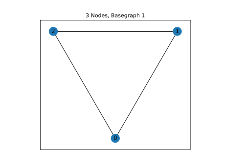
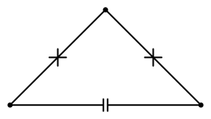

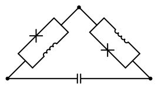

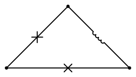

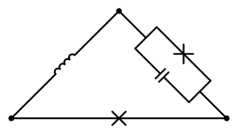
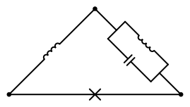

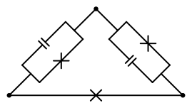
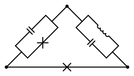
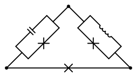

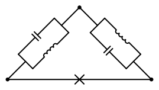

.. |image39| image:: img/n3_g1_c97.svg
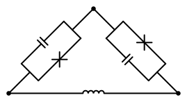
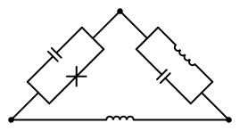

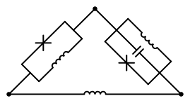

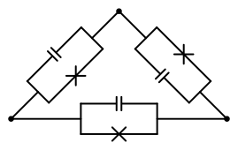

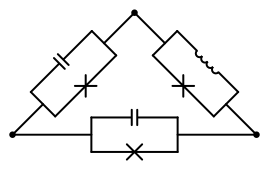

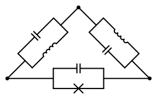

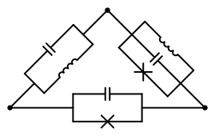

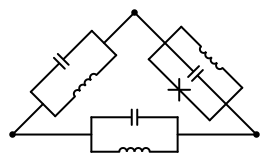
.. |image61| image:: img/n3_g1_c236.svg
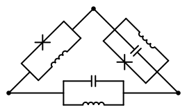

